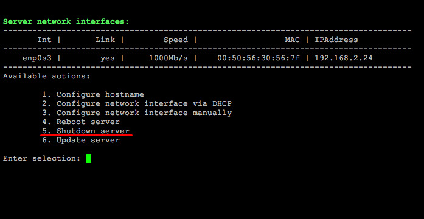

# 5. Выключение сервера (5. Shutdown server)

**Навигация**
- [← Оглавление курса](index.md)
- [← Предыдущий: 29280 — 4. Перезагрузка сервера (4. Reboot server)](lesson_29280.md)
- [Следующий: 29284 — 6. Обновление локального сервера (6. Update server) →](lesson_29284.md)

Официальная страница урока: https://dev.1c-bitrix.ru/learning/course/index.php?COURSE_ID=32&LESSON_ID=29282

Чтобы выключить сервер виртуальной машины *BitrixVM*, нужно перейти в главном меню 2. Configure localhost settings - 5. Shutdown server.

Далее согласиться на остановку сервера:

