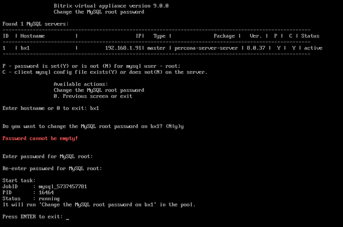

# 2. Изменить пароль пользователя root для MySQL (2. Change password for MySQL root user)

**Навигация**
- [← Оглавление курса](index.md)
- [← Предыдущий: 29290 — 1. Обновить настройки для всех MySQL-серверов (1. Update settings for all MySQL servers)](lesson_29290.md)
- [Следующий: 29294 — 3. Остановить/Запустить службу MySQL на сервере (3. Stop/Start MySQL service on the server) →](lesson_29294.md)

Официальная страница урока: https://dev.1c-bitrix.ru/learning/course/index.php?COURSE_ID=32&LESSON_ID=29292

**Внимание!** В *BitrixVM/BitrixEnv* **версии 9.x+** пароль root для MySQL-сервера не может быть пустым. При первом запуске  *BitrixVM* он автоматически создается, а при установке *BitrixEnv* будет выдан запрос на его создание.

Если вам понадобилось сменить пароль root MySQL-сервера, нужно перейти в главном меню 3. Configure MySQL service for the pool - 2.Change password for MySQL root user.

Далее выбрать нужный сервер (имя хоста), согласиться на изменение и ввести новый пароль.

