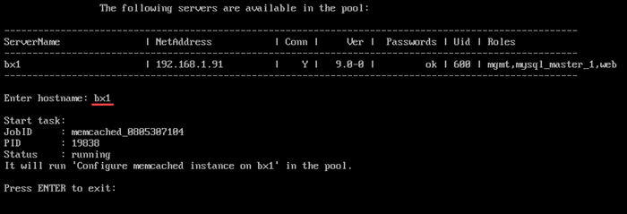
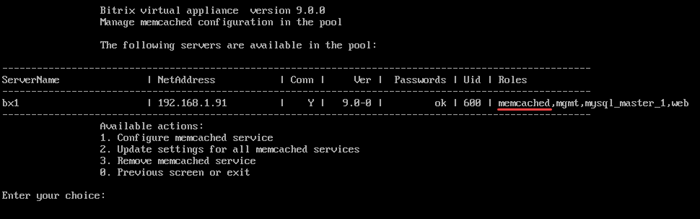

# 1. Настройка службы memcached (1.Configure memcached service)

**Навигация**
- [← Оглавление курса](index.md)
- [← Предыдущий: 29294 — 3. Остановить/Запустить службу MySQL на сервере (3. Stop/Start MySQL service on the server)](lesson_29294.md)
- [Следующий: 29306 — 2. Обновить настройки memcached сервера (2. Update settings for all memcached servers) →](lesson_29306.md)

Официальная страница урока: https://dev.1c-bitrix.ru/learning/course/index.php?COURSE_ID=32&LESSON_ID=29304

Для создания memcached сервера нужно:

- Выбрать пункт меню 4. Configure Memcached service for the pool &gt; 1. Configure memcached service.
  Ввести имя хоста, на котором будет запущен сервер (в данном примере — **bx1**):
  
  Подождать, пока задача по запуску будет закончена.
  В результате для сервера появится роль memcached и в меню отобразятся дополнительные пункты обновления настроек и удаления memcached сервера:
  

**Примечание.** Задачи могут выполняться длительное время. Время зависит от сложности задачи, объема данных, используемых в этих задачах, мощности и загруженности сервера.
Проверить текущие выполняемые задачи можно с помощью меню 10. Background pool tasks &gt; 1. View running tasks. Лог-файлы выполнения задач находятся в директории `/opt/webdir/temp`.
