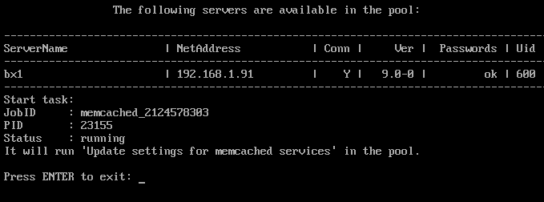

# 2. Обновить настройки memcached сервера (2. Update settings for all memcached servers)

**Навигация**
- [← Оглавление курса](index.md)
- [← Предыдущий: 29304 — 1. Настройка службы memcached (1.Configure memcached service)](lesson_29304.md)
- [Следующий: 29308 — 3. Удаление memcached сервера (3. Remove memcached server) →](lesson_29308.md)

Официальная страница урока: https://dev.1c-bitrix.ru/learning/course/index.php?COURSE_ID=32&LESSON_ID=29306

**Примечание**: Данный пункт меню появится только тогда, когда будет создан memcached-сервер с помощью меню 4. Configure memcached servers for the pool &gt; 1. Configure memcached server.

Чтобы обновить настройки memcached-сервера, нужно перейти в главном меню 4. Configure memcached servers for the pool &gt; 2. Update settings for all memcached servers:

Эта опция запускает проверку текущей конфигурации memcached-сервера в пуле.

**Примечание.** Задачи могут выполняться длительное время. Время зависит от сложности задачи, объема данных, используемых в этих задачах, мощности и загруженности сервера.
Проверить текущие выполняемые задачи можно с помощью меню 10. Background pool tasks &gt; 1. View running tasks. Лог-файлы выполнения задач находятся в директории `/opt/webdir/temp`.
