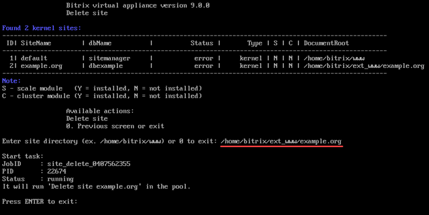

# 2. Удалить сайт (2. Delete a site)

**Навигация**
- [← Оглавление курса](index.md)
- [← Предыдущий: 29320 — 1. Создание сайта (1. Create a site)](lesson_29320.md)
- [Следующий: 29324 — 3. Настройка задач cron (3. Change a site'a cron settings) →](lesson_29324.md)

Официальная страница урока: https://dev.1c-bitrix.ru/learning/course/index.php?COURSE_ID=32&LESSON_ID=29322

Для удаления записи о дополнительном сайте необходимо в административном меню выбрать пункт 8. Configure pool sites &gt; 2. Delete a site и выбрать директорию удаляемого сайта (**Enter site directory**):

**Внимание!** Мастер удаления дополнительного сайта удаляет папку и базу данных дополнительного сайта, поэтому необходимо предварительно сделать бекап важных данных.

**Примечание.** Задачи могут выполняться длительное время. Время зависит от сложности задачи, объема данных, используемых в этих задачах, мощности и загруженности сервера.
Проверить текущие выполняемые задачи можно с помощью меню 10. Background pool tasks &gt; 1. View running tasks. Лог-файлы выполнения задач находятся в директории `/opt/webdir/temp`.
