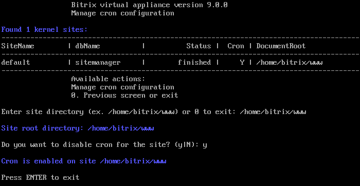

# 3. Настройка задач cron (3. Change a site'a cron settings)

**Навигация**
- [← Оглавление курса](index.md)
- [← Предыдущий: 29322 — 2. Удалить сайт (2. Delete a site)](lesson_29322.md)
- [Следующий: 29328 — Настройки для почтовых сервисов →](lesson_29328.md)

Официальная страница урока: https://dev.1c-bitrix.ru/learning/course/index.php?COURSE_ID=32&LESSON_ID=29324

По умолчанию в виртуальной машине **cron** уже включен. Для сайта по умолчанию настройки Cron хранятся в файле `/etc/crontab`. Для сайтов, созданных из меню, — в `/etc/cron.d/bx_dbName`, где dbName — имя базы данных сайта.

Если по каким-либо причинам нужно отключить эту службу или включить заново, то для этого необходимо:

- Перейти в главном меню в 8. Configure pool sites &gt; 3. Change a site'a cron settings и ввести директорию сайта, для которого нужно отключить / включить службу **cron**.
- Согласиться на отключение / включение и дождаться пока задача будет выполнена:
  

Информацию о том, как настроить в продуктах *«1С-Битрикс»* обработку всех агентов на **cron**, можно прочитать [здесь](lesson_29410.md).
