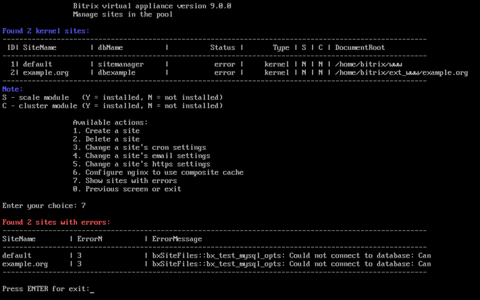

# 8. Показать сайты с ошибками (8. Show sites with errors)

**Навигация**
- [← Оглавление курса](index.md)
- [← Предыдущий: 30278 — 3. Удалить настройки NTLM (3. Delete NTLM settings)](lesson_30278.md)
- [Следующий: 29362 — 1. Настроить модули PHP (1. Manage PHP extensions) →](lesson_29362.md)

Официальная страница урока: https://dev.1c-bitrix.ru/learning/course/index.php?COURSE_ID=32&LESSON_ID=29348

Если по каким-либо причинам на сайтах появились серьезные ошибки: отсутствие модулей на сайте или нет подключения к БД (не получается подключиться с данными настроек сайта), то в меню виртуальной машины появляется пункт меню 8. Configure pool sites &gt; 8. Show sites with errors.

Выбрав этот пункт меню, отобразится список сайтов с кратким описанием ошибки (в данном примере у двух сайтов нет соединения с базой данных):

**Примечание**: Пункт меню 8. Configure pool sites &gt; 8. Show sites with errors является скрытым и появляется только тогда, когда есть ошибки на сайтах под управлением виртуальной машиной *BitrixVM* или linux-окружением *BitrixEnv*. Как только ошибки будут исправлены, данный пункт снова скроется.
