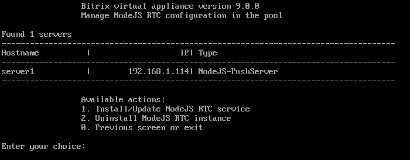
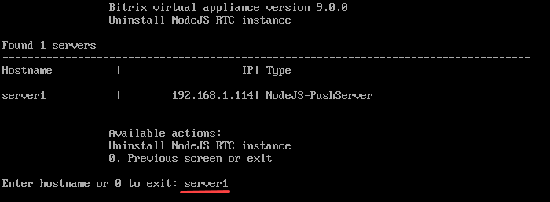

# 2. Удалить NodeJS RTC инстанс (2. Uninstall NodeJS RTC instance)

**Навигация**
- [← Оглавление курса](index.md)
- [← Предыдущий: 29376 — 1. Настроить NodeJS RTC сервис (1. Install/Update NodeJS RTC Service)](lesson_29376.md)
- [Следующий: 30268 — 1. Настроить сервис Конвертер файлов (1. Configure Transformer service) →](lesson_30268.md)

Официальная страница урока: https://dev.1c-bitrix.ru/learning/course/index.php?COURSE_ID=32&LESSON_ID=29378

Чтобы удалить сервис NodeJS RTC:

1. В главном меню виртуальной машины выберите пункт 6. Configure Push/RTC service for the pool &gt; 2. Uninstall NodeJS RTC instance:
  
2. Введите имя хоста (в примере мы выбрали **server1** c запущенным сервисом NodeJS RTC):
  
3. Согласитесь на удаление `y` и подождите пока задача по удалению Push&Pull сервиса будет выполнена:
  

**Примечание.** Задачи могут выполняться длительное время. Время зависит от сложности задачи, объема данных, используемых в этих задачах, мощности и загруженности сервера.
Проверить текущие выполняемые задачи можно с помощью меню 10. Background pool tasks &gt; 1. View running tasks. Лог-файлы выполнения задач находятся в директории `/opt/webdir/temp`.
