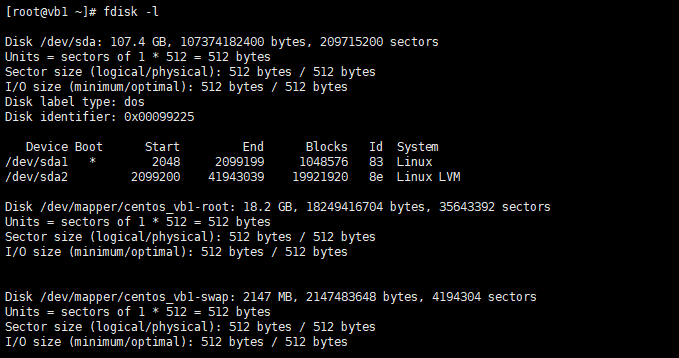
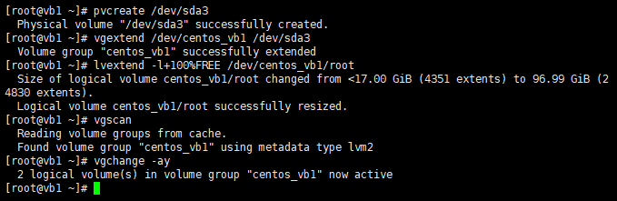
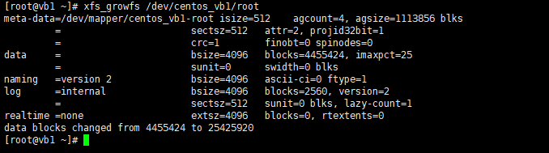
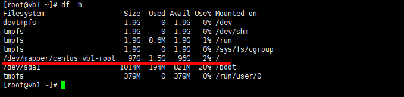

# Увеличение размера LVM-раздела BitrixEnv

**Навигация**
- [← Оглавление курса](index.md)
- [← Предыдущий: 30164 — Как увеличить размер жесткого диска BitrixVM v9.x](lesson_30164.md)
- [Следующий: 29400 — Подключение Swap-раздела →](lesson_29400.md)

Официальная страница урока: https://dev.1c-bitrix.ru/learning/course/index.php?COURSE_ID=32&LESSON_ID=29398

**Внимание!**

1. Для операций, описанных в данной главе, необходимы знания администрирования *nix-систем. Перед началом проведения данных операций рекомендуется сделать полный бекап *«Виртуальной машины»*.
2. Приведённые настройки выходят за рамки меню Виртуальной машины. Это означает, что информация – ознакомительная и применять её следует с чётким пониманием того что вы делаете и с собственной ответственностью за совершаемые действия. В нашей техподдержке рассматриваются только вопросы по работе пунктов меню ВМ.
3. При автоматической разбивке диска на этапе установки системы CentOS 9, например в случае будущего развертывания VMBitrix c помощью скрипта bitrix-env-9.sh на готовый CentOS 9, устанавливается менеджер логических томов **LVM2**. В таком случае изменение размера LVM-раздела будет отличаться от предыдущих способов.


Пусть размер системного диска был увеличен с 20 ГБ до 100Гб, как было [сделано ранее](https://dev.1c-bitrix.ru/learning/course/index.php?COURSE_ID=32&LESSON_ID=29396) в VMWare или VirtualBox (пункт 1).


Тогда действия по изменению размера LVM-раздела будут такими:


1. Смотрим, что в системе на данный момент есть из устройств/разделов командой:
  ```
  fdisk -l
  ```
  
2. Убеждаемся, что место в системе автоматически не увеличилось при помощи команды:
  ```
  df -h
  ```
  
  Здесь мы также видим и запоминаем имя группы томов и имя тома – `centos_vb1-root` (у вас они будут другие):

  - **centos_vb1** – имя группы томов;
  - **root** – имя тома.
3. Создаем новый раздел **sda3** – тип раздела: **Linux LVM** (код типа `8e`) на неразмеченной области. Для этого начинаем работу с устройством **sda** c помощью команды:
  ```
  fdisk /dev/sda
  ```
4. Далее командой **n** создаем новый раздел:

  - основной (primary partition) – команда **p** и `Partition number (1-3, default 3): 3` (так как у нас было 2 логических раздела sda1 и sda2 – см. п.1);
  - первый и последний сектора при этом выбираем по умолчанию – нажмите Enter, таким образом, будет создан раздел, используя все свободное пространство на диске;
  - укажем тип раздела – команда **t** и `Partition number (1-3, default 3): 3`;
  - вводим код типа раздела, соответствующий Linux LVM – `8e`;
  - смотрим таблицу разделов – команда **p** и убеждаемся, что все верно;
  - Раздел **sda3** создан. Для сохранения обновленной таблицы разделов и выхода из fdisk – команда **w**.
    
5. Чтобы система подгрузила новую таблицу разделов, необходима перезагрузка виртуальной машины:
  ```
  reboot
  ```
6. После перезагрузки необходимо создать физический том **sda3**:
  ```
  pvcreate /dev/sda3
  ```
7. Далее расширяем группу томов на новое пространство, используя имя группы томов **centos_vb1** (которое мы запомнили ранее в п.2):
  ```
  vgextend /dev/centos_vb1 /dev/sda3
  ```
8. Теперь расширим логический том, используя имя тома **root** (которое мы запомнили ранее в п.2):
  ```
  lvextend -l+100%FREE /dev/centos_vb1/root
  ```
9. Сканируем диски на предмет наличия групп томов и активируем все найденные группы томов:
  ```
  vgscan
  vgchange -ay
  ```
  
10. Узнаем тип файловой системы:
  ```
  file -s /dev/sda1
  ```
  
  Видим, что файловая система **XFS**.
11. И наконец, расширяем файловую систему XFS (может потребоваться время):
  ```
  xfs_growfs /dev/centos_vb1/root
  ```
  
  **Внимание!** Если файловая система не **XFS**, а, например, **ext4** или **reiserfs**, то команды будут такие (с учетом `centos_vb1` – имя группы томов и `root` – имя тома из п.2):
  - `resize2fs /dev/centos_vb1/root` – для **ext4**;
  - `resize_reiserfs /dev/centos_vb1/root` – для **reiserfs**;
12. Проверяем итоговый результат:
  ```
  df -h
  ```
  
