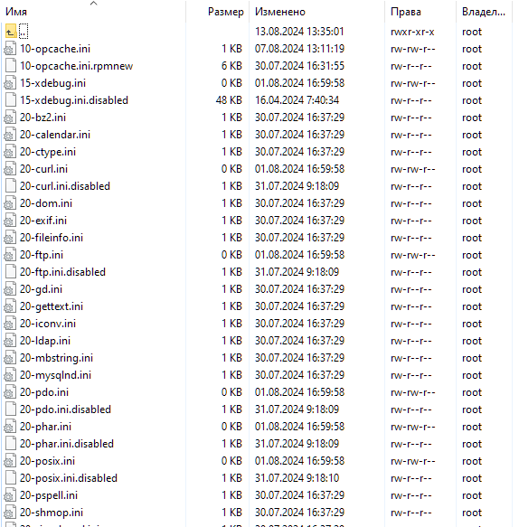
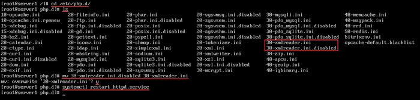
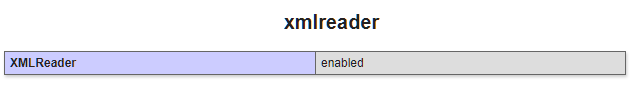
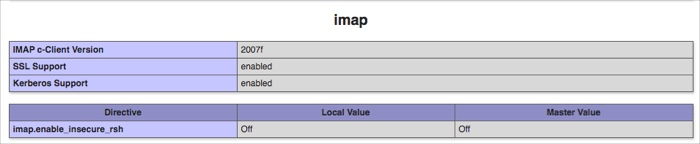

# Ручное включение php-расширений

**Навигация**
- [← Оглавление курса](index.md)
- [← Предыдущий: 29416 — Исходные коды пакетов](lesson_29416.md)
- [Следующий: 29424 — Настройка сервера →](lesson_29424.md)

Официальная страница урока: https://dev.1c-bitrix.ru/learning/course/index.php?COURSE_ID=32&LESSON_ID=29420

**Внимание!**

1. Для операций, описанных в данной главе, необходимы знания администрирования *nix-систем. Перед началом проведения данных операций рекомендуется сделать полный бекап *«Виртуальной машины»*.
2. Приведённые настройки выходят за рамки меню Виртуальной машины. Это означает, что информация - ознакомительная и применять её следует с чётким пониманием того что вы делаете и с собственной ответственностью за совершаемые действия. В нашей техподдержке рассматриваются только вопросы по работе пунктов меню ВМ.


### Ручное включение


Помимо

			включения некоторых php-расширений из меню BitrixEnv

                    В разделе 7. Manage web nodes in the pool &gt; 1. Manage PHP extensions можно включить дополнительные модули PHP, которые могут понадобится в продуктах «1C-Битрикс».

[Подробнее ...](/learning/course/index.php?COURSE_ID=32&LESSON_ID=9375)

		 можно включать нужные расширения **вручную**.


Конфигурационные ini-файлы доступных php-расширений находятся в директории `/etc/php.d/`:





Чтобы вручную включить нужное расширение, нужно файл **{имя_расширения}.ini.disabled** переименовать в **{имя_расширения}.ini** и перезапустить сервис Apache – **httpd**.


### Пример


Например, нам нужно включить расширение **xmlreader**.


1. Переходим в директорию сервера `/etc/php.d/`:
  ```
  cd /etc/php.d/
  ```
2. Выводим список файлов в директории:
  ```
  ls
  ```
3. Видим в списке файл **30-xmlreader.ini.disabled**. Переименуем его в **30-xmlreader.ini** и сохраним с заменой текущего:
  ```
  mv 30-xmlreader.ini.disabled 30-xmlreader.ini
  ```
  **Внимание!** Если скопировать содержимое **30-xmlreader.ini.disabled** в **30-xmlreader.ini** и оставить эти два файла в директории `/etc/php.d/`, то при обновлении PHP или виртуальной машины расширение будет деактивировано. Чтобы этого не произошло, нужно оставлять только один файл **30-xmlreader.ini** с активированным расширением.
4. Далее перезапустим сервис Apache — **httpd**:
  ```
  systemctl restart httpd.service
  ```
  
5. Все готово, расширение **xmlreader** работает:
  


### Установка php-расширения, которого нет в BitrixVM


Также вы можете установить любое php-расширение  самостоятельно.


Например установим расширение **php-imap**.


Сначала нужно найти его имя с помощью команды:


```

dnf list php-imap*
```


Далее установить командой:


```

dnf install php-imap
```


При установке будет создан файл **/etc/php.d/20-imap.ini**.


Затем нужно перезапустить сервис **httpd**.


```

systemctl restart httpd.service
```


Все готово, php-расширение **imap** работает:





**Примечание**: Некоторые php-расширения могут автоматически сами включаться после установки. Если **ini**-файл не был создан во время установки расширения, нужно создать его самостоятельно.
