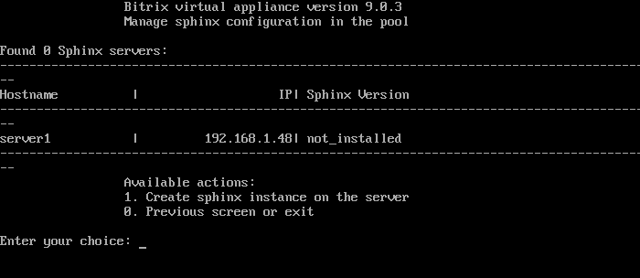
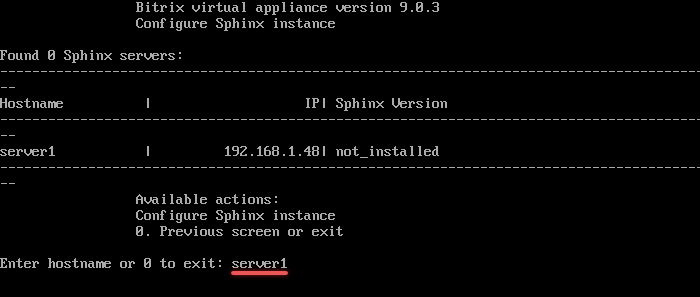
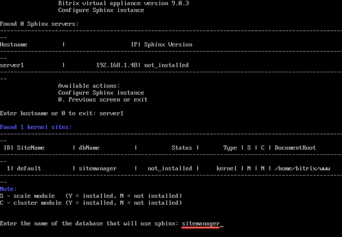
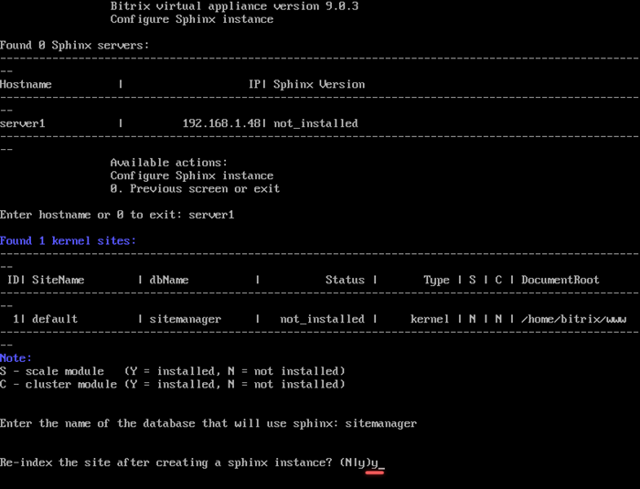
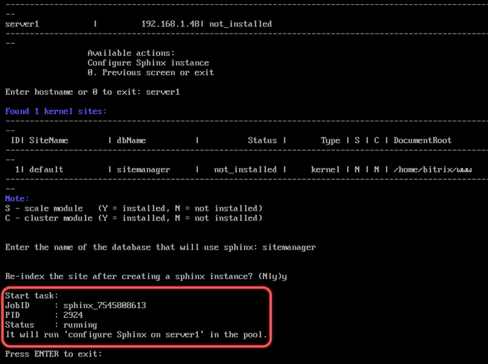

# 1. Создать инстанс sphinx на сервере (1. Create sphinx instance on server)

**Навигация**
- [← Оглавление курса](index.md)
- [← Предыдущий: 29308 — 3. Удаление memcached сервера (3. Remove memcached server)](lesson_29308.md)
- [Следующий: 30258 — 2. Обновить настройки sphinx (2. Update sphinx instance on server) →](lesson_30258.md)

Официальная страница урока: https://dev.1c-bitrix.ru/learning/course/index.php?COURSE_ID=32&LESSON_ID=30256

Для установки Sphinx на сервер необходимо:

- Установить и обновить проект до последней актуальной версии.
- В меню виртуальной машины выбрать пункт *5. Configure Sphinx service for the pool &gt; 1. Create sphinx instance on the server*.
  
- Далее ввести имя хоста, где будет запущен сервер поиска. В примере это `server1`.
  
- Выбрать базу данных ядра системы сайта из списка:
  
- Дать согласие на запуск полной переиндексации после установки сервера:
  
- Подождать, пока задача по установке и переиндексации будет закончена:
  

**Примечание.** Задачи могут выполняться длительное время. Время зависит от сложности задачи, объема данных, используемых в этих задачах, мощности и загруженности сервера.
Проверить текущие выполняемые задачи можно с помощью меню *10. Background pool tasks &gt; 1. View running tasks*. Лог-файлы выполнения задач находятся в директории `/opt/webdir/temp`.

#### Дополнительно

Ручная настройка поискового механизма **Sphinx** описана в учебном курсе [Администратор. Базовый](/learning/course/index.php?COURSE_ID=35&LESSON_ID=5935).
