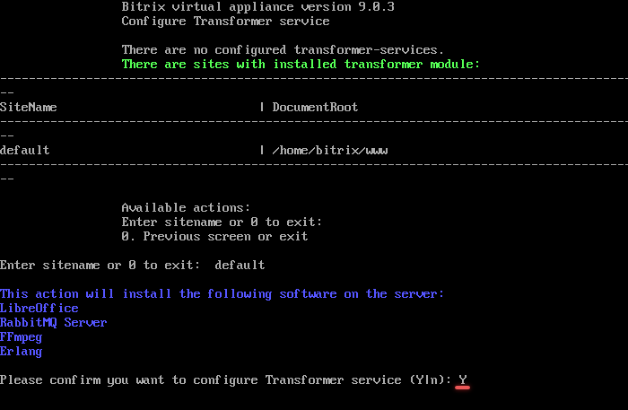
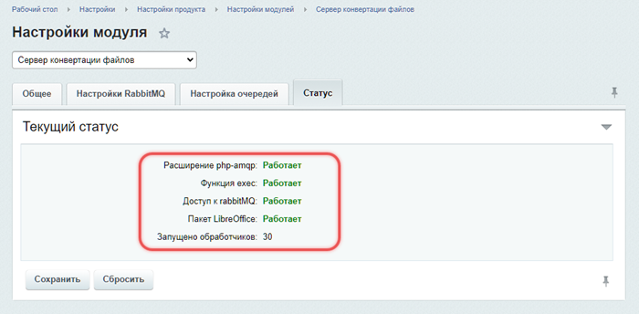

# 1. Настроить сервис Конвертер файлов (1. Configure Transformer service)

**Навигация**
- [← Оглавление курса](index.md)
- [← Предыдущий: 29378 — 2. Удалить NodeJS RTC инстанс (2. Uninstall NodeJS RTC instance)](lesson_29378.md)
- [Следующий: 30270 — 2. Удалить сервис «Конвертер файлов» (2. Remove Transformer service) →](lesson_30270.md)

Официальная страница урока: https://dev.1c-bitrix.ru/learning/course/index.php?COURSE_ID=32&LESSON_ID=30268

У роли есть ограничения:

1. Требуется модуль Сервер конвертации файлов (transformercontroller), который есть только в редакции [1С-Битрикс24: Энтерпрайз](https://enterprise.1c-bitrix.ru/products/b24/).
2. Нельзя удалить сайт, если для него настроена роль. Сначала нужно удалить роль, затем сайт.
3. Можно установить только одну роль на машину.

Чтобы настроить роль выполните следующие шаги:

1. В главном меню виртуальной машины выберите пункт 7. Configure Transformer service &gt; 1. Configure Transformer service.
  
  Если у вас нет подходящих сайтов для роли, отобразится сообщение «No suitable sites were found to configure the transformer service».
  
2. Введите имя сайта. В примере `default`.
  
3. Перед запуском роли будет выдано оповещение об устанавливаемом ПО. Подтвердите, что хотите настроить сервис `Y`.
  
4. BitrixVM запустит задачу `configure_transformer_***`, которая:

- установит пакеты LibreOffice, RabbitMQ Server, FFmpeg, Erlang и их связи
- настроит модули Конвертер файлов и Сервер конвертации файлов для указанного сайта

После завершения задачи в указанных выше модулях пропишутся все необходимые настройки.

В настройках Битрикс24 в публичной части сайта или в настройках модуля Диск в административном части сайта *Настройки &gt; Настройки продукта &gt; Настройки модулей &gt; Диск* установите опцию Просматривать документы с помощью Битрикс24.

**Примечание.** Задачи могут выполняться длительное время. Время зависит от сложности задачи, объема данных, используемых в этих задачах, мощности и загруженности сервера.
Проверить текущие выполняемые задачи можно с помощью меню 10. Background pool tasks &gt; 1. View running tasks. Лог-файлы выполнения задач находятся в директории `/opt/webdir/temp`.

#### Дополнительные материалы

- [Установка и настройка сервера конвертации файлов](https://dev.1c-bitrix.ru/learning/course/index.php?COURSE_ID=48&LESSON_ID=21876)
- [Нагрузка и логирование](https://dev.1c-bitrix.ru/learning/course/index.php?COURSE_ID=48&LESSON_ID=21878)
- [Использование сервера конвертации файлов другими сайтами](https://dev.1c-bitrix.ru/learning/course/index.php?COURSE_ID=48&LESSON_ID=21882)
