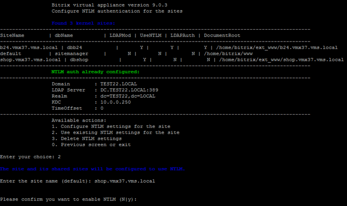

# 2. Использовать существующие настройки NTLM для сайта (2. Use existing NTLM settings for the site)

**Навигация**
- [← Оглавление курса](index.md)
- [← Предыдущий: 30274 — 1. Настроить NTLM-авторизацию для сайта (1. Configure NTLM settings for the site)](lesson_30274.md)
- [Следующий: 30278 — 3. Удалить настройки NTLM (3. Delete NTLM settings) →](lesson_30278.md)

Официальная страница урока: https://dev.1c-bitrix.ru/learning/course/index.php?COURSE_ID=32&LESSON_ID=30276

Возможность использовать существующие настройки NTLM для сайта появится в меню виртуальной машины, если NTLM авторизация уже включена и настроена хотя бы для одного сайта.

На следующем сайте нужно настроить подключение к AD в административном разделе. Инструкция в уроке [1. Настроить NTLM-авторизацию для сайта](lesson_30274.md).

Когда подключение готово, вернитесь в меню машины в раздел *8. Configure pool sites &gt; 7. Configure NTLM auth for sites*. Чтобы подключить сайт к настроенной NTLM авторизации выберите пункт меню *2. Use existing NTLM settings for the site*.

Укажите имя сайта.

BitrixVM запустит задачу `ntlm_update_***`. Она добавит настройки NTLM авторизации в модуле LDAP для указанного сайта.

**Примечание.** Задачи могут выполняться длительное время. Время зависит от сложности задачи, объема данных, используемых в этих задачах, мощности и загруженности сервера.
Проверить текущие выполняемые задачи можно с помощью меню 10. Background pool tasks &gt; 1. View running tasks. Лог-файлы выполнения задач находятся в директории `/opt/webdir/temp`.

Как работает механизм авторизации, описано в уроке [1. Настроить NTLM-авторизацию для сайта](lesson_30274.md).
