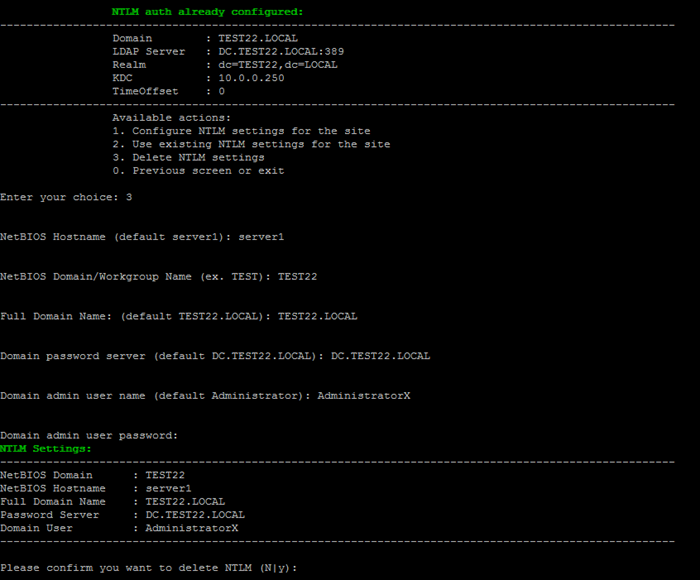

# 3. Удалить настройки NTLM (3. Delete NTLM settings)

**Навигация**
- [← Оглавление курса](index.md)
- [← Предыдущий: 30276 — 2. Использовать существующие настройки NTLM для сайта (2. Use existing NTLM settings for the site)](lesson_30276.md)
- [Следующий: 29348 — 8. Показать сайты с ошибками (8. Show sites with errors) →](lesson_29348.md)

Официальная страница урока: https://dev.1c-bitrix.ru/learning/course/index.php?COURSE_ID=32&LESSON_ID=30278

Если NTLM авторизация больше не нужна, ее можно удалить через меню виртуальной машины.

Перейдите в раздел меню *8. Configure pool sites &gt; 7. Configure NTLM auth for sites*. Выберите пункт *3. Delete NTLM settings*. Он запустит мастер, который удалит настройки NTLM для всех сайтов и для машины.

Мастер запросит те же данные, которые указывали при подключении NTLM, за исключением имени сайта:

- NetBIOS Hostname (default server1) — имя сервера в пуле. В примере `server1`
- NetBIOS Domain/Workgroup Name (ex. TEST) — домен. В примере `TEST22`
- Full Domain Name: (ex. TEST.LOCAL) — fqd домена. В примере `TEST22.LOCAL`
- Domain password server (ex. TEST-DC-SP.TEST.LOCAL) — контроллер домена. В примере `DC.TEST22.LOCAL`
- Domain admin user name (default Administrator) — имя пользователя и пароль. В примере `AdministratorX / ************`

BitrixVM запустит задачу `ntlm_delete_***`. Задача выполнит следующее:

- удалит настройки NTLM авторизации в модуле LDAP для каждого сайта
- выведет машину из домена
- остановит службы и перезапустит те, что необходимо
- удалит необходимые пакеты, файлы и так далее

После выполнения задачи на все сайты вернется обычный механизм авторизации.
