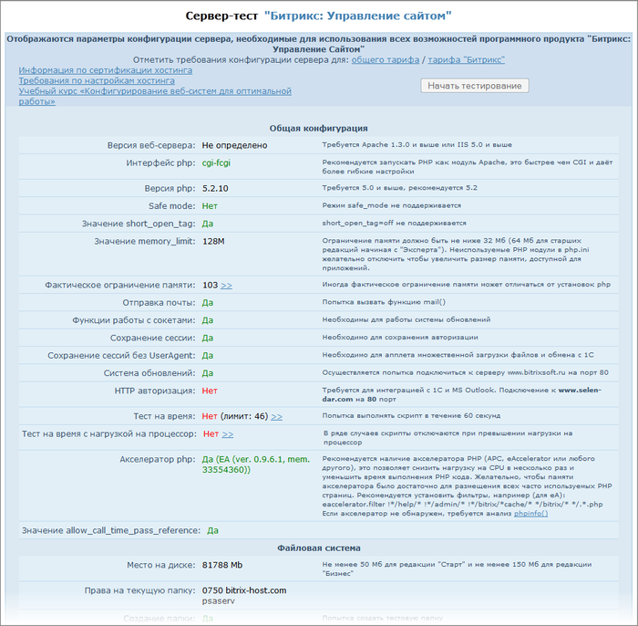

# Скрипт bitrix_server_test

**Навигация**
- [← Оглавление курса](index.md)
- [Следующий: 4631 — Модульная структура →](lesson_4631.md)

Официальная страница урока: https://dev.1c-bitrix.ru/learning/course/index.php?COURSE_ID=32&LESSON_ID=3262

Компания "1С-Битрикс" рекомендует клиентам и разработчикам проверять потенциальный хостинг специальным скриптом [bitrix_server_test](https://dev.1c-bitrix.ru/download/scripts/bitrix_server_test.php). Скрипт постоянно обновляется под выявляемые проблемы и обновления системы:

Хостерам рекомендуется периодически скачивать обновленную версию теста и проверять свои сервера по тестируемым параметрам.
