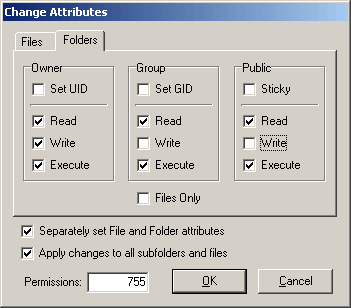
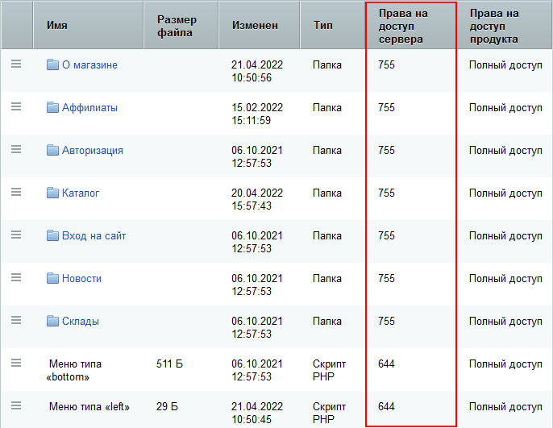

# Необходимый уровень прав на сервере

**Навигация**
- [← Оглавление курса](index.md)
- [← Предыдущий: 3293 — Возможные ошибки при переносе сайта](lesson_3293.md)
- [Следующий: 3295 — Использование файлов .htaccess →](lesson_3295.md)

Официальная страница урока: https://dev.1c-bitrix.ru/learning/course/index.php?COURSE_ID=32&LESSON_ID=3294

Настройка прав на сервере хостинг-провайдера может быть индивидуальна, но прежде всего должны быть установлены права на**чтение/запись из скрипта** для пользователя, под которым запущен веб-сервер **Apache**.


При этом на разделяемом хостинге другие пользователи на этой же машине не должны иметь права на **чтение/запись** в ваши файлы через свои скрипты. Также желательно, чтобы пользователь по FTP мог перезаписывать эти файлы, и в то же время файлы, закаченные по FTP, могли быть перезаписаны из скрипта.


Проблема в том, что у каждого хостинг-провайдера своя политика безопасности и свои настройки.


На некоторых хостингах процесс сервера запускается по умолчанию под пользователем **nobody:группа**. Файлы, которые пользователь хостинга хранит на своей машине, должны быть доступны **Apache**. Это означает, что они либо имеют атрибут **чтение для всех**, либо же пользователь-владелец файлов обязан принадлежать к той же самой группе, что и сервер. В последнем случае файлы должны быть доступны для чтения членами группы (именно такие права для них устанавливают по умолчанию FTP-серверы). При таком подходе страдает безопасность: раз все пользователи принадлежат к одной и той же группе, то они могут читать файлы друг друга.


Представим, что пользователь открыл в браузере страницу, запустившую CGI-скрипт. Так как скрипт в действительности запустил сервер **Apache**, запущенный под**nobody**, то он будет выполняться с правами этого пользователя. Следовательно, для того чтобы скрипт смог записать какой-нибудь файл в директорию хостинг-клиента, для нее должен стоять атрибут записи для членов группы. Мы видим, что при таком подходе хостинг-пользователи также могут и изменять файлы друг друга.


«1С-Битрикс: Управление сайтом» работает с любым уровнем прав, который вы указали ему при настройке (установке).


Чтобы продукт корректно работал с папками и файлами с заданным **CHMOD** (писал и создавал), вам нужно установить в `/bitrix/php_interface/dbconn.php` следующие константы:


```
define("BX_FILE_PERMISSIONS", 0644);
define("BX_DIR_PERMISSIONS", 0755);
```


Это типовые настройки прав на большинстве хостингов. Если возникают какие-то проблемы с работой, то обращайтесь в техническую поддержку вашего хостинга.


Самостоятельно установить нужный уровень прав можно, используя команду **CHMOD** в консольном режиме.


Следующий вызов устанавливает уровень прав доступа и для файлов, и для папок:


```
chmod -R 644 *
```


Для установки прав только на папки можно использовать следующий код:


```
find . -type d -exec chmod 0755 {} ';'
```


Если надо установить разные права на папки и файлы, то выполните следующий скрипт:


```
<?php
define("BX_FILE_PERMISSIONS", 0644);
define("BX_DIR_PERMISSIONS", 0755);

function chmod_R($path) {

   $handle = opendir($path);
   while ( false !== ($file = readdir($handle)) ) {
     if ( ($file !== ".") && ($file !== "..") ) {
       if ( is_file($path."/".$file) ) {
         chmod($path . "/" . $file, BX_FILE_PERMISSIONS);
       }
       else {
         chmod($path . "/" . $file, BX_DIR_PERMISSIONS);
         chmod_R($path . "/" . $file);
       }
     }
   }
   closedir($handle);
}

$path=dirname(__FILE__);
umask(0);
chmod_R($path);
echo $path;
?>
```


Для установки рекурсивно прав раздельно на файлы и папки можно использовать некоторые программы FTP клиентов. Например, FlashFXP версии 3.хх.


FlashFXP позволяет также разделять права для файлов и папок, но выполняет смену прав медленнее.


Обратите внимание на установки соответствующих флагов:


```
Separately set File and Folder attributes (Раздельно устанавливать права на файлы и папки);
Apply changes to all subfolders and files (Рекурсивная установка прав на подпапки и файлы)
```


Для каждой из установок настраивается свой уровень:


|  |  |  |
| --- | --- | --- |
| *Установка прав на папки* |  | *Установка прав на файлы* |


**Обратите внимание!** Модуль **Управление структурой** позволяет просмотреть права на доступ к файлам и папкам, установленные на уровне системы.





При просмотре файловой структуры в **Менеджере файлов** в столбце **Права на доступ** отображается уровень прав на доступ к файлам и папкам, информация о владельце и группе пользователей (для *NIX).
