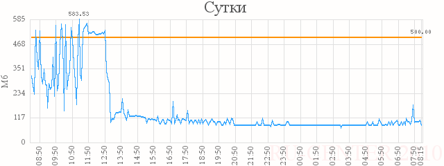
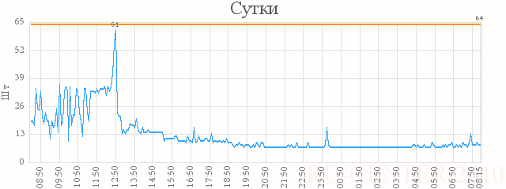

# Back-end и порядок взаимодействия

**Навигация**
- [← Оглавление курса](index.md)
- [← Предыдущий: 3358 — Front-end](lesson_3358.md)
- [Следующий: 3360 — Стабилизируем Back-end по расходу оперативной памяти →](lesson_3360.md)

Официальная страница урока: https://dev.1c-bitrix.ru/learning/course/index.php?COURSE_ID=32&LESSON_ID=3359

### Back-end

**Back-end** представляет собой обычный веб-сервер *Apache*, который исполняет PHP-приложения.

Back-end готов исполнять запросы на графические и статические документы, если вы используете кэширующий прокси-сервер для Front-end. Но очень важно, чтобы число запросов к статическим элементам через Back-end было минимальным и 99% запросов приходилось на выполнение именно PHP-страниц. Не забывайте, что использование Back-end для обработки статических запросов обходится очень дорого.

Конфигурируя Back-end, можно добиться значительного выигрыша в производительности и стабилизировать систему по расходу памяти. В большинстве случаев Back-end представляет собой обычный веб-сервер *Apache*, работающий на нестандартном порту, к примеру, на порту 88 и отвечающий только на запросы с **localhost** или IP адреса **Front-end**.

**Совет администратору**: Лучше использовать несколько внутренних IP адресов типа 127.0.0.2, 127.0.0.3 и т.д. с 80-м портом, иначе возможны нежелательные редиректы на неработающий порт у Front-end.

### Процесс взаимодействия

Рассмотрим **процесс взаимодействия** Front-End и Back-End при обработке запроса пользователя к обычной странице сайта.

- Запрос от пользователей принимается Front-end, например, по адресу [http://www.1c-bitrix.ru/](http://www.1c-bitrix.ru/) на 80 порту. На нашем сайте мы используем NGINX в качестве Front-end.
- Запрос принимается и транслируется к Back-end (веб-сервер Apache с PHP), который обрабатывает запросы по адресу http://127.0.0.2:80/.
- Запрос исполняется Back-end веб-сервером, отрабатывает программный продукт на PHP и генерируется HTML-текст страницы для пользователя.
- Подготовленная HTML-страница от Back-end передается Front-end как ответ на запрос пользователя, соединение между Front-end и Back-end закрывается (желательно не использовать KeepAlive на Back-end), и процесс Back-end высвобождает оперативную память или начинает обработку другого запроса.
- Front-end передает готовую сформированную страницу посетителю столько времени, сколько требуется пользователю, даже если он работает на медленном канале. Потребление памяти Front-end для передачи страницы пользователю минимально.
- Получив страницу, браузер посетителя посылает последовательно серию запросов на графические элементы и таблицу стилей. Все запросы принимаются Front-end и обрабатываются без обращений к Back-end, т.е. все статически документы самостоятельно вычитываются с диска без использования медленных и дорогих процессов Back-end.

### Пример уменьшения объема памяти

Пример уменьшения объема занимаемой оперативной памяти и числа процессов при подключении Front-end сервера (без настройки на отдачу статических файлов).

В этом примере был подключен NGINX, который все запросы, в том числе и запросы к статике, передавал back-end (Apache). Никаких дополнительных настроек на Back-end не выполнялось. Время подключения nginx – 12:50.

Используемая веб-сервером память:

Число одновременно выполняемых процессов *Apache*:

Как показала практика, двухуровневая конфигурация **Front-end** + **Back-end** существенно разгружает машину, уменьшает объемы потребляемой памяти, значительно ускоряет время обработки запросов и позволяет больше памяти выделить для работы базы данных. Такая конфигурация также позволяет значительно разгрузить сервер при обработке большого числа статических файлов, например, музыки, дистрибутивов программных продуктов, презентаций и других схожих объектов. Например, простым подключением NGINX удалось снизить нагрузку на веб-сервер в 5 раз.
