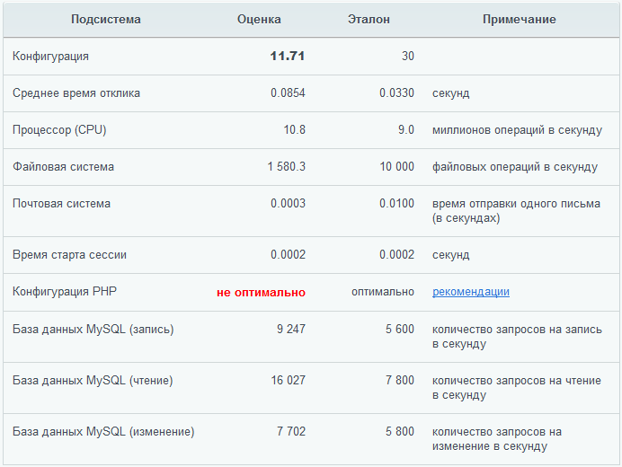

# Производительность PHP

**Навигация**
- [← Оглавление курса](index.md)
- [← Предыдущий: 3360 — Стабилизируем Back-end по расходу оперативной памяти](lesson_3360.md)
- [Следующий: 3362 — Сжатие страниц →](lesson_3362.md)

Официальная страница урока: https://dev.1c-bitrix.ru/learning/course/index.php?COURSE_ID=32&LESSON_ID=3361

### PHP прекомпиляторы


**Важно!** До 60% рабочего времени веб-сервера тратят на повторную компиляцию PHP-кода перед исполнением.


Ключевой способ снизить нагрузку на процессор – использовать прекомпиляторы PHP-кода. В настоящее время поддерживается акселератор [OPcache](http://php.net/manual/ru/book.opcache.php) (рекомендуется, доступен сразу «из коробки» в PHP v.5.5+).


<!-- &lt;ul&gt;
&lt;li&gt;OPcache&lt;/li&gt;
&lt;li&gt;Zend Performance Suite&lt;/li&gt;
&lt;li&gt;Alternative PHP Cache (APC)&lt;/li&gt;
&lt;li&gt;>eAccelerator&lt;/a&gt;
&lt;p&gt;&lt;div class="warning"&gt;&lt;b&gt;Внимание&lt;/b&gt;: &lt;i&gt;eAccelerator&lt;/i&gt; не совместим с PHP версий выше 5.3 и больше не поддерживается в продуктах «1C-Битрикс» с версии ядра 15.0.13. Подробнее см. в &lt;a href="https://dev.1c-bitrix.ru/community/blogs/vad/the-end-of-support-for-eaccelerator.php" target="_blank" / &gt;блоге разработчиков&lt;/a&gt;.&lt;/div&gt;&lt;/p&gt;&lt;/li&gt;
&lt;li&gt;XCache&lt;/li&gt;
&lt;li&gt;PHP Accelerator&lt;/li&gt;
&lt;li&gt;AfterBurner Cache&lt;/li&gt;
 &lt;/ul&gt; -->


<!-- Лучшие результаты производительности и кэширования PHP достигаются с использованием &lt;i&gt;OPcache&lt;/i&gt; (рекомендуется, доступен сразу «из коробки» в PHP v.5.5+), &lt;i&gt;XCache&lt;/i&gt; или &lt;i&gt;APC&lt;/i&gt; (Alternative PHP Cache), как более стабильная, но менее производительная альтернатива. -->

Не забывайте выделять достаточный объем оперативной памяти для хранения разделяемого кэша скомпилированных PHP-файлов. Обычно бывает достаточно 32-64 Мб, но для уверенности можно увеличить объем выделяемой памяти до 128 Мб, в расчете на файлы административного раздела. Прекомпиляторы используют разделяемый кэш для хранения скомпилированного PHP кода в оперативной памяти, который доступен всем рабочим процессам веб-сервера, при этом скомпилированный PHP код хранится в кэше в единственном экземпляре (без дублирования).


Для уменьшения потребляемой памяти процессами веб-сервера, в котором запускается PHP, желательно исключить из компиляции или динамической загрузки все неиспользуемые модули.


При этом очень важно, чтобы в кэш прекомпилятора помещалось достаточное количество скриптов на PHP. Одна из самых часто встречающихся ошибок - это отсутствие каталога для сохранения откомпилированного кода.


Для ускорения работы с PHP-сессиями рекомендуется сохранять файлы сессий в каталоге, который представляет собой виртуальный диск в памяти или использовать установку `session.save_handler=mm` в **php.ini**. Если есть возможность, рекомендуется использовать системный **RAM** диск. При этом необходимо отключать опцию **Передавать пароль в зашифрованном виде** на закладке **Авторизация** страницы настроек Главного модуля.


### Панель производительности


Важным инструментом по настройке производительности PHP является модуль **Монитор производительности**, входящий в комплект всех продуктов "1С-Битрикс". Протестировать настройки системы можно в административной части на странице [Панель производительности](https://dev.1c-bitrix.ru/learning/course/index.php?COURSE_ID=35&CHAPTER_ID=03376) (Настройки &gt; Производительность &gt; Панель производительности). Неоптимальная конфигурация PHP:





Как правило, выполнение рекомендаций позволяет увеличить производительность системы до достаточных величин. Численное значение параметра **Конфигурация** показывает основную характеристику сайта – скорость отдачи страниц клиенту. Чем больше число, тем лучше.


### Некоторые типовые ошибки


Ошибка **Segmentation fault** может произойти:


- В результате "падения" РНР при использовании отложенной загрузки классов;
- При использовании Zend server могут "упасть" скрипты в cron или консоли.


В первом случае необходимо определить в **dbconn.php**:


```
define("NO_BITRIX_AUTOLOAD",true)
```


Во втором случае надо:


- либо использовать другую версию PHP без подключения *Zend optimizer+* ;
- либо скопировать хостерский **php.ini** куда-то выше **document root**, удалить подключение *Zend extension manager* или *zend optimizer* и прописать в кроне опцию `-c`, которая позволяет указать папку, в которой необходимо искать файл **php.ini**.
- либо в "падающем" скрипте определить:
  ```
  define('BX_NO_ACCELERATOR_RESET', true)
  ```
