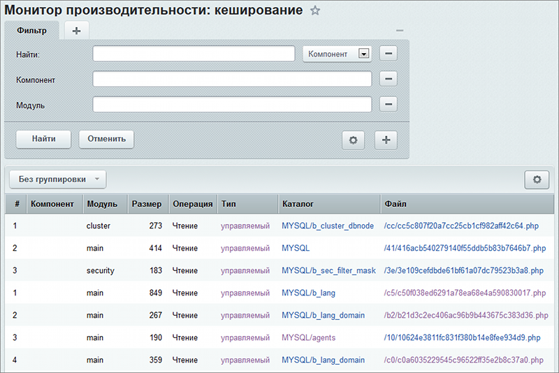

# Кеширование

**Навигация**
- [← Оглавление курса](index.md)
- [← Предыдущий: 5128 — SQL запросы](lesson_5128.md)
- [Следующий: 5129 — Таблицы в базе данных →](lesson_5129.md)

Официальная страница урока: https://dev.1c-bitrix.ru/learning/course/index.php?COURSE_ID=32&LESSON_ID=3838

|  | ### Файлы кеша |
| --- | --- |

Информация о файлах кеша доступна при включённой в настройках модуля **Монитор производительности** опции

			Вести журнал кеширования

                    

		. В этом случае эта информация отобразится на странице **Кеширование** (Настройки &gt; Производительность &gt; Кеширование).

Кнопка **Группировка** позволяет выбрать режим отображения данных в таблице:

- **Без группировки** - отображается вся информация о кеше, без каких-либо группировок;
- **Группировка по компонентам** - информация о кеше сгруппирована по названию компонентов;
- **Группировка по типу** - информация о кеше сгруппирована по типу кеша (управляемый / неуправляемый);
- **Группировка по каталогу** - информация о кеше сгруппирована по каталогам, в которых хранятся файлы кеша;
- **Группировка по файлу** - информация о кеше сгруппирована по файлам, в которых хранятся кеш.

Ссылки в таблице позволяют применять фильтр, согласно выбранному полю. Для полей таблицы в колонке **Файл** ссылка с названием позволяет перейти к просмотру содержимого этого файла.

|  | ### Документация по теме: |
| --- | --- |

- [Пользовательская документация](http://dev.1c-bitrix.ru/user_help/settings/perfmon/perfmon_cache_list.php)
