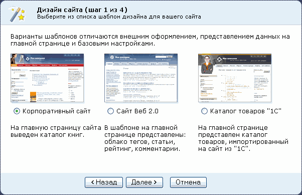
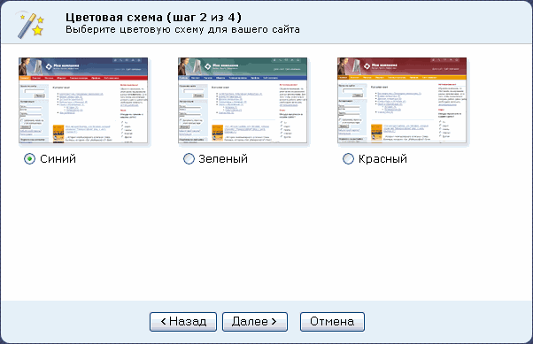
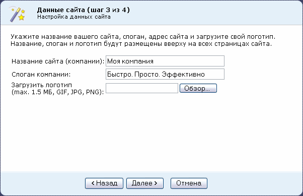
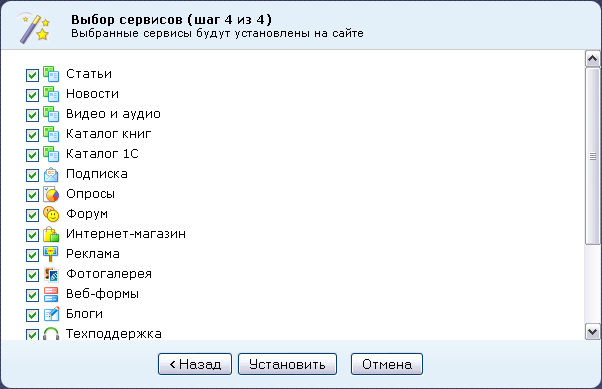
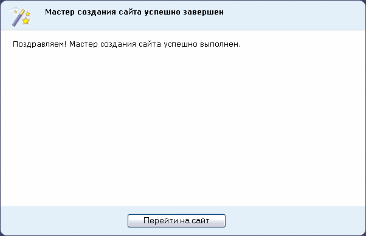

# Установка демо-сайта для разработчиков

**Навигация**
- [← Оглавление курса](index.md)
- [← Предыдущий: 2063 — Девятый шаг](lesson_2063.md)
- [Следующий: 5325 — Установка решения «1C-Битрикс: Управление сайтом» версии 16.5.х и выше →](lesson_5325.md)

Официальная страница урока: https://dev.1c-bitrix.ru/learning/course/index.php?COURSE_ID=32&LESSON_ID=4582

**Примечание:**Переход к этому мастеру осуществляется, только если былo выбрано решение **Демо-сайт для разработчиков** на [седьмом шаге](lesson_2060.md) установки.

### Мастер установки демо-сайта

Выбор кнопки

			Далее

                    

		 запустит Мастер создания демо-сайта для разработчиков.

**Примечание**: В случае выбора кнопки **Отмена** продукт будет установлен в "чистом" виде, без демо-данных. То есть, будет выведена страница с приветственным текстом. Эта функция предназначена для разработчиков проектов. Если цель – ознакомление с продуктом, то пользоваться этой кнопкой не рекомендуется.

### Первый шаг

Выберите шаблон дизайна для сайта. Шаблоны отличаются внешним оформлением, представленной информацией на главной странице сайта, а также базовыми настройками.



### Второй шаг

Укажите предпочтительную цветовую схему для выбранного на первом шаге шаблона дизайна сайта. Для разных типов шаблонов предлагаются разные цветовые схемы.



### Третий шаг

Задайте название вашего сайта, слоган и логотип.



- Заполните поля **Название компании** и **Слоган компании**.
- С помощью кнопки **Обзор** можно выбрать логотип компании для загрузки на сайт.
  **Внимание!** Размер загружаемого файла логотипа не должен превышать 1,5 Мб, формат файлов должен быть: GIF, JPG, PNG.

### Четвертый шаг

Выберите необходимые сервисы для создаваемого сайта.

**Примечание**. Если снять флажки со всех сервисов, то будет установлена только **Главная страница**, **страница авторизации** и **поиск**. Впоследствии через **Административную панель** можно запустить **Мастер** повторно и установить нужные сервисы, а также сменить шаблон сайта.



Для изменения настроек предназначена кнопка **Назад**, для запуска процесса установки - кнопка **Установить**.

Ход установки отображается с помощью графического индикатора.

### Окончание работы мастера

После завершения установки выводится информация об успешном завершении работы **Мастера создания сайта**.



Для выхода из мастера нажмите кнопку **Перейти на сайт**. Откроется публичный раздел созданного демо-сайта.

Установка продукта завершена.

|  |
| --- |

### Дополнительная настройка

- Чтобы отключить подстановку идентификатора сессии в ссылки на сайте, необходимо добавить в находящийся в корне сайта файл **.htaccess** директиву `php_flag session.use_trans_sid off`.
      Установка этой директивы может не поддерживаться установленной текущей версией Apache.
- Чтобы включить кеширование изображений, необходимо добавить в находящийся в корне сайта файл **.htaccess** директивы:
  ```
  ExpiresActive on
  ExpiresByType image/jpeg "access plus 3 day"
  ExpiresByType image/gif "access plus 3 day"
  ```
      Установка этих директив может не поддерживаться установленной текущей версией **Apache**.
  **Примечание**: Включение кеширования изображений рекомендуется производить уже после всех отладочных работ на сайте.
