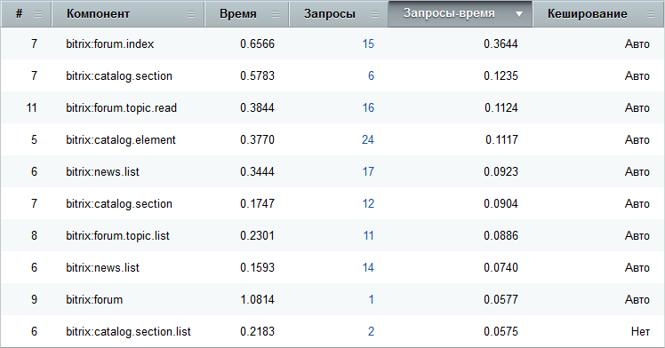

# Страницы и компоненты

**Навигация**
- [← Оглавление курса](index.md)
- [← Предыдущий: 3375 — Публичная часть модуля](lesson_3375.md)
- [Следующий: 5126 — Хиты →](lesson_5126.md)

Официальная страница урока: https://dev.1c-bitrix.ru/learning/course/index.php?COURSE_ID=32&LESSON_ID=5125

Чтобы собиралась статистика по нагрузке страниц, должен быть включен Монитор производительности (в настройках модуля, опция **Включить монитор**).

### Страницы

На странице **Монитор производительности: страницы** (Настройки &gt; Производительность &gt; Страницы) можно просмотреть отчет по нагружаемости страниц:

Переход по ссылке с названием страницы позволяет просмотреть все её хиты на странице **Хиты**.

### Компоненты

На странице **Монитор производительности: компоненты** (Настройки &gt; Производительность &gt; Компоненты) можно просмотреть отчет по используемым на страницах сайта компонентам или включаемым областям:

Переход по ссылке в графе **Запросы** позволяет просмотреть все SQL Запросы компонента на странице **SQL Запросы**.

Здесь же можно включить группировку по компонентам, если необходимо увидеть общую картину по использованию того или иного компонента.

