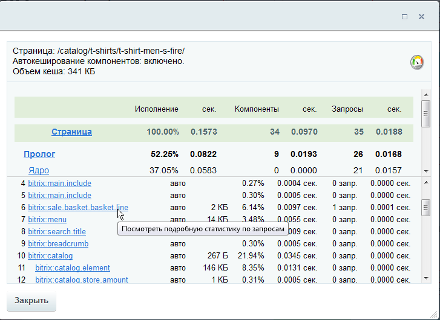

# Вкладка Разработка

**Навигация**
- [← Оглавление курса](index.md)
- [← Предыдущий: 8601 — Вкладка Битрикс](lesson_8601.md)
- [Следующий: 2731 — Вкладка Масштабируемость →](lesson_2731.md)

Официальная страница урока: https://dev.1c-bitrix.ru/learning/course/index.php?COURSE_ID=32&LESSON_ID=8645

### Разработка

В этой вкладке отображается список страниц сайта, среднего времени выполнения и предполагаемых ошибок разработчика.

Например, ошибка, которую предлагается исправить, - некэшированные компоненты.

**Примечание:** Для просмотра информации об ошибках используйте ссылку в колонке **Ошибки разработки**.

Чтобы увидеть причину ошибки, нажмите на адрес страницы в колонке **20 самых нагружающих страниц**.

### Пример анализа

Список адресов и статистики выполнения для страницы `/catalog/index.php`:

Обратите внимание – на странице `/catalog/index.php` размещён комплексный компонент **Каталог** с включенным ЧПУ, поэтому реальные URL для этой страницы – разные. Приведенная таблица отсортирована по уменьшению времени выполнения страницы, и хорошо видно, что если в первый раз страница открывалась 1,5 секунды, то в последующие разы с постоянным уменьшением времени. При этом сработало кэширование компонентов, и, как следствие - уменьшение времени на выполнение SQL-запросов.

Проверим, какие компоненты выполняются на этой странице. Для этого нажмите на число в колонке **Компоненты** нужной страницы. Список компонентов и их характеристики для хита 14 по адресу `/catalog/t-shirts/t-shirt-men-s-fire/`.

Вы увидите

                    

		 список компонентов, подключаемых на странице, число SQL-запросов из них и тип кэширования. В этом списке ищутся те некэшированное компоненты, о которых сообщал монитор производительности.

Аналогичным образом просматривается список SQL-запросов на этой странице (для данного хита). Для определения, какой из компонентов не кэшируется вернитесь на страницу **Монитор производительности: хиты** и нажмите на ссылку &gt;&gt; перед адресом страницы, откроется сводная статистика по странице. Здесь вы увидите, на каком именно этапе построения страницы сайта

			затрачивается максимальное время

                    

		.

Если на **Панели управления** нажата кнопка **Отладка** (Отладка &gt; Суммарная статистика), то в этом окне будет отображён и

			список компонентов страницы

                    

		. Любой из компонентов можно настроить, выбрав его из этого списка. Как правило, компоненты расположены в том же порядке, что и на странице диагностики.

**Примечание:** Подробнее про работу с монитором производительности в публичной части сайта смотрите в уроке [Публичная часть модуля](lesson_3375.md).
