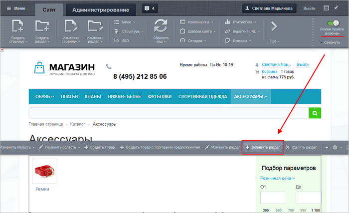
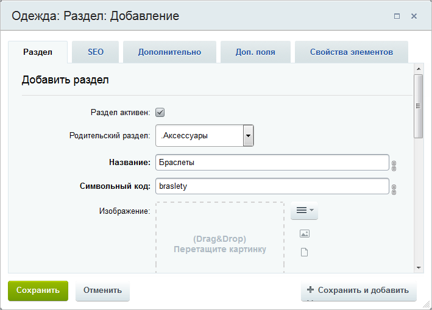
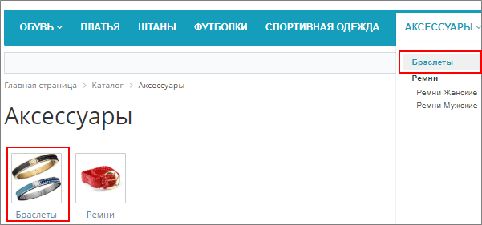
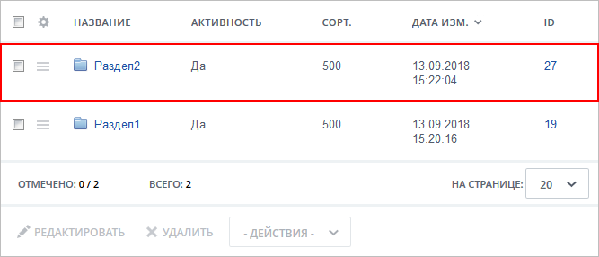
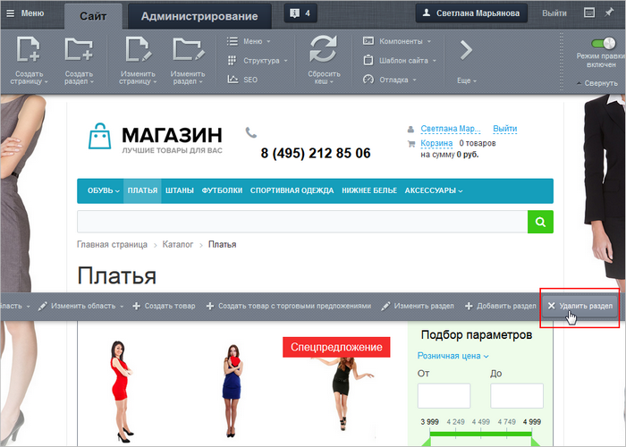
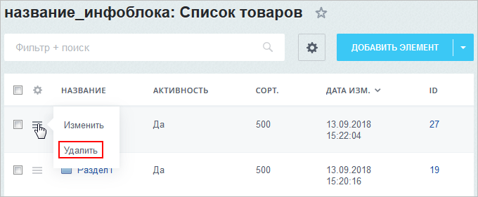
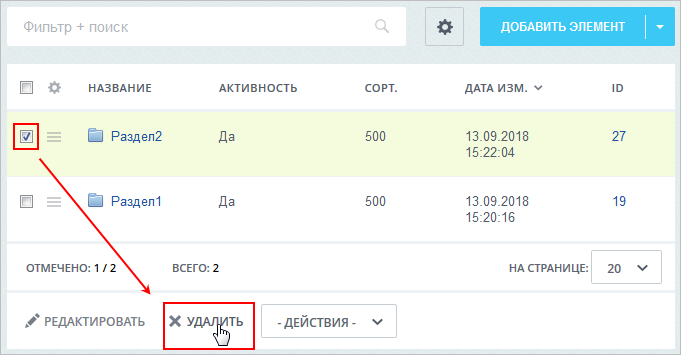
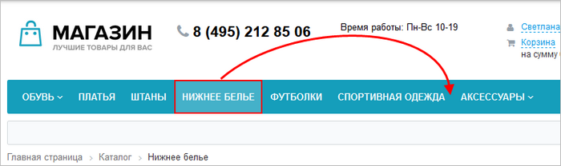
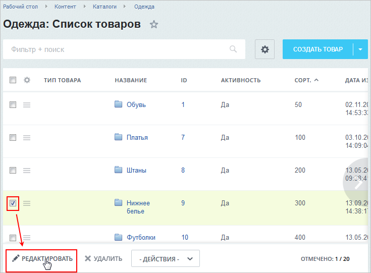
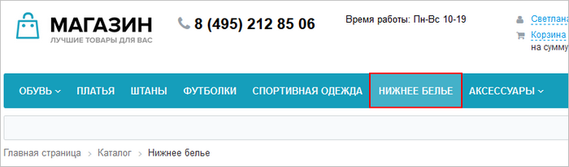

# Разделы: создание, расположение в меню, удаление

**Навигация**
- [← Оглавление курса](index.md)
- [← Предыдущий: 13032 — Практические задания](lesson_13032.md)
- [Следующий: 10131 — Элементы: создание, изменение, удаление →](lesson_10131.md)

Официальная страница урока: https://dev.1c-bitrix.ru/learning/course/index.php?COURSE_ID=34&LESSON_ID=10077

### Видеоурок

Посмотрите видеоролик о том, как создать, переместить в меню и удалить раздел инфоблока.

### Как добавить новый раздел в инфоблок?

#### Публичная часть сайта

Если Ваш инфоблок уже опубликован на сайте, добавляйте разделы прямо из публичной части сайта, не тратя время на поиски инфоблока в административном разделе:

1. Откройте на сайте каталог или раздел, в котором вам требуется добавить новый раздел (или подраздел);
2. Включите
  			режим правки
                      Режим Правки - специальный режим работы "1С-Битрикс: Управление сайтом", в котором
  происходит изменение информации на сайте.
  
  [Подробнее...](lesson_1832.md)
  		;
3. Наведите курсор мыши на содержимое каталога и нажмите
  			Добавить раздел
                      
  		 во всплывающем меню;
4. Заполните важные для вас поля в
  			форме редактирования раздела
                      
  		;
5. Сохраните настройки. Раздел добавится в
  			список разделов и в меню
                      
  		.

#### Административная часть сайта

Если инфоблок только создан и еще не опубликован на сайте, то разделы в него добавляйте из административной части сайта:

1. Откройте страницу инфоблока: Контент &gt; название_типа &gt; название_инфоблока (где вместо *название_типа*, *название_инфоблока* будут реальные названия вашего типа и инфоблока). Если требуется новый подраздел создать в уже имеющемся разделе, то дополнительно нажмите на название этого раздела;
2. Нажмите кнопку **Добавить раздел**:
  
3. Сохраните настройки. Раздел
  			добавится в список
                      
  		.

**Обратите внимание, что для формы создания раздела:**

- Значение каждого поля поясняется в [документации;](https://dev.1c-bitrix.ru/user_help/content/iblock/iblock_section_edit.php)
- Для проведения SEO настроек рекомендуется почитать урок
  			Настройка SEO информации;
  В данном уроке научимся работать с SEO данными для элементов и разделов инфоблока. Допустим, что у нас на сайте опубликован инфоблок Продукция, в котором уже заданы некоторые настройки SEO.
  Как вы знаете, шаблоны SEO данных могут быть настроены сразу для всего инфоблока. Но эти настройки можно переопределить (задать собственные) непосредственно для конкретного раздела или даже элемента.
  [Подробнее](lesson_6305.md)...
- Добавляемые в раздел изображения можно откорректировать с помощью
  			встроенного редактора.
  Делайте информацию в инфоблоках привлекательной, загружайте большое количество фотографий. При этом не нужно устанавливать специальное программное обеспечение, в инфоблоки встроен собственный редактор изображений.
  **Примечание:**инструмент загрузки и обработки изображений доступен с версии 15.5.1. Его можно использовать для картинок анонса , детальных картинок элемента, для фотографий, загружаемых в свойство типа Файл и для изображений раздела.
  [Подробнее](lesson_7243.md)...

### Как удалить раздел?

#### Публичная часть сайта

1. Перейдите в раздел, который следует удалить.
2. Включите режим правки.
3. Наведите курсор мыши на содержимое раздела и нажмите
  			Удалить раздел
                      
  		 во всплывающем меню.

#### Административная часть сайта

1. Откройте страницу инфоблока: Контент &gt; название_типа &gt; название_инфоблока (где вместо *название_типа*, *название_инфоблока* будут реальные названия вашего типа и инфоблока).
2. Для удаляемого раздела выберите
  			Удалить
                      
  		 в меню действий или отметьте раздел галочкой и внизу страницы нажмите
  			Удалить
                      
  		.

**Важно!** Независимо от способа удаления раздел удаляется вместе со всеми его элементами.

### Как переместить раздел в меню?

Иногда требуется пересортировать пункты в меню каталога. Например, расположить пункт **Нижнее белье** после пункта **Спортивная одежда**.

Для этого:

1. Откройте
  			административную часть
                      **Административный раздел** - раздел системы, недоступный для просмотра обычным посетителям сайта. В нём производятся настройки сайта и системы для работы.
  [Подробнее...](https://dev.1c-bitrix.ru/learning/course/index.php?COURSE_ID=34&CHAPTER_ID=04459&LESSON_PATH=3905.4455.4459)
  		 сайта.
2. Перейдите на страницу со списком разделов инфоблока.
3. Отметьте флагом раздел, который требуется переместить, и нажмите на
  			Редактировать
                      
  		 под таблицей.
4. Измените значение сортировки (чем меньше сортировка, тем выше по меню раздел будет показан). Так, для нашего примера значение сортировки раздела **Нижнее белье** установим больше значения сортировки раздела **Спортивная одежда**, но меньше значения для раздела **Аксессуары**.
5. Сохраните настройки. Раздел переместится в меню:
  

### Заключение

Вы познакомились с тем, как выполнять операции с разделами инфоблока в публичной и административной частях сайта:

- Для создания раздела нажимайте **Добавить раздел** и заполняйте поля формы;
- Для удаления - используйте **Удалить раздел**;
- Для изменения расположения раздела в меню - настройте значение сортировки.

### Дополнительно

- Пользовательская документация:

  - [Разделы информационного блока](https://dev.1c-bitrix.ru/user_help/content/iblock/iblock_section_admin.php?clear_cache=Y)
  - [Создание и редактирование раздела инфоблока](https://dev.1c-bitrix.ru/user_help/content/iblock/iblock_section_edit.php)
- [Редактор изображений в элементах инфоблока](lesson_7243.md)
- [Настройка SEO информации](lesson_6305.md)
