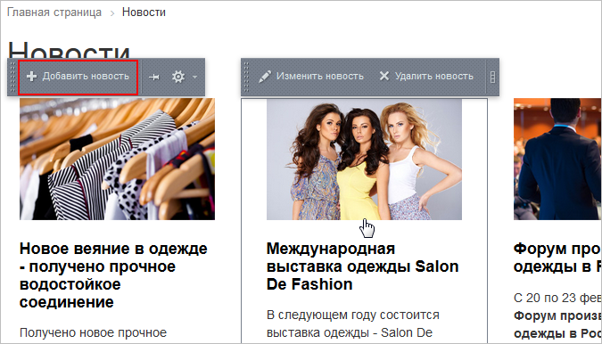
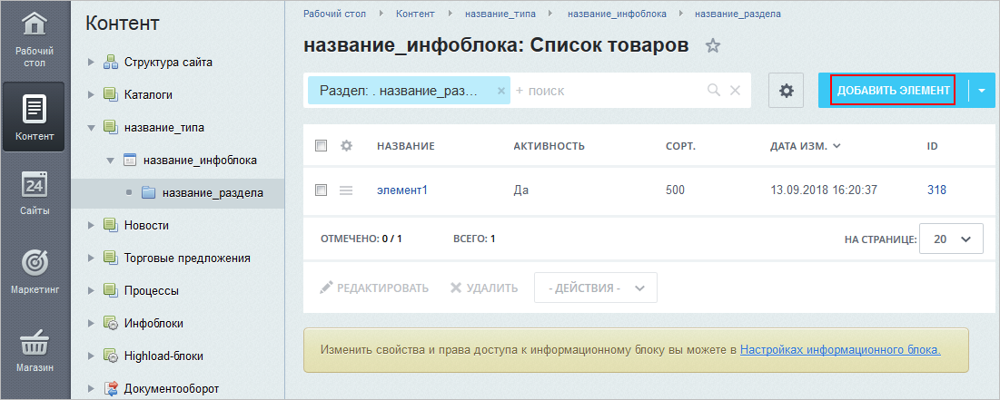
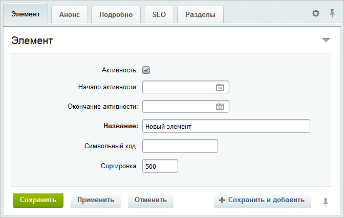
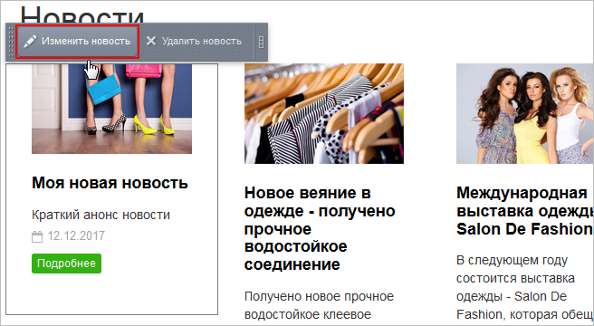
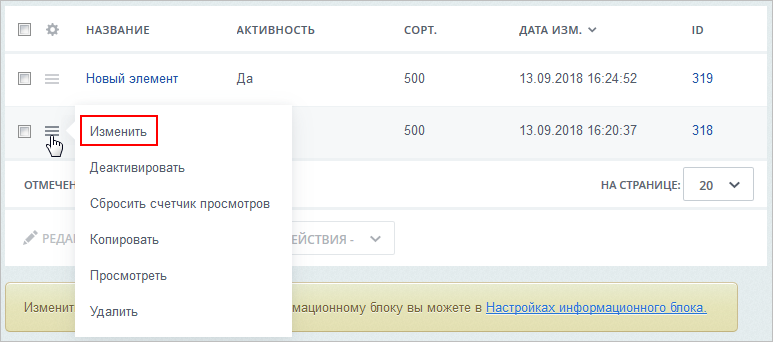
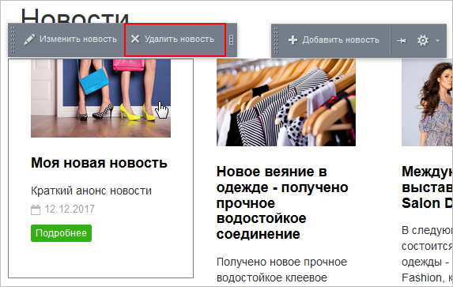
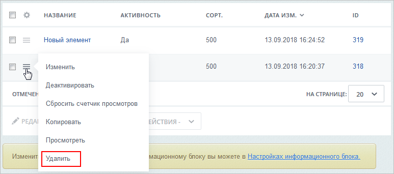

# Элементы: создание, изменение, удаление

**Навигация**
- [← Оглавление курса](index.md)
- [← Предыдущий: 10077 — Разделы: создание, расположение в меню, удаление](lesson_10077.md)
- [Следующий: 7243 — Редактор изображений в элементах инфоблока →](lesson_7243.md)

Официальная страница урока: https://dev.1c-bitrix.ru/learning/course/index.php?COURSE_ID=34&LESSON_ID=10131

### Видеоурок

Посмотрите видеоролик о том, как создать, изменить и удалить элемент инфоблока в публичной и административной частях сайта.

### Как создать новый элемент инфоблока?

Следуйте инструкциям на схеме и расширяйте контент вашего сайта: публикуйте статьи, добавляйте товары и новости.

|  | **1****.** Материалы вашего инфоблока уже показываются на сайте? |  |
| --- | --- | --- |
|  |  |  |
| **2.** На сайте откройте любую страницу с материалами из вашего инфоблока. |  | **2.** Перейдите в  административный раздел **Административный раздел** - раздел системы, недоступный для просмотра обычным посетителям сайта. В нём производятся настройки сайта и системы для работы.  
 [Подробнее...](https://dev.1c-bitrix.ru/learning/course/index.php?COURSE_ID=34&CHAPTER_ID=04459&LESSON_PATH=3905.4455.4459) сайта. |
| **3.** Включите  режим правки Режим Правки - специальный режим работы "1С-Битрикс: Управление сайтом", в котором
 происходит изменение информации на сайте.   [Подробнее...](lesson_1832.md) и наведите курсор мыши на  содержимое страницы  . |  | **3.** Откройте страницу Контент &gt; название_типа &gt; название_инфоблока или (если элемент добавляете в раздел)  *Контент &gt; название_типа &gt; название_инфоблока &gt; название_раздела*  . |
|  | **4.** Нажмите **Добавить *элемент***. 
 			 (вместо слова *элемент* может быть *новость*, *товар* и т.п.) |  |
|  |  |  |
|  | **5.** Заполните поля в  форме редактирования элемента  .  
 
 ## Важные моменты при заполнении полей формы - значение каждого поля поясняется в [документации](https://dev.1c-bitrix.ru/user_help/content/iblock/iblock_element_edit.php); - форма может быть   			настроена под вас                        При работе с товарами, материалами статей, каталогами справочников вы зачастую обращаете   							 внимание на следующий момент: в форме присутствуют поля, которые не используются на сайте.   							 Лишние поля увеличивают размеры формы редактирования и затрудняют внесение данных.   							 Облегчите свой труд, используйте инструмент настройки форм инфоблоков. Инструмент учитывает   							 индивидуальные потребности, позволяет настроить формы редактирования разделов и   							 элементов инфоблока под себя:   - удаляйте лишние поля или целые вкладки;   - перемещайте поля между вкладками;   - создавайте свои вкладки.    [Подробнее](lesson_1883.md)...   		 и иметь отличный от по умолчанию вид; - настройки SEO можно пропустить, чаще всего они выполняются отдельно (рекомендуется почитать урок   			Настройка SEO информации                        В данном уроке научимся работать с SEO данными для элементов и разделов инфоблока. Допустим, что у нас на сайте опубликован инфоблок Продукция, в котором уже заданы некоторые настройки SEO.   							 Как вы знаете, шаблоны SEO данных могут быть настроены сразу для всего инфоблока. Но эти настройки можно переопределить (задать собственные) непосредственно для конкретного раздела или даже элемента.    [Подробнее](lesson_6305.md)...   		; - добавляемые в элемент изображения можно откорректировать с помощью   			встроенного редактора.                        Делайте информацию в инфоблоках привлекательной, загружайте большое количество фотографий. При этом не нужно устанавливать специальное программное обеспечение, в инфоблоки встроен собственный редактор изображений.   							 Примечание: инструмент загрузки и обработки изображений доступен с версии 15.5.1. Его можно использовать для картинок анонса , детальных картинок элемента, для фотографий, загружаемых в свойство типа Файл и для изображений раздела.    [Подробнее](lesson_7243.md)... |  |
|  |  |  |
|  | **6.** Сохраните введенную информацию. Элемент добавится в общий список. |  |

**Примечание:** если вы добавляете новый товар, то дополнительно почитайте главу

			Наполнение каталога товарами.

                     Товары в каталог добавляются либо вручную, либо "оптом", через импорт. При первичном заполнении каталога предпочтительнее импорт, а вот добавлять новые товары в уже существующий каталог приходится вручную, через административный или публичный раздел, как удобнее.

 [Подробнее](https://dev.1c-bitrix.ru/learning/course/index.php?COURSE_ID=34&CHAPTER_ID=06462&LESSON_PATH=3905.4478.6462)...

Создание элементов возможно и через инструмент

			Документооборот.

                     Решим задачу организации документооборота на сайте на примере новостного блока, когда на каждом этапе за новость отвечают определенные группы пользователей. Контент-менеджеры сайта создают и редактируют новости, корректоры - правят созданные сообщения, а публикацию новостей выполняют администраторы интернет-магазина.

 [Подробнее](https://dev.1c-bitrix.ru/learning/course/index.php?COURSE_ID=34&CHAPTER_ID=03834&LESSON_PATH=3905.4753.5305.3834)...

### Как отредактировать элемент инфоблока?

Представьте, что вам требуется внести правки в информацию элемента инфоблока, например, откорректировать текст новости или поправить описание товара. Выбирайте способ редактирования на свой вкус. Система предлагает два варианта:

1. Из публичного раздела:

  - На сайте откройте страницу вашего элемента.
  - Включите
    			режим правки
                        Режим Правки - специальный режим работы "1С-Битрикс: Управление сайтом", в котором
    происходит изменение информации на сайте.
    
    [Подробнее...](lesson_1832.md)
    		.
  - Наведите курсор мыши на информацию элемента и нажмите
    			Изменить элемент
                        
    		 (вместо слова *элемент* может быть *новость*, *товар* и т.п.).
  - В открывшейся форме внесите необходимые правки в текст, картинки.
  - Сохраните изменения.
2. Из административного раздела:

  - Откройте страницу Контент &gt; название_типа &gt; название_инфоблока &gt; название_раздела (переходить в раздел требуется только в том случае, если элемент расположен в разделе).
  - Для элемента выберите
    			Изменить
                        
    		 в меню действий.
  - В открывшейся форме внесите необходимые правки в текст, картинки.
  - Сохраните изменения.
    **Примечание**: Вы можете
    			отредактировать
                         Чтобы быстро отредактировать несколько элементов, отметьте их в колонке флажков и нажмите кнопку **Редактировать**.
     [Подробнее](lesson_11767.md#edit)...
    		 сразу несколько элементов, отметив их в списке.

### Как удалить элемент инфоблока?

Удаляйте элемент наиболее удобным для вас способом:

1. Из публичного раздела:

  - На сайте откройте страницу с элементом, который следует удалить.
  - Включите режим правки.
  - Наведите курсор мыши на информацию элемента и нажмите
    			Удалить элемент
                        
    		 (вместо слова *элемент* может быть *новость*, *товар* и т.п.).
2. Из административного раздела:

  - Откройте страницу Контент &gt; название_типа &gt; название_инфоблока &gt; название_раздела (переходить в раздел требуется только в том случае, если элемент расположен в разделе).
  - Для удаляемого элемента выберите
    			Удалить
                        
    		 в меню действий.

**Примечание.** При удалении элементов информационных блоков также удаляются загруженные в них картинки и файлы.

### Заключение

Итак, вы познакомились с тем, как выполнять операции с элементами инфоблока:

- чтобы создать элемент - нажимайте **Добавить элемент** и заполняйте поля формы;
- чтобы внести правки в материалы - нажимайте **Изменить элемент** и корректируйте информацию;
- чтобы удалить - используйте **Удалить элемент**.

### Документация по теме

- [Создание и редактирование элемента инфоблока](https://dev.1c-bitrix.ru/user_help/content/iblock/iblock_element_edit.php)
- [Элементы информационного блока](https://dev.1c-bitrix.ru/user_help/content/iblock/iblock_element_admin.php)
