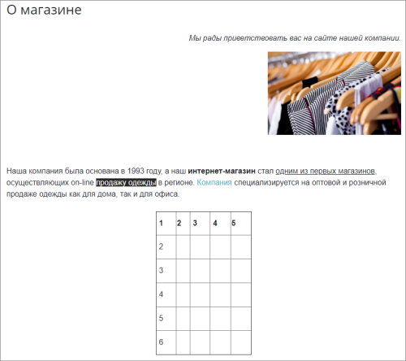

# Практические задания

**Навигация**
- [← Оглавление курса](index.md)
- [← Предыдущий: 10187 — Проверьте себя](lesson_10187.md)
- [Следующий: 1992 — Что такое компоненты →](lesson_1992.md)

Официальная страница урока: https://dev.1c-bitrix.ru/learning/course/index.php?COURSE_ID=34&LESSON_ID=10193

После изучения главы рекомендуем выполнить несколько практических заданий.


### Практические задания

Практические задания состоят из вопроса, скриншота или видео с конечным результатом и объяснением, как это получить в спойлере. Не торопитесь подглядывать в спойлер. 

1. В практическом задании № 3 к главе Управление структурой мы
  			создали новую страницу
  Вспомним, как мы это делали:
  - Урок [Создание физических страниц](lesson_1911.md);
  - Задание № 3 в [Практических заданиях](lesson_10231.md);
  - Видео [линейное задание 13](https://www.youtube.com/watch?v=oQC9G9zg79w).
  		 с названием **Тест** и произвольным текстом.
  			Отредактируйте
                      Например, таким образом:
  
  		 эту страницу (*или создайте новую, если не сохранились результаты прошлых заданий*) следующим образом:
  ## Решение
  **Задание составлено по материалам уроков:**
  - [Где используется редактор](lesson_9201.md)
  - [Форматирование текста](lesson_9235.md)
  - [Как работать со ссылками](lesson_9241.md)
  - [Как работать с таблицами](lesson_9239.md)
  - [Как загрузить и разместить изображение](lesson_9247.md)
  **Результат:**


  1. Вставьте абзац произвольного текста и отформатируйте произвольные слова:

    - выделите жирным;
    - подчеркните;
    - измените цвет и фон текста.
  2. Добавьте заголовок текста в стиле **Заголовок 3**;
  3. Задайте в тексте ссылку на сайт http://1c-bitrix.ru/ с любого слова;
  4. Добавьте ещё строку текста, выделите курсивом и отформатируйте её по правому краю;
  5. Разместите на странице произвольное изображение, загруженное с локального компьютера и установите для него масштаб 30%;
  6. Создайте таблицу из 5 столбцов и 6 строк:

    - Задайте для таблицы ширину и высоту: 200х300;
    - Верхнюю строку сделайте заголовком;
    - Выравнивание: по центру;
    - Введите любые данные в ячейки таблицы.
2. Создайте сниппет и разместите его на странице. Код сниппета:
  ```
  <table cellspacing=0 cellpadding=0>
    <tbody>
      <tr bgcolor="white">
      <td bgcolor="#8C8C8C">
      <table cellspacing="1" cellpadding="5">
            <tbody>
              <tr bgcolor="silver"><td colspan="2"><b>Заголовок таблицы</b> </td></tr>
              <tr bgcolor="white"> <td><b>1</b></td> <td>2</td> </tr>
              <tr bgcolor="#EEEEEE"> <td><b>3</b></td> <td>4</td> </tr>
             </tbody>
           </table>
               </td></tr>
     </tbody>
  </table>
  ```
  ## Решение
  **Задание составлено по материалам урока:**
  - [Внешний вид редактора](lesson_6301.md#snippets)
  **Результат:**


### Где выполнять задания?

Демонстрационную версию с пробным периодом в 30 дней вы можете установить на свой компьютер или на хостинг. Подробная информация о настройке каждого варианта представлена в уроке [Где практиковаться и выполнять задания](lesson_26638.md).

**Примечания:**

1. Настоятельно рекомендуем **НЕ** выполнять задания на работающем, «боевом» сайте.
2. Если вы всё же пытаетесь выполнять задания на работающем сайте, где вы не являетесь администратором, то не все задания можно выполнить.


Для получения сертификата после изучения главы нужно пройти четвёртый тест (из шести) [Контент-менеджер. Визуальный редактор](https://dev.1c-bitrix.ru/learning/course/index.php?COURSE_ID=34&TEST_ID=39).
