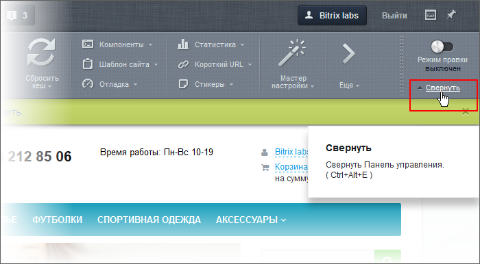
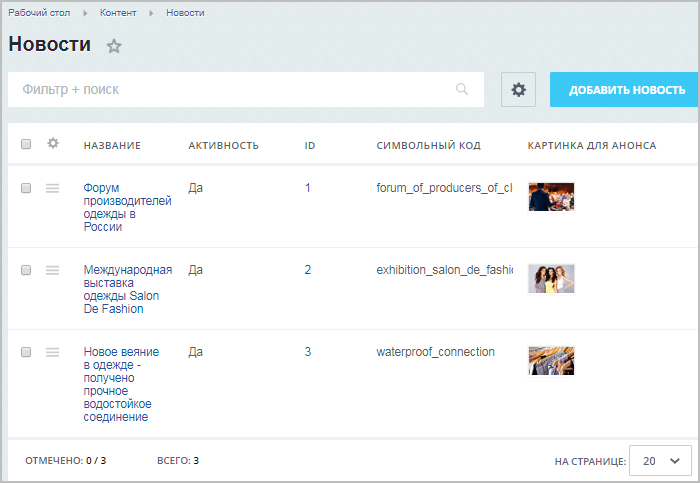

# Практические задания

**Навигация**
- [← Оглавление курса](index.md)
- [← Предыдущий: 10181 — Проверьте себя](lesson_10181.md)
- [Следующий: 3397 — Статическая и динамическая информация →](lesson_3397.md)

Официальная страница урока: https://dev.1c-bitrix.ru/learning/course/index.php?COURSE_ID=34&LESSON_ID=10217

После изучения главы рекомендуем выполнить несколько практических заданий.

### Практические задания

Практические задания состоят из вопроса, скриншота или видео с конечным результатом и объяснением, как это получить в спойлере. Не торопитесь подглядывать в спойлер. 

1. Найдите два способа перейти из публичной части сайта в административный отдел для редактирования своего профиля.
  ## Способы перехода
  **Задание составлено по материалам урока:**
  - [Панель управления](lesson_1831.md)
  **Результат:**

2. Уменьшите Панель управления и освободите место на экране монитора для самого сайта.
  ## Решение
  **Задание составлено по материалам урока:**
  - [Панель управления](lesson_1831.md)
  				 Воспользуйтесь командой **Свернуть**:
  
  Либо дважды кликните по панели управления левой кнопкой мыши.
3. Найдите сколько компонентов размещено на главной странице демо сайта?
  ## Ответ
  **Задание составлено по материалам урока:**
  - [Режим правки](lesson_1832.md)
  				 29 компонентов. Как найти:

4. Найдите самый быстрый способ (в 2 клика мышкой) перейти из публичной части к списку валют в Административном отделе.
  ## Решение
  **Задание составлено по материалам урока:**
  - [Панель управления](lesson_1831.md)
  **Результат:**

5. Увеличьте в Административном отделе место Рабочей области.
  ## Решение
  **Задание составлено по материалам урока:**
  - [Меню функций](lesson_2735.md)
  **Результат:**

6. Найдите самый быстрый способ перейти к настройкам инфоблока из списка элементов инфоблока.
  ## Решение

7. Измените вид списка элементов инфоблока новостей с настроек по умолчанию до
  			такого вида
                      
  		. И сделайте экспорт списка в файл Excel.
  ## Решение
  **Задание составлено по материалам уроков:**
  - [Настройка списка элементов (новый интерфейс)](lesson_11801.md)
  - [Экспорт в MS Excel](lesson_5067.md)
  **Результат:**

### Где выполнять задания?

Демонстрационную версию с пробным периодом в 30 дней вы можете установить на свой компьютер или на хостинг. Подробная информация о настройке каждого варианта представлена в уроке [Где практиковаться и выполнять задания](lesson_26638.md).

**Примечания:**

1. Настоятельно рекомендуем **НЕ** выполнять задания на работающем, «боевом» сайте.
2. Если вы всё же пытаетесь выполнять задания на работающем сайте, где вы не являетесь администратором, то не все задания можно выполнить.

Для получения сертификата после изучения главы нужно пройти первый тест (из шести) [Контент-менеджер. Элементы управления](https://dev.1c-bitrix.ru/learning/course/index.php?COURSE_ID=34&TEST_ID=29).
