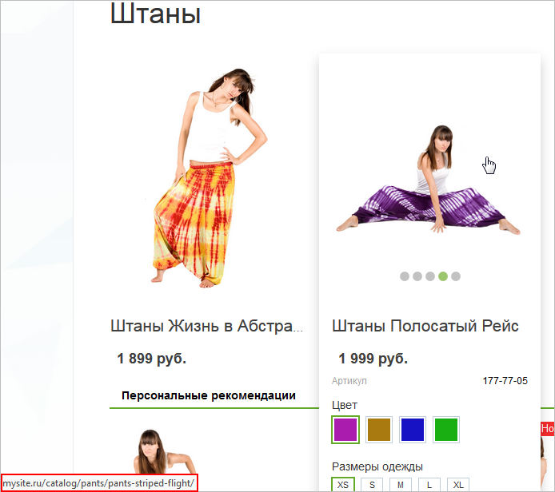
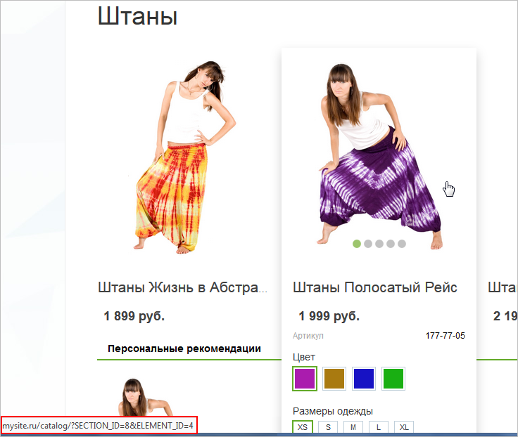
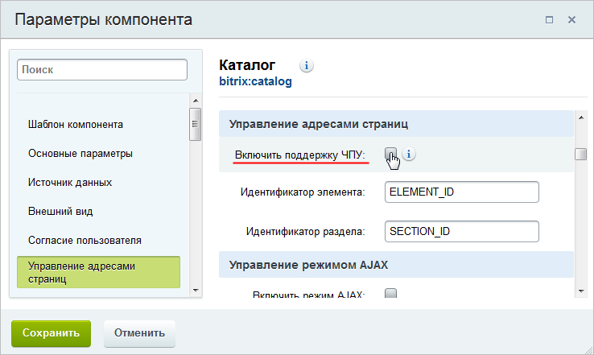
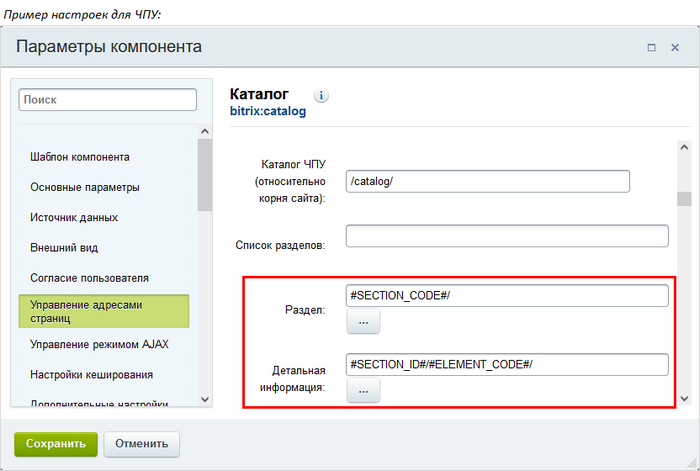
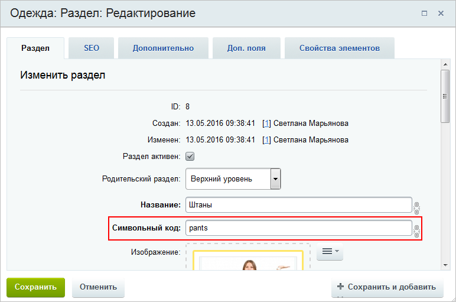
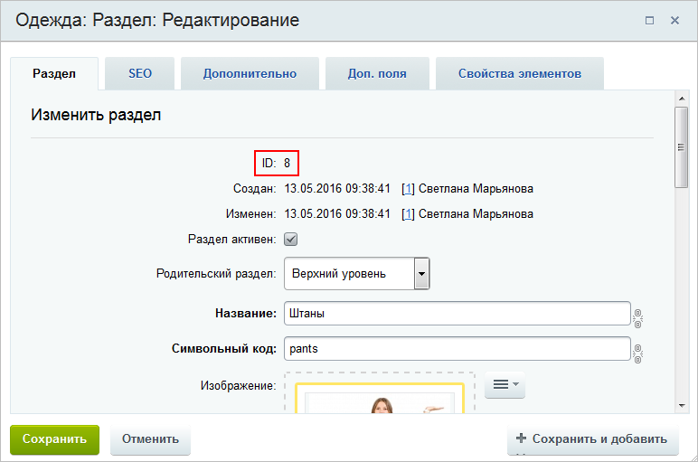
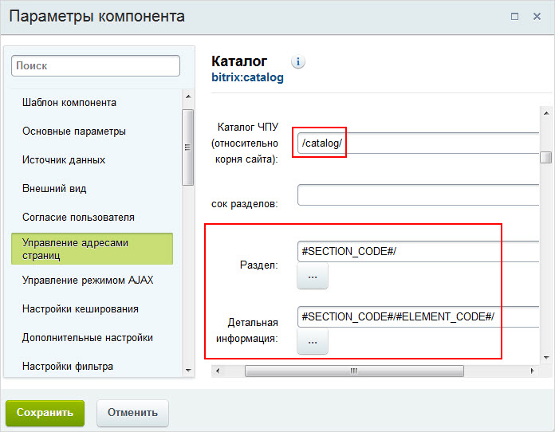

# ЧПУ: делаем адреса понятными

**Навигация**
- [← Оглавление курса](index.md)
- [← Предыдущий: 2335 — Настройки инфоблока для корректного поиска элементов](lesson_2335.md)
- [Следующий: 5319 — Вложенные ЧПУ: формируем полные адреса →](lesson_5319.md)

Официальная страница урока: https://dev.1c-bitrix.ru/learning/course/index.php?COURSE_ID=34&LESSON_ID=10233

### ЧПУ: делаем адреса понятными

Согласитесь, что ссылка на некий элемент инфоблока

			http://mysite.ru/catalog/pants/pants-striped-flight/

                    

		 гораздо понятнее посетителям, чем

			http://mysite.ru/catalog/?SECTION_ID=8&ELEMENT_ID=4

                    

		. Весомым аргументом в пользу человеко-понятных адресов является и то, что такие адреса лучше воспринимаются поисковыми машинами.

Сделайте красивые адреса для элементов инфоблока вместе с поддержкой

			ЧПУ

Средства *«1С-Битрикс: Управление сайтом»* позволяют сделать ссылки более понятными с помощью специальной функции. Функция встроена во все комплексные компоненты (и отдельные простые) и преобразует стандартный веб-адрес в так называемый человеко-понятный URL (сокращенно ЧПУ).

[Подробнее](lesson_3579.md)...

		 в компонентах:

1. Откройте на
  			редактирование
  В режиме правки наведите мышь на область компонента, появится панель настроек. Выберите пункт **Редактировать параметры компонента**. Откроется форма настройки.
  
  [Подробнее](lesson_9165.md)...
  		 параметры компонента, который используется для вывода материалов инфоблока.
2. В секции **Управление адресами страниц** отметьте опцию
  			Включить поддержку ЧПУ
                      
  		.
3. Задайте настройки для ЧПУ:
  
  	 Если такие настройки не выполнять, то адрес страницы элементов всего лишь изменит вид с http://mysite.ru/catalog/?SECTION_ID=8&ELEMENT_ID=4 на http://mysite.ru/catalog/8/4/.

  - При наличии разделов в инфоблоке в поле **Раздел** (или **Страница раздела**) замените **#SECTION_ID#/** на **#SECTION_CODE#/**. Построение ссылки будет выполняться с помощью
    			символьного кода раздела
                        
    		, а не его
    			идентификатора
                        
    		.
    		 Если разделов нет, то оставьте поле пустым.
  - В поле **Страница детального просмотра** измените **#SECTION_ID#/#ELEMENT_ID#/** на **#SECTION_CODE#/#ELEMENT_CODE#/** в случае наличия разделов.
    		 Если разделов нет, то просто замените **#ELEMENT_ID#** на **#ELEMENT_CODE#**.
4. Сохраните настройки компонента.
5. Для всех разделов и элементов инфоблока заполните поле
  			Символьный код
                      
  		.
  **Примечание:** если поле **Символьный код** не показывается в форме раздела и/или элемента, то выполните
  			настройку форм.
  Настройка формы выполняется только из административной части сайта.
  Если собираетесь настроить форму редактирования элемента, то откройте страницу со списком
  элементов инфоблока. Если же нужно настроить форму раздела, то страницу со списком разделов.
  Откройте на редактирование любой элемент (или раздел соответственно). В правой части формы нажмите на «шестеренку»  . Откроется окно с настройками
  [Подробнее](lesson_1883.md)...
  		 Кроме того, [настройте](/learning/course/index.php?COURSE_ID=34&LESSON_ID=1912") обязательность заполнения поля **Символьный код** и вы не будете забывать указывать код при создании новых разделов и элементов. Дополнительно можете включить
  			автогенерацию кода
                      
  		 из названия раздела/элемента путем транслитерации.
  Настоятельно рекомендуется сделать настройки символьных кодов **ДО** добавления разделов/элементов в инфоблок. Так как для того, чтобы прописать символьные коды в уже добавленных разделах/элементах, придется открывать каждый элемент и транслитерировать название вручную.
6. В форме инфоблока выполните
  			настройку адресов
  Посетители пользуются формой поиска на сайте, чтобы максимально быстро найти требуемую информацию. Но они не увидят подробную информацию по найденным элементам, если настройки инфоблока выполнены некорректно. Не огорчайте клиентов, настройте пути к страницам инфоблока правильно.
  В форме редактирования инфоблока укажите правильные пути к просмотру элемента инфоблока и раздела (если используются).
  [Подробнее](lesson_2335.md)...
  		 так, как меняли для компонента.

Теперь адреса страниц на материалы инфоблока имеют удобный читабельный вид.

### Пример настройки ЧПУ в новостном инфоблоке

### Важно запомнить!

**Обратите внимание!** При настройке ЧПУ значения в полях **Раздел** и **Детальная информация** должны различаться по уровню вложенности или способу формирования ссылок.

Если ссылки на разделы и элементы будут иметь одинаковый вид http://сайт.ru/catalog/символьный_код/, то возникнет конфликт - компонент не сможет определить, открывать ему по ссылке раздел или элемент.

Поэтому в настройках адресов должен быть

			разный уровень

                    

		 вложенности. А если уровень вложенности нужен одинаковый, то используйте префиксы (или постфиксы) при формировании ссылок. Например, в поле **Раздел** укажите `section-#SECTION_CODE#/`, а в поле **Детальная информация** - `detail-#ELEMENT_CODE#/`.

### Заключение

Для настройки человеко-понятных адресов необходимо:

- включить поддержку ЧПУ в компоненте;
- задать настройки ЧПУ для страниц и разделов;
- задать символьные коды для страниц и разделов.
