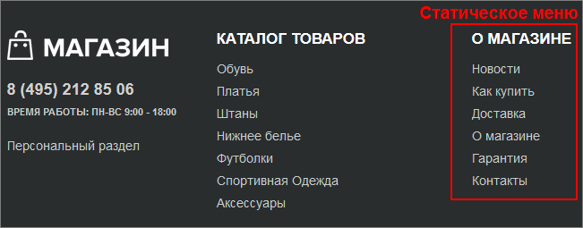
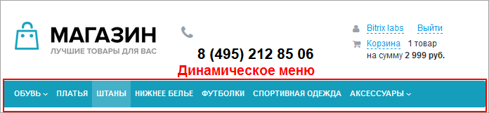
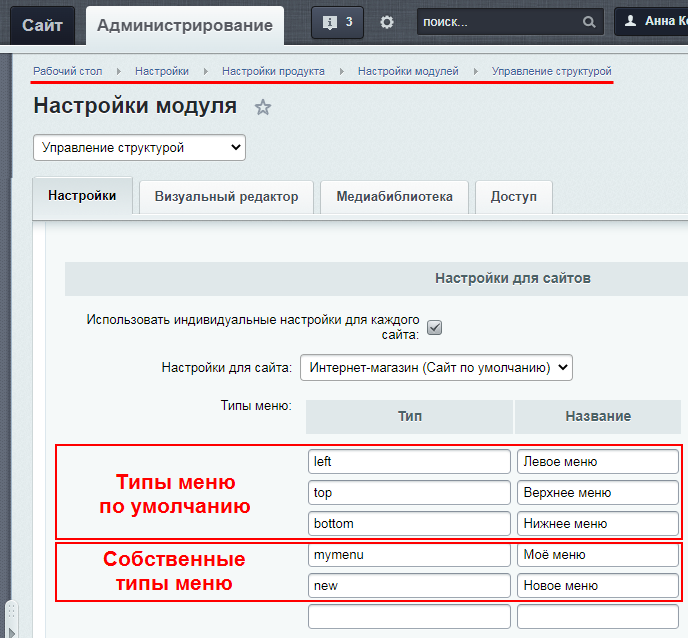

# Виды и типы меню

**Навигация**
- [← Оглавление курса](index.md)
- [← Предыдущий: 10269 — Средства навигации на сайте](lesson_10269.md)
- [Следующий: 26240 — Компоненты и файлы меню →](lesson_26240.md)

Официальная страница урока: https://dev.1c-bitrix.ru/learning/course/index.php?COURSE_ID=34&LESSON_ID=10239

Разработка эффективного, то есть заметного, красивого, понятного и логичного меню — важнейшая задача контент-менеджера. *«1С-Битрикс: Управление сайтом»* позволяет быстро создавать и редактировать различные варианты меню. В видеоролике демонстрируются общие принципы работы с меню.

### Видеоурок

### Виды меню

Как вы уже знаете, в *"1С-Битрикс: Управление сайтом"* информация делится на два вида —

			статическую

                    Статическая информация - это информация, которая редко меняется с течением времени. Например, рекламные тексты, история компании, контактная информация. Статическая информация создается и редактируется вручную. [Подробнее...](https://dev.1c-bitrix.ru/learning/course/index.php?COURSE_ID=34&CHAPTER_ID=01848&LESSON_PATH=3905.4461.1848)

		 и

			динамическую

                    Динамическая информация - информация, хранимая в Базе Данных сайта и выводимая специальными компонентами системы. Как правило, это - часто изменяемая информация со множеством свойств. [Подробнее...](https://dev.1c-bitrix.ru/learning/course/index.php?COURSE_ID=34&CHAPTER_ID=01848&LESSON_PATH=3905.4461.1848)

		. Статическая вводится непосредственно на странице сайта, меняется редко и вручную. Динамическая размещается с помощью программного кода, меняется автоматически в зависимости от изменений в источнике данных — инфоблоке. Кроме того, эти два типа информации

			отличаются

                    	Изучите общее и отличия для двух типов информации. Понимание разницы между ними позволяет быстрее и оптимальнее решать задачи по наполнению сайта. Общее у обоих типов то, что редактирование в обоих случаях происходит одинаково: в Визуальном редакторе. А вот различий намного больше...

[Подробнее ...](lesson_9141.md)

		 способами хранения, вывода и обработки.

Таким же образом и меню может быть статическим, динамическим или смешанным, т.е. содержать как динамические, так и статические пункты.

Какое меню вы будете создавать, зависит от ваших целей, того, что вы хотите в нём видеть.

Если вы хотите получить **меню, из которого можно переходить в разделы или на страницы сайта** — делайте **статическое**. Добавьте в меню названия разделов и страниц, пропишите ссылки на соответствующие файлы и папки из физической

			структуры

                    **Физическая структура** - это порядок размещения

физических файлов в папках сайта на сервере.
 В том числе файлов с программным кодом.

Мы рекомендуем
работать с физической структурой с большой осторожностью.

Вы можете повредить системные файлы и всё сломается:).

		 сайта и всё. Это очень просто и является несомненным плюсом статического меню.

Например, вы решили, что для главного меню хватит пунктов Новости, Как купить, Доставка, О магазине, Гарантия, Контакты:

Клик по какому-либо из пунктов переведет посетителя на соответствующую страницу сайта, где ему будет продемонстрирована информация в виде текстов, изображений, ссылок, фрагментов карты и т.п.

Но что, если в будущем нужно будет актуализировать меню — пунктов не хватит или появится новый раздел, новый файл в структуре? Кроме создания самой физической страницы, Вам придется вручную добавлять в меню новый пункт и ссылку на него. А в случае горизонтального меню может случиться, что добавляемый пункт не поместится на страницу по ширине — тогда придется переделывать верстку. Это, конечно, недостаток статического меню.

Если же вам нужно **меню, которое будет автоматически меняться при изменении и добавлении информации в каталог** товаров, услуг, статей, мероприятий — используйте **динамическое**. Клик по пункту меню будет переводить пользователя на раздел или элемент каталога. При этом, если раздел содержит несколько элементов, то вам не нужно создавать для каждого из них физическую страницу и хранить их в виде файлов. Страница будет сформирована программным кодом в момент обращения к ней. И значит, будет содержать актуальную информацию, а вам не придется следить за этим или вообще что-то менять в публичной части.

Например, на рисунке ниже не нужно будет создавать отдельный пункт в меню и страницу для каждого товара, когда в ассортименте магазина появится домашняя одежда:

Возможно также, что вы захотите совместить в одном меню разные типы информации. Например, перечень услуг вашей компании и контактную информацию. Контактная информация меняется редко, а вот услуги со временем могут появиться новые или какие-то больше не будут востребованы.

Такой вариант тоже возможен. Настройте компонент меню на вывод инфоблока услуг, и добавьте к нему статические пункты.

> **Примечание.** Перечисленные варианты меню (динамическое, статическое, смешанное) предоставляют очень широкие возможности и покрывают подавляющую часть потребностей контент-менеджера. Но если вам всё-таки нужно что-то очень оригинальное (например, вывести одним компонентом меню данные из нескольких
>
> 			Инфоблоков
>
>
>
>                     Информационный блок (или Инфоблок) – специальный инструмент "1С-Битрикс: Управление сайтом" с помощью которого заносится информация в Базу данных.
>  [Подробнее...](https://dev.1c-bitrix.ru/learning/course/index.php?COURSE_ID=34&CHAPTER_ID=04477&LESSON_PATH=3905.4477)
>
>
>
>
> 		 с
>
> 			разнородными товарами
>
>
>
>                     Например, вы торгуете одеждой и швейными машинами. У этих типов товаров будут совершенно разные характеристики (свойства). У одежды — размер, цвет, фасон, тип ткани. У швейных машин — тип челночного устройства, количество строчек, скорость работы, площадь рабочей зоны. Логично хранить эти *разнородные товары* в разных инфоблоках.
>
>
>
> 		), то вариантов решения задачи может быть несколько:
>
> - Еще раз тщательно продумать структуру сайта и инфоблоков. Возможно, стоит создать новый раздел сайта со своим оригинальным меню.
> - Попробовать задействовать
>   			Многосайтовость
>                       **Многосайтовость** — это возможность системы «1С-Битрикс: Управление сайтом» управлять разными сайтами из единой Панели управления.
>   [Подробнее...](/learning/course/index.php?COURSE_ID=103)
>   		 — разделить разные типы информации по разным сайтам.
> - Поискать похожие решения на [Маркетплейсе](https://marketplace.1c-bitrix.ru/).
> - Обратиться к разработчикам для [кастомизации шаблона](/learning/course/index.php?COURSE_ID=43&CHAPTER_ID=04778) того компонента, которым вы будете выводить ваше оригинальное меню.

### Типы меню

В разных

			шаблонах сайтов

**Шаблон дизайна** — это внешний вид сайта, в котором определяется расположение различных элементов на сайте, художественный стиль и способ отображения страниц.

[Подробнее](lesson_1994.md)...

		 могут быть разные предустановленные типы меню.

В текущем демонстрационном шаблоне интернет-магазина по умолчанию существует три типа меню:

- left  — левое (основное)
- top —  верхнее
- bottom — нижнее

При этом использовать эти типы меню вы можете в разных частях сайта. Название типа меню никак не ограничивает его расположение на сайте. Например, в демо-решении в подвале сайта вы увидите два меню: одно из них имеет тип «Нижнее меню» (bottom), а другое — тип «Левое меню» (left).

А для поклонников оригинальности и креативности в системе не ограничивается число типов меню. Вы можете создать свой собственный тип в административном разделе на странице настроек модуля **Управление структурой** (Настройки &gt; Настройки продукта &gt; Настройки модулей &gt; Управление структурой).

Вы можете задать типы меню отдельно для каждого сайта с помощью опции **Использовать индивидуальные настройки для каждого сайта**.

Тип меню, заданный в настройках модуля **Управления структурой**, будет использован в названии файла с

			шаблоном меню

                    **Шаблон компонента** - программный код, преобразующий данные, подготовленные компонентом, непосредственно в HTML-код. [Подробнее...](/learning/course/index.php?COURSE_ID=43&LESSON_ID=2829)

		 (например, **top.menu_template.php**), а также для определения файлов с пунктами меню (например, **.top.menu.php**). Кроме того, имя типа меню используется для подключения меню в шаблоне сайта.

### Заключение

- Меню может быть различного вида - статическое, динамическое или смешанное.
- Статическое меню подключает файлы и папки физической структуры сайта, динамическое меню подключает разделы и элементы инфоблока.
- Можно использовать разные типы меню и создавать собственные.
- Меню может выводиться в публичной части разными компонентами.
- Любое меню является иерархически наследуемым.

### Документация по теме

- [Редактирование меню](https://dev.1c-bitrix.ru/user_help/content/fileman/fileman/fileman_menu_edit.php)
