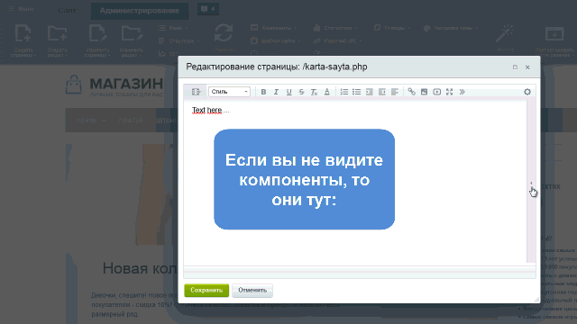
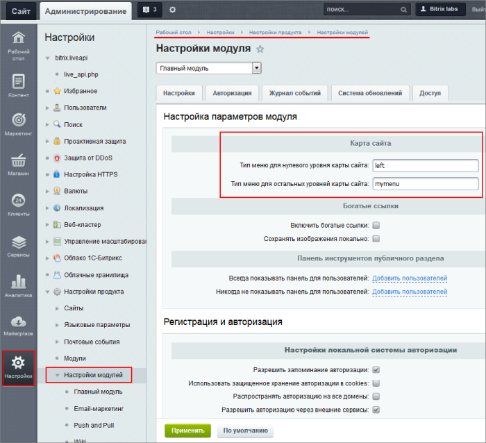
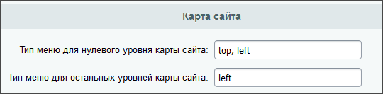

# Карта сайта

**Навигация**
- [← Оглавление курса](index.md)
- [← Предыдущий: 26246 — Примеры создания динамического меню](lesson_26246.md)
- [Следующий: 1863 — Цепочка навигации →](lesson_1863.md)

Официальная страница урока: https://dev.1c-bitrix.ru/learning/course/index.php?COURSE_ID=34&LESSON_ID=10243

В этом уроке мы расскажем, как визуализировать структуру сайта при помощи инструмента **Карта сайта**. Задача такой карты — помочь пользователям с навигацией и поиском на сайте.

Информацию о карте сайта для поисковых систем вы найдете в уроке [Генерация файла карты сайта](https://dev.1c-bitrix.ru/learning/course/index.php?COURSE_ID=139&LESSON_ID=5816) учебного курса «Продвижение сайта и маркетинг».

### Видеоурок

**Карта сайта** — это отдельная страница, на которой содержатся ссылки на все остальные разделы и страницы в иерархическом порядке. С неё возможен переход в любую точку сайта за минимальное число переходов. Главные задачи карты сайта:

- Предоставление посетителю доступа к любой странице за один-два клика.
- Обеспечение первенства сайта в
  			поисковой выдаче
                      Хорошо организованная карта облегчает создание индексных страниц для поисковых роботов
  		.

Посмотрите, как быстро создать в *«1С-Битрикс: Управление сайтом»* полноценную карту сайта:

### Создание карты сайта

Создавайте карту сайта в *«1С-Битрикс: Управление сайтом»* с помощью специального компонента

			Карта сайта

                    С помощью данного компонента осуществляется показ карты сайта.

						[Описание компонента «Карта сайта» в пользовательской документации.](http://dev.1c-bitrix.ru/user_help/detail.php?ID=63457)

		:

- Создайте отдельную страницу
- Разместите на ней компонент
                      
- Настройте его параметры
                      Основными являются **максимальный уровень вложенности** (до какого уровня иерархии меню будет углубляться карта) и **количество колонок**, в которых она будет размещена

По умолчанию Карта сайта

			строится

                    Карта строится на основе меню, используемых в системе. Типы меню указываются в настройках главного модуля, раздел Карта сайта (Настройки &gt; Настройки продукта &gt; Настройки модулей &gt; Главный модуль).

[Подробнее ...](/learning/course/index.php?COURSE_ID=43&CHAPTER_ID=04708)

		 на [типе меню](lesson_10239.md#types) `top`. Меняйте тип меню, на котором следует строить карту,  в **Административном разделе** в

			настройках Главного модуля

                     

		. Если в карте должно быть использовано несколько меню —

			перечислите их через запятую

                    

		.

В результате опубликованная карта сайта выглядит так:

|  | #### Как в карту сайта включить разделы, не входящие в меню |
| --- | --- |

Обычно для этого требуется кастомизация шаблона компонента, но есть и другой вариант: сделайте для этих разделов

			свой тип меню

                    Таким же образом решается проблема **повторов** разделов в карте. Просто создайте своё меню!
[Подробнее](lesson_10239.md)...

		 и добавьте его через запятую в настройках **Главного модуля** в опции типов меню карты сайта.

### Заключение

- Карта сайта важна не только для посетителей, но и для поисковых роботов, чтобы продвигать сайт в выдаче.
- Есть специальный компонент для создания карты сайта.
- Выбирайте разные типы меню для разных уровней карты сайта.
