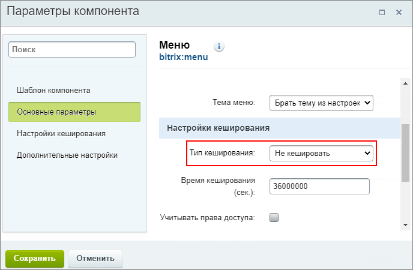

# Пример создания статического меню

**Навигация**
- [← Оглавление курса](index.md)
- [← Предыдущий: 26242 — Наследование](lesson_26242.md)
- [Следующий: 26246 — Примеры создания динамического меню →](lesson_26246.md)

Официальная страница урока: https://dev.1c-bitrix.ru/learning/course/index.php?COURSE_ID=34&LESSON_ID=10247

Рассмотрим разницу между статическим и динамическим меню на примерах.

### Еще раз о разнице между статическим и динамическим меню

Давайте повторим: статическая информация - это папки (разделы) и файлы (страницы) в структуре сайта, динамическая информация - это

			инфоблоки

                    Информационный блок (или Инфоблок) – специальный инструмент "1С-Битрикс: Управление сайтом" с помощью которого заносится информация в Базу данных.
 [Подробнее...](https://dev.1c-bitrix.ru/learning/course/index.php?COURSE_ID=34&CHAPTER_ID=04477&LESSON_PATH=3905.4477)

		.

Значит, статическое меню:

- Использует файлы и папки из структуры сайта
- Пункты доступны для редактирования
- Файл **.тип_меню.menu_ext.php** не подключается

А динамическое меню:

- Основано на инфоблоке
- Его пункты не видны при редактировании
- В настройках
  			компонента
                      Компонент – это программный код, оформленный в визуальную оболочку, выполняющий определённую функцию какого-либо модуля по выводу данных в Публичной части. Мы можем вставлять этот блок кода на страницы сайта без непосредственного написания кода. [Подробнее...](https://dev.1c-bitrix.ru/learning/course/index.php?COURSE_ID=34&CHAPTER_ID=04457)
  		 указано использование файла **.тип_меню.menu_ext.php**

Как мы уже знаем из [видео-ролика](lesson_10239.md#rolik) в предыдущем уроке, основное меню нашего сайта - динамическое, имеет горизонтальный шаблон, тип `left`, наследуется всеми разделами сайта.

### Создаем статическое меню

Разместим на нашем демо-сайте статическое меню:

- создаем новый раздел Мода;
- в административном разделе в папке `/moda` создаем пустой файл **.left.menu_ext.php**, чтобы основное динамическое меню не показывалось в нашем разделе;
- в разделе Мода создаем и наполняем содержимым несколько страниц;
- статическое меню формируется автоматически, если при создании страниц будет отмечена опция "Добавить пункт меню";
- отключаем использование
  			кеша
                      Кеш - это некое хранилище для ускорения просмотра информации на сайте. Когда пользователь просматривает информацию на сайте, то она не всегда запрашивается из базы данных, а берется из кеша.
  [Подробнее...](lesson_3270.md)
  		 для того, чтобы компонент меню обновлялся сразу при изменении данных. Рекомендуем отключать кеш в настройках самого
  			 компонента меню
                      Материал о работе с компонентами Вы ещё не изучали. Если такая настройка покажется Вам
  сложной,  можете вернуться к ней позже.
  Подробнее в уроке [Как настроить компонент](lesson_9165.md).
  
  		, т.к. функция **Не использовать кеш** работает для всего сайта.

В результате мы получаем статическое меню в нашем разделе Мода, а на всех остальных страницах сайта по-прежнему работает основное динамическое меню.

### Документация по теме

- [Редактирование меню](https://dev.1c-bitrix.ru/user_help/content/fileman/fileman/fileman_menu_edit.php)
