# Создание курса

**Навигация**
- [← Оглавление курса](index.md)
- [← Предыдущий: 5140 — Основные понятия](lesson_5140.md)
- [Следующий: 11169 — Редактирование курса →](lesson_11169.md)

Официальная страница урока: https://dev.1c-bitrix.ru/learning/course/index.php?COURSE_ID=34&LESSON_ID=11167

Для создания курса "с нуля" нужно выполнить несколько несложных действий.

### Видеоурок

### Создание курса

Разберем эти действия по шагам:

1. Для начала необходимо выбрать (или
  			создать новый
  Новый раздел создается с помощью соответствующей кнопки **Создать раздел**. Все шаги по созданию
  раздела идентичны созданию страницы.
  
  [Подробнее](lesson_3450.md)...
  		) раздел, в котором будут размещаться наши учебные курсы. В этом разделе нужно
  			создать страницу
  Создать новую страницу можно и через Публичный раздел, и через Административный. В Публичном
  разделе есть удобный инструмент - Мастер создания новой страницы.
  Для создания страницы с помощью Мастера нажмите **Создать страницу**.
  
  [Подробнее](lesson_1911.md)...
  		, которая будет использоваться для вывода выбранного курса. Это вспомогательная страница, поэтому для неё не нужно создавать пункт меню. В нашем примере создадим страницу **kurs.php**.
  Скопируем часть URL созданной страницы от конца домена и заканчивая расширением файла php (понадобится в третьем действии).
  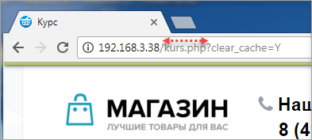
  URL необходимо копировать вместе со всеми промежуточными папками (
  			пример 1
                      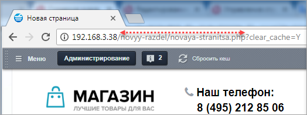
  		,
  			пример 2
                      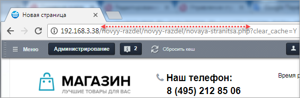
  		).
2. На созданной странице **kurs.php** разместим
  			компонент
                      Компонент – это программный код, оформленный в визуальную оболочку, выполняющий определённую функцию какого-либо модуля по выводу данных в Публичной части. Мы можем вставлять этот блок кода на страницы сайта без непосредственного написания кода. [Подробнее...](https://dev.1c-bitrix.ru/learning/course/index.php?COURSE_ID=34&CHAPTER_ID=04457)
  		 **bitrix:learning.course**. Обратите внимание, что в настройках компонента в пункте **Основные параметры** должен быть именно такой **Идентификатор курса**:
  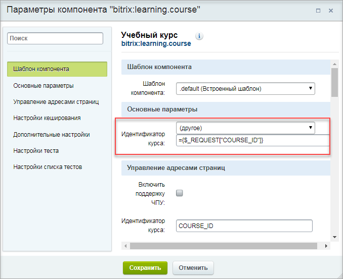
  Это нужно для того, чтобы одна физическая страница могла использоваться для отображения разных курсов.
  Не пугайтесь, когда увидите
  			сообщение о том, что курс не найден
                      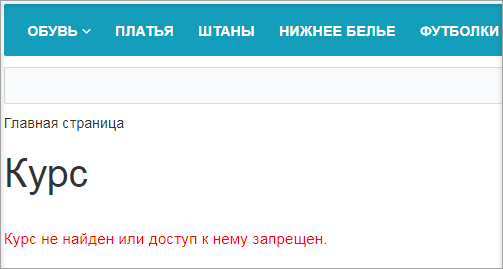
  		. После выполнения следующего шага эта ошибка исчезнет.
3. Далее необходимо выбрать страницу, на которой мы хотим разместить список курсов. Это может быть как специально созданная страница с личным пунктом меню, так и уже готовая страница с какой-либо информацией.
  На этой странице разместим компонент **bitrix:learning.course.list**. В настройках компонента в пункте
  			Шаблоны ссылок
                      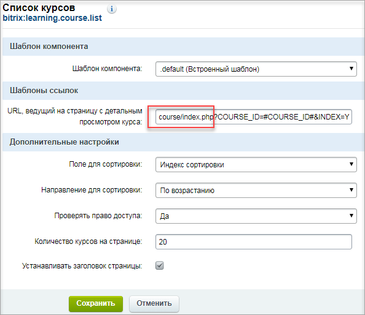
  		  замените `course/index.php` на URL страницы, созданной в первом пункте (в нашем примере это **kurs.php**). Должно получиться так:
  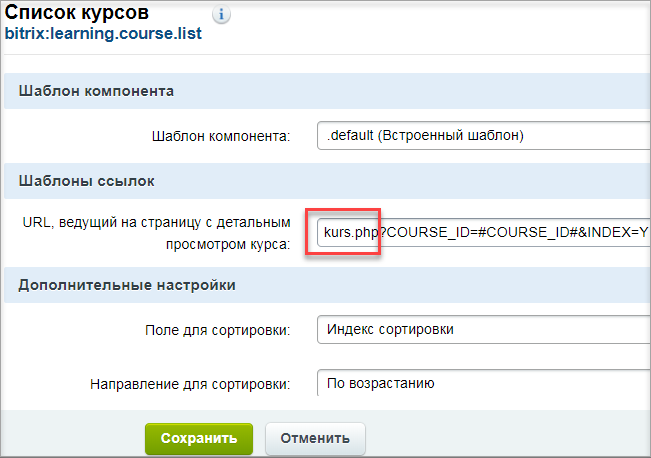
4. Следующий шаг - создание, собственно, самого курса. На странице со списком курсов наведем курсор на область компонента - высветится
  			меню
                      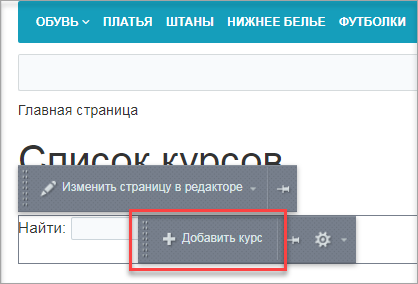
  		 возможных действий. Выбираем **Добавить курс**, откроется форма создания курса. Заполним ее:
  - На закладке
    			Курс
                        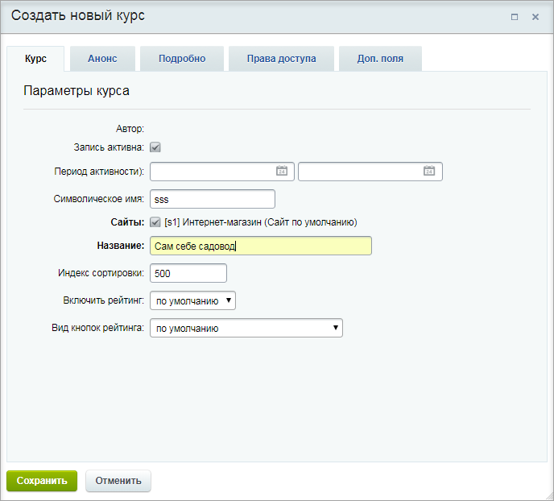
    		 зададим основные параметры учебного курса.
    На закладке
    			Анонс
                        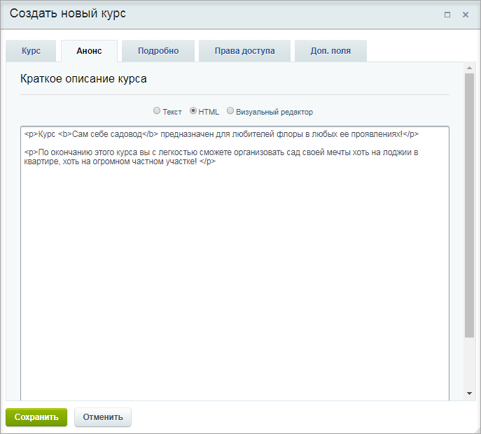
    		  задается описание для анонса курса, которое будет отображаться на странице со списком курсов.
    Подробное описание курса, которое будет отображаться на странице детального просмотра курса, задается на закладке
    			Подробно.
                        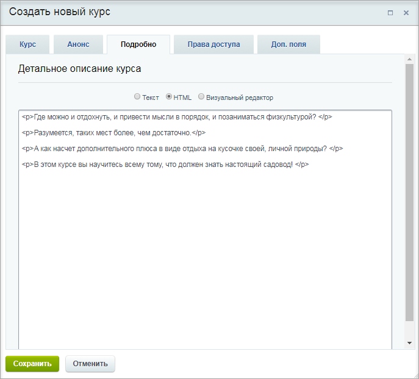
    **Примечание**: Для работы с анонсом и подробным описанием курса удобно использовать визуальный редактор. Подробнее о возможностях визуального редактора читайте [в отдельной главе](https://dev.1c-bitrix.ru/learning/course/index.php?COURSE_ID=34&CHAPTER_ID=06299&LESSON_PATH=3905.6299).
    На закладке
    			Права доступа
                         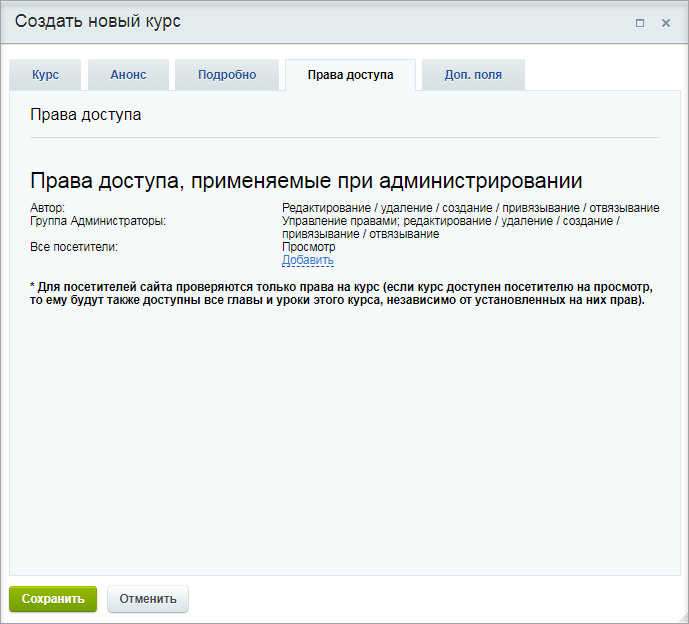
    		 выполняется настройка прав доступа пользователей и групп пользователей к курсу (подробную информацию об уровнях прав доступа смотрите в [документации по продукту](http://dev.1c-bitrix.ru/user_help/service/learning/learn_course_edit.php)).
    На закладке перечисляются пользователи и группы пользователей, для которых настроены права доступа к модулю **Обучение**. Эти записи отредактировать невозможно, поскольку права доступа на модуль перекрывают права доступа на курс. Таким образом, если пользователям и группам пользователей уже установлены права на модуль **Обучение**, то они обладают этими же правами доступа и на все курсы системы.
    Настройка прав доступа к курсу некоторым другим пользователям и группам пользователей выполняется с помощью ссылки
    			Добавить
                        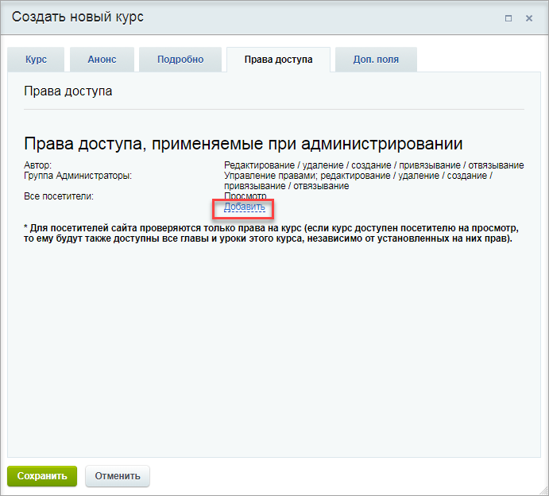
    		. При ее нажатии открывается
    			окно выбора пользователей и групп.
                         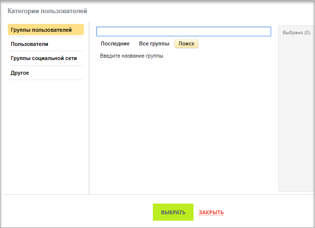
     Выберите пользователей или группы, для которых настраиваются права доступа, и задайте для них нужный уровень прав.
    **Примечание:** Обычно при создании курса доступ к нему предоставляется только для тех групп, участники которых и создают курс (чтобы обычные пользователи не видели "сырой" материал). А уже после того, как курс готов, его делают доступным для всех необходимых групп пользователей.
    Дополнительные поля для курса настраиваются на закладке
    			Доп. поля
                         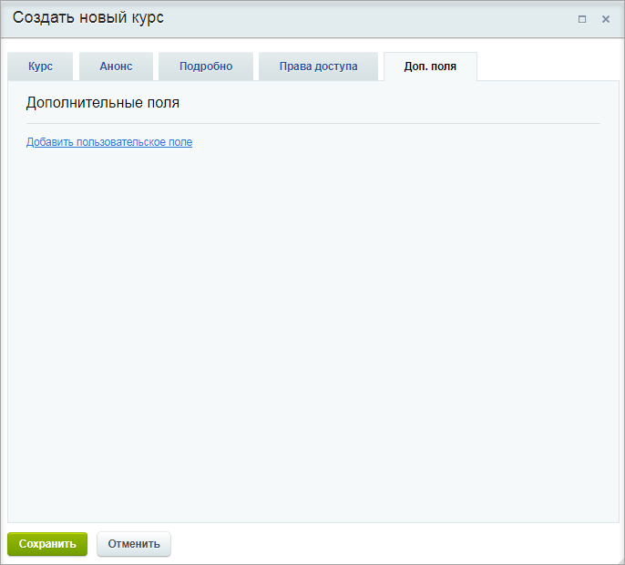
    		.  Здесь можно задать иконку для курса, добавить файлы к материалам курса, указать, за сколько дней предупреждать о закрытии курса и прекращать тестирование и т.д. (настраивает Администратор сайта).

**Важно!** Удалять курсы из Публичной части нельзя. Необходимо в Административной части (Сервисы &gt; Обучение &gt; Курсы ) найти требуемый курс в

			списке курсов

                     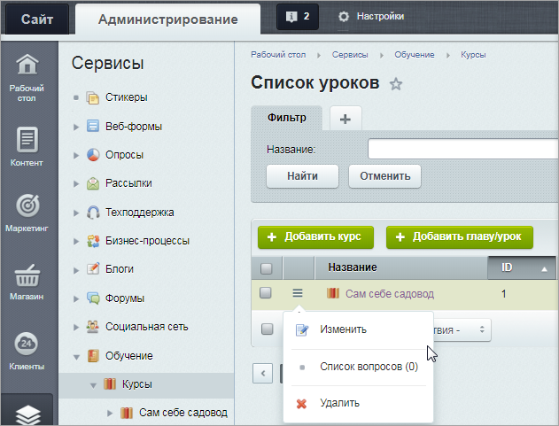

		 и в списке действий выбрать опцию **Удалить**.

Если курс был деактивирован, то результаты тестов и сертификаты по этому курсу будут недоступны пользователям. Если курс был удален, то результаты тестов и сертификаты этого курса будут также удалены.
