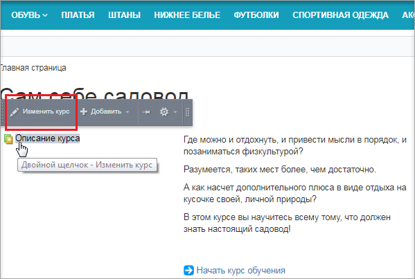
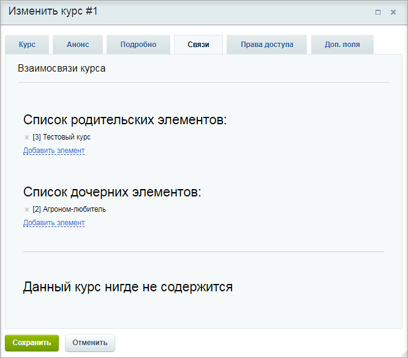
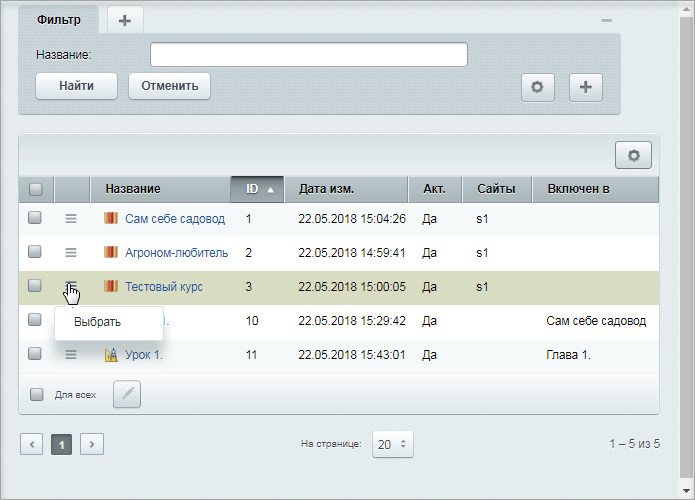

# Редактирование курса

**Навигация**
- [← Оглавление курса](index.md)
- [← Предыдущий: 11167 — Создание курса](lesson_11167.md)
- [Следующий: 11171 — Создание глав и уроков →](lesson_11171.md)

Официальная страница урока: https://dev.1c-bitrix.ru/learning/course/index.php?COURSE_ID=34&LESSON_ID=11169

### Видеоурок

### Редактирование и удаление курса

Для редактирования учебного курса пройдите на страницу с его содержанием, и при наведении курсора на поле с описанием во всплывающем меню выберите опцию **Изменить курс** (либо дважды кликните по области компонента).

Откроется форма редактирования, практически аналогичная форме создания (см. предыдущий урок). Единственное отличие - наличие закладки **Связи**.

 На данной закладке указываются все взаимосвязи курса: какие главы (уроки) из других курсов (а, может быть, и целый курс) содержатся в текущем курсе, а также включен ли этот курс в какой-нибудь другой курс/главу (в нашем примере курс "Сам себе садовод" включает в себя курс "Агроном-любитель", а сам включен в "Тестовый курс").

**Примечание:** курсы, главы и уроки могут быть как родительскими, так и дочерними элементами по отношению друг к другу.

По ссылке **Добавить элемент**, расположенной в списке родительских элементов, вы можете с помощью

			специального окна

                     

		  выбрать курс, к которому должен быть привязан текущий курс. По одноименной ссылке, но расположенной в списке дочерних элементов, вы можете привязать к курсу как любые главы и уроки из других курсов, так и целиком некоторый курс.
