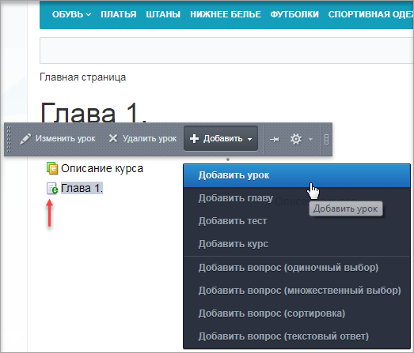
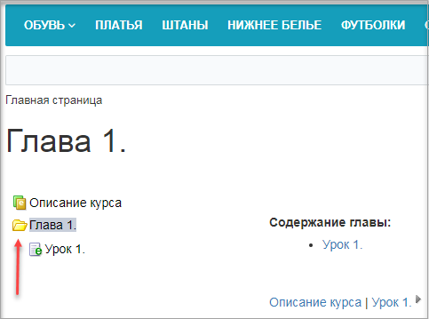
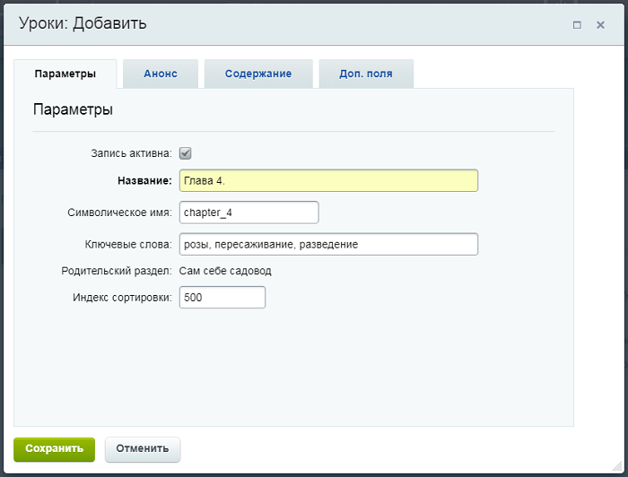
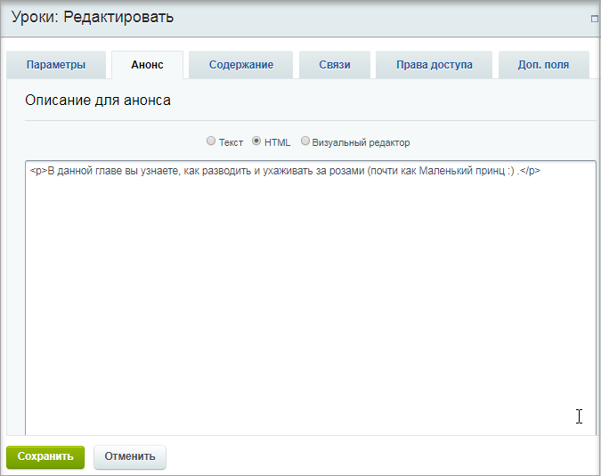
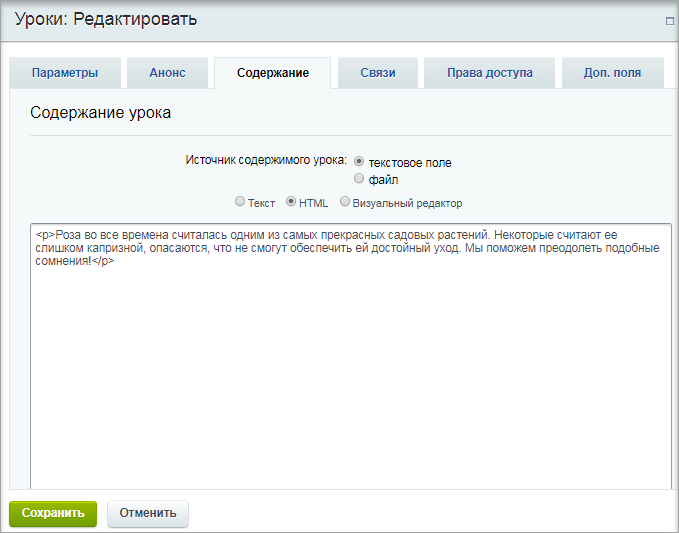
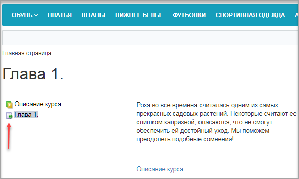
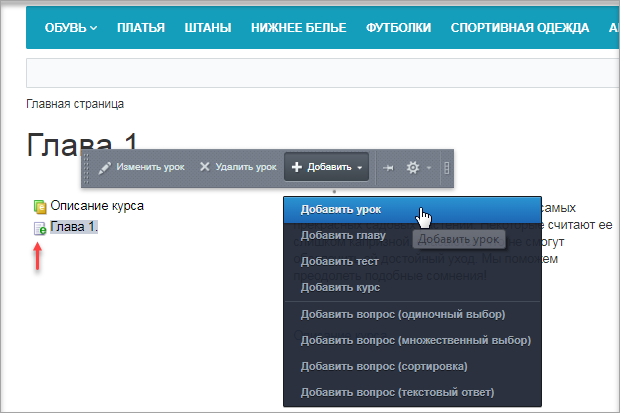
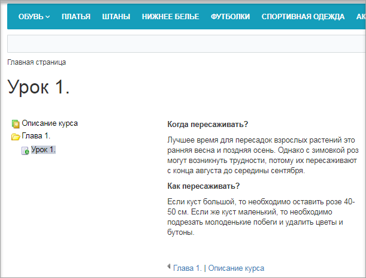
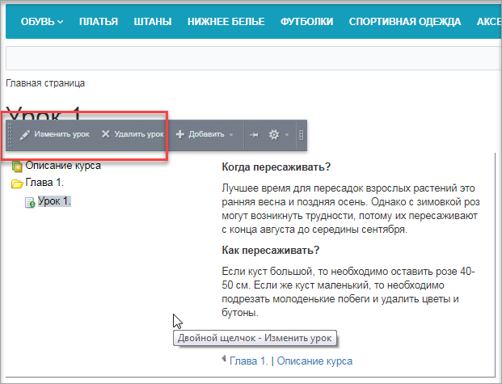

# Создание глав и уроков

**Навигация**
- [← Оглавление курса](index.md)
- [← Предыдущий: 11169 — Редактирование курса](lesson_11169.md)
- [Следующий: 11173 — Создание вопросов для тестов →](lesson_11173.md)

Официальная страница урока: https://dev.1c-bitrix.ru/learning/course/index.php?COURSE_ID=34&LESSON_ID=11171

### Видеоурок

### Создание глав и уроков

Когда создается

			новая глава

                     Созданная глава без вложенного урока (обратите внимание на значок слева от названия главы):

		, она технически является просто уроком. И только тогда, когда в нее будет добавлен хотя бы один урок, она становится

			полноценной главой

                     Созданная глава со вложенным уроком (обратите внимание на значок слева от названия главы):

 

		. Аналогично, если некоторый урок **А** сделать вложенным в урок **Б**, то урок **Б** становится главой. Если же из главы удалить единственный урок, то она сама превращается в урок.

**Примечание:** прежде, чем приступить к созданию главы (или урока), следует перейти в тот раздел курса, где она (он) должна находиться.

В качестве примера создадим главу в верхнем уровне:

1. Перейдите в раздел **Описание курса** и во всплывающем меню выберите **Добавить главу** (или **Добавить урок**, эти кнопки равнозначны);
  
2. В открывшейся форме заполните вкладки
  			Параметры
                       
  		,
  			Анонс
                       
  		 и
  			Содержание
                       
  		.
  После заполнения и сохранения внесенных данных наша глава выглядит как урок:
  
    А теперь добавим урок в созданную главу:
  - Перейдите в созданную Главу 1 и во всплывающем меню выберите
    			Добавить урок
                         
    		;
  - Создайте урок аналогично описанию в пункте 2.

После сохранения внесенных данных страница будет выглядеть так:

**Примечание:** редактировать или удалять главы и уроки очень просто: нужно кликнуть на название главы/урока и во всплывающем меню выбрать

			нужную опцию

                    
