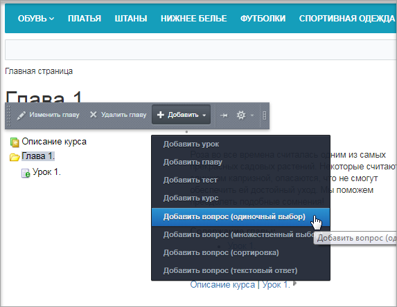
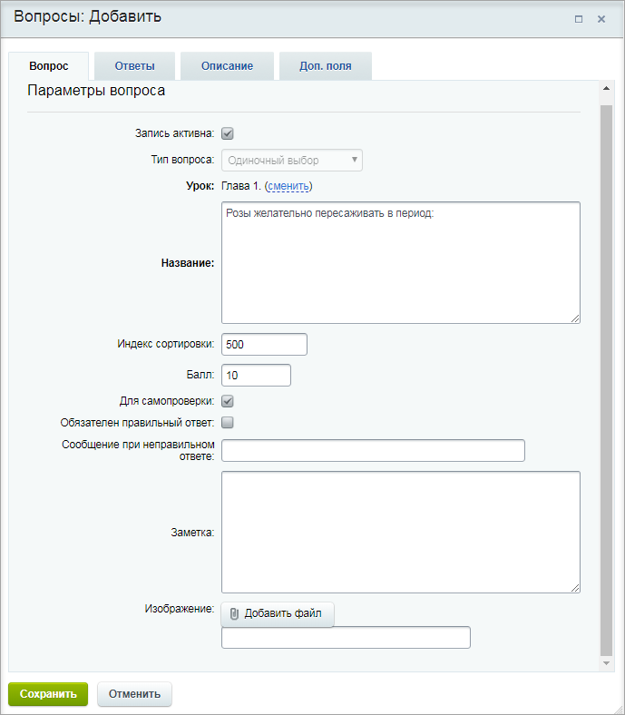
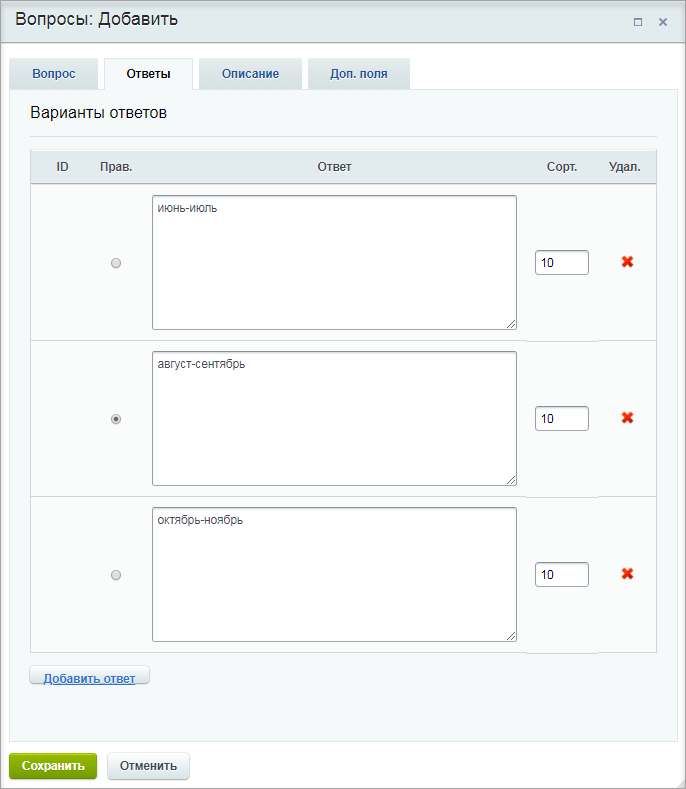
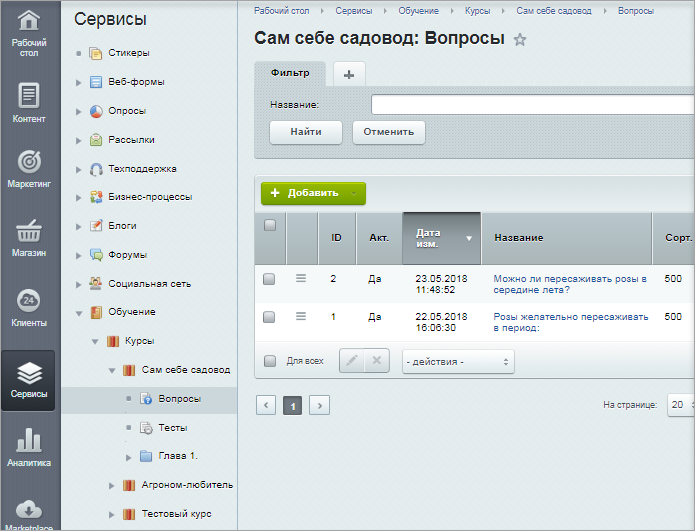
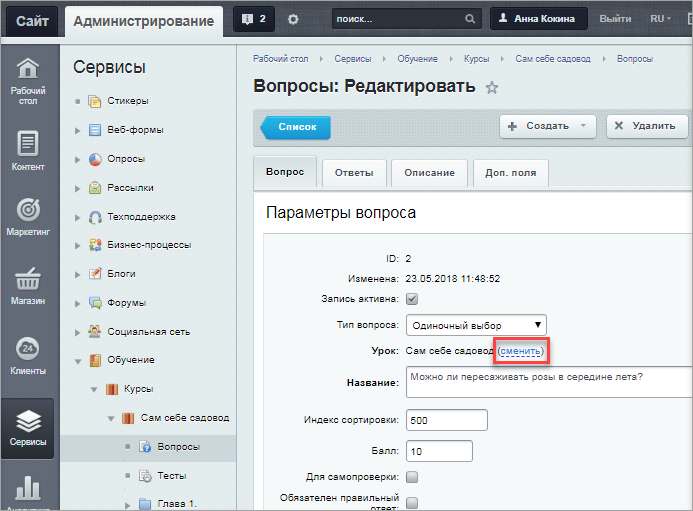
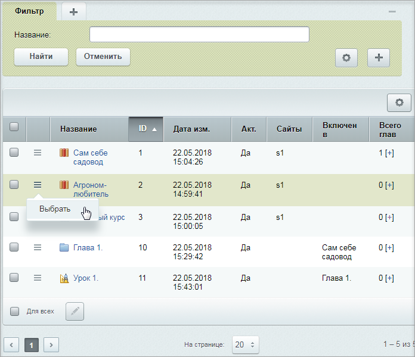
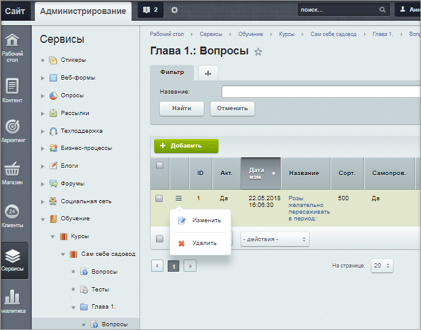

# Создание вопросов для тестов

**Навигация**
- [← Оглавление курса](index.md)
- [← Предыдущий: 11171 — Создание глав и уроков](lesson_11171.md)
- [Следующий: 11181 — Формирование теста для самопроверки →](lesson_11181.md)

Официальная страница урока: https://dev.1c-bitrix.ru/learning/course/index.php?COURSE_ID=34&LESSON_ID=11173

### Видеоурок

### Создание вопросов

В обучающем курсе есть возможность создать вопросы для двух типов тестов:

- тест для самопроверки
- итоговый тест

Вопросы создаются как самостоятельные объекты, которые можно включать в тот или иной тест. В данном уроке мы разберемся, как создавать вопросы.

Допустим, мы хотим создать вопрос по материалам Главы 1 нашего курса "Сам себе садовод":

1. Кликнем по Главе 1 и во всплывающем меню выберем
  			Добавить вопрос
                       
  		. Вопрос может быть одного из четырех типов:

  - **одиночный выбор** - в списке предложенных вариантов ответов может быть выбран только один ответ;
  - **множественный выбор** - в списке предложенных вариантов ответов может быть выбрано несколько ответов.
  - **сортировка** - в списке предложенных вариантов ответов необходимо расставить ответы в нужном порядке;
  - **текстовый ответ**- выводится текстовое поле для самостоятельного ответа обучаемым. Вопросы этого типа не проверяются системой, его должен оценить и отметить, как правильный, преподаватель. Для вопросов данного типа доступна возможность отправки письма с ответом преподавателю (т.е. автору урока). Эту опцию настраивает Администратор сайта.
2. Заполним поля на первой закладке:
  

  - Если требуется изменить привязку вопроса к уроку, то в поле **Урок** нажмите ссылку **сменить**. Откроется окно выбора главы/урока, к которому должен быть привязан ваш вопрос.
  - Если на вопрос обязательно нужен правильный ответ, то нужно отметить соответствующую опцию **Обязателен правильный ответ**. Тогда, если на этот вопрос не получен правильный ответ, то тест считается не пройденным (независимо от количества набранных баллов).
  - Также при неправильном ответе можно выводить сообщение, которое указывается в поле **Сообщение при неправильном ответе**.
  - К тексту вопроса можно добавить изображение с помощью кнопки **Добавить файл**.
3. Далее заполним поля закладки **Ответ**:
  
  Если необходимо добавить больше четырех ответов, то следует нажать кнопку **Добавить ответ** для добавления поля ответа.
  В поле **Сорт.** указываются порядок отображения ответов в вопросе (сортировка будет учитываться, если в тесте, в котором содержится данный вопрос, отключена опция **Случайный порядок ответов**).
  **Важно!** Не забудьте отметить правильный вариант (варианты) ответа.
  Для удаления ответа необходимо нажать кнопку  рядом с соответствующей записью.
4. На закладке **Описание** можно создать более подробное описание вопроса, а на закладке **Доп. поля** заполнить имеющиеся пользовательские поля или перейти к добавлению новых полей.

После сохранения вопрос будет добавлен в общий список всех вопросов урока/главы/курса. Просмотреть список созданных вопросов можно только в административной части (Сервисы &gt; Обучение &gt; Курсы &gt; Нужный курс &gt; Вопросы):

**Примечание**: редактировать вопросы можно как в административной части сайта (на странице Сервисы &gt; Обучение &gt; Курсы &gt; Нужный курс &gt; Вопросы), так и в публичной части, начав прохождение теста и включив

			режим Правки

Для включения режима нажмите на соответствующую кнопку:

После этого при наведении мыши на области страницы мы увидим всплывающую панель. Вид

этой панели зависит от той области, с которой мы работаем.

[Подробнее](lesson_1832.md)...

		.

Если при редактировании вопроса вам потребуется изменить его привязку, то в поле **Урок** нажмите ссылку

			сменить

                     

		. Откроется

			окно выбора

                    В данном примере мы отвязали вопрос от курса "Сам себе садовод" и привязали к курсу "Агроном-любитель":

		 курса/главы/урока, к которому(ой) вопрос должен быть привязан.

**Важно!** Удалять вопросы из Публичной части нельзя. Необходимо в Административной части (Сервисы &gt; Обучение &gt; Курсы &gt; Нужный курс &gt; Нужная глава &gt; Вопросы) найти требуемый вопрос в

			списке вопросов главы

                     

		 и в списке действий выбрать **удалить**.
