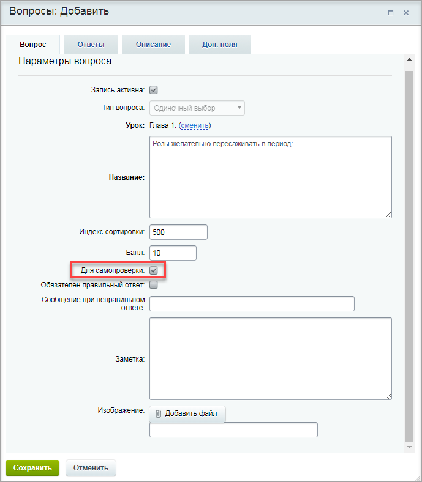
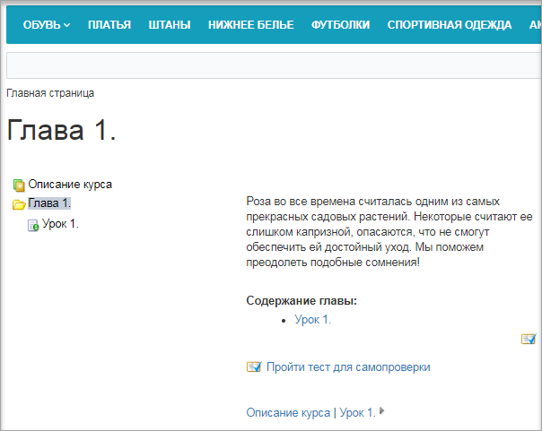

# Формирование теста для самопроверки

**Навигация**
- [← Оглавление курса](index.md)
- [← Предыдущий: 11173 — Создание вопросов для тестов](lesson_11173.md)
- [Следующий: 11193 — Создание итоговых тестов →](lesson_11193.md)

Официальная страница урока: https://dev.1c-bitrix.ru/learning/course/index.php?COURSE_ID=34&LESSON_ID=11181

|  | ### Формирование теста для самопроверки |
| --- | --- |

Тест для самопроверки создается (как это уже понятно из названия) с целью проверки обучающимся того, как он усвоил материал. Это не итоговая проверка знаний, а промежуточная, без сбора информации о прохождении конкретных пользователей. Такие тесты логичнее создавать для урока или главы, чтобы сперва изучить материал, а затем проверить свои знания.

Тест для самопроверки генерируется автоматически из [созданных вопросов](lesson_11173.md), если у них при создании было отмечено поле **Для самопроверки**.

Тест самопроверки генерируется автоматически и выглядит так:

**Важно!** Тест для самопроверки будет удален тогда, когда не останется ни одного вопроса с пометкой **Для самопроверки**.
