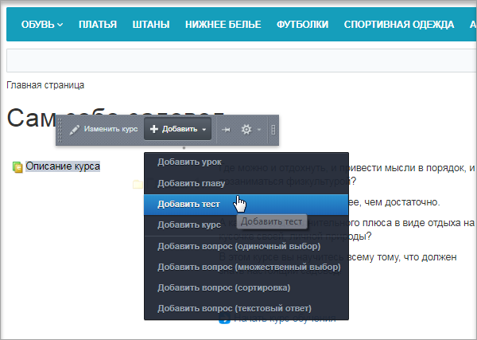
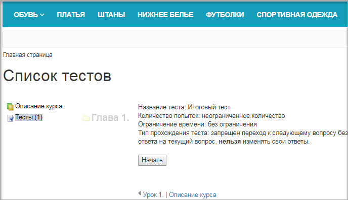
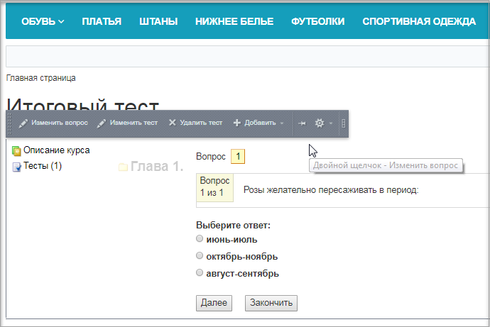

# Создание итоговых тестов

**Навигация**
- [← Оглавление курса](index.md)
- [← Предыдущий: 11181 — Формирование теста для самопроверки](lesson_11181.md)
- [Следующий: 26220 — Проверьте себя →](lesson_26220.md)

Официальная страница урока: https://dev.1c-bitrix.ru/learning/course/index.php?COURSE_ID=34&LESSON_ID=11193

|  | ### Создание итоговых тестов |
| --- | --- |

Итоговые тесты могут быть привязаны непосредственно к курсу, к главам или урокам курса, как и тесты для самопроверки. Главное отличие итоговых тестов от тестов для самопроверки в том, что вся информация об их прохождении строго фиксируется (количество попыток, число набранных баллов и т.д.).

**Примечание:**
	Если для публикации курса используется комплексный компонент

			Учебный курс

                    Комплексный компонент осуществляет полноценный вывод учебного курса. Компонент стандартный и входит в дистрибутив модуля.

						[Описание компонента «Учебный курс (комплексный компонент)» в пользовательской документации.](http://dev.1c-bitrix.ru/user_help/detail.php?ID=63239)

		 со стандартным

			шаблоном

                    

		, то страница со списком итоговых тестов будет расположена

			в конце основного курса

                    

		. Если же понадобится расположить её в другом месте (например, в конце главы или дочернего курса), то следует использовать простые компоненты раздела

			Обучение

                    Компонент выводит список активных тестов курса. Компонент является стандартным и входит в дистрибутив модуля.

						[Описание компонента «Список тестов» в пользовательской документации.](http://dev.1c-bitrix.ru/user_help/detail.php?ID=63250)

		, либо создавать собственный шаблон.

Создадим итоговый тест по всему курсу:

1. Кликнем по Описанию курса и во всплывающем меню выберем
  			Добавить тест
                       
  		.
2. В открывшейся форме зададим параметры теста. Параметры сгруппированы по назначению:
  

  1. Добавление вопросов в тест выполняется на основе параметров, указанных в поле **В тесте участвуют**. Уроки и подуроки могут быть выбраны из списка, только если они активны и в их параметрах не отмечена опция "Не публиковать".
  2. По умолчанию вопросы, участвующие в тесте для самопроверки, не включаются в проверочный тест. Чтобы включить данные вопросы в тест, нужно отметить соответствующую опцию.
  3. Настройки теста позволяют определить порядок вывода вопросов и ответов на них.
  4. Возможно ограничение количества попыток и времени, предоставляемых пользователю на одну попытку прохождения и между попытками.
  5. Чтобы проверка результатов теста выполнялась автоматически (т.е. для того чтобы в журнале выводилось сообщение, является ли тест пройденным или нет), нужно отметить соответствующую опцию и ввести процент вопросов, на которые необходимо ответить правильно для успешного прохождения теста. Проценты вводятся в целых числах.
  6. Настройки прохождения теста (порядок перехода к следующему вопросу и право на изменение ответа) задаются в поле **Тип прохождения теста**.
  7. Дополнительные условия теста могут задать порядок прохождения теста в группе тестов учебного курса и другие условия.

После сохранения итогового теста страница с описанием курса будет выглядеть так:

**Примечание:** итоговый тест можно изменять из Публичной части. Необходимо начать выполнение нужного теста, и тогда во

			всплывающем меню

                     

		 станут доступны опции:

- изменить вопрос
- изменить тест
- удалить тест
