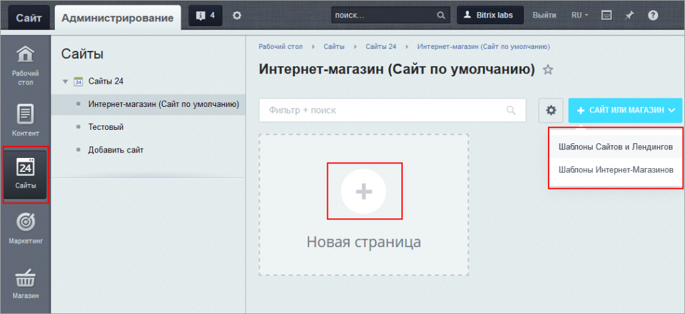
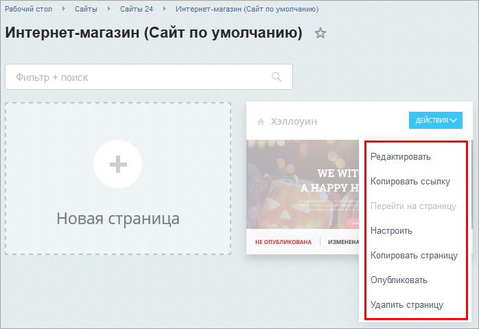

# Модуль Сайты - что это, зачем, как установить и работать

**Навигация**
- [← Оглавление курса](index.md)
- [← Предыдущий: 5200 — Как создать сайт](lesson_5200.md)
- [Следующий: 11249 — Как настраивать блоки →](lesson_11249.md)

Официальная страница урока: https://dev.1c-bitrix.ru/learning/course/index.php?COURSE_ID=34&LESSON_ID=11217

### Введение

Перефразируя Билла Гейтса, можно сказать, что если сейчас у вас нет продающего сайта - у вас нет бизнеса!

С нашим модулем **Сайты 24** любой пользователь **CMS** Битрикс может самостоятельно, просто и быстро создать собственный сайт. Профессиональный, красивый и приносящий прибыль.

Зачем? Продавать, конечно! А кроме того, показывать контактную информацию, публиковать прайс-листы, создавать обратную связь с пользователями и собирать сведения о посетителях, рекламировать себя или какую-то конкретную акцию, оценивать эффективность рекламной кампании и многое другое.

Конечно, если у вас уже есть полнофункциональный интернет-магазин, давно и успешно работающий, вам удобнее будет продолжать использовать его, добавляя по мере надобности разделы и страницы. Но если вы решили попробовать другую сферу деятельности, или провести какую-нибудь юбилейную распродажу, или открыли новое подразделение, филиал - сделайте отдельный сайт и оцените эффективность вашей новой бизнес-модели.

### Как установить?

Идем в Настройки &gt; Настройки продукта &gt; Модули. На странице находим строку **Сайты 24** (landing). Нажимаем кнопку **Установить**, в меню появляется пункт **Сайты 24**.

### Как делать сайты (видео-пример)

Идем в меню в пункт **Сайты 24** и создаем страницы

			в поле справа.

Посмотрите видеоролик, в котором мы быстро и просто создаём многостраничный сайт агентства недвижимости:

- в Административной части в разделе **Сайты 24** добавляем новую страницу
- выбираем, что будем создавать -
  			лендинг
                      Лендинг - целевая ("посадочная") страница. Это простенький сайт, основная цель которого - прорекламировать какую-то конкретную акцию или только что открывшийся магазин и собрать контакты пользователей.
  		 или интернет-магазин
- выбираем подходящий для наших целей шаблон из готового набора
- настраиваем страницу - адрес, название, шаблон, другое
- настраиваем блоки на странице - удаляем ненужные, вносим нашу информацию в нужные
- аналогично создаем другие страницы сайта
- настраиваем связи между страницами - вносим правильные ссылки в кнопки межстраничного перехода и пункты меню
- публикуем все созданные страницы

Созданные страницы

                    

		 будут храниться в административном разделе системы. В любой момент можно продолжить работу с ними, обновить информацию или использовать настроенные области и страницы в других сайтах. Все доступные

			действия

                    

		 перечислены в меню созданной страницы.

### Заключение

- Модуль **Сайты 24** - это простой конструктор сайтов.
- Модуль поставляется с готовыми шаблонами и блоками, которые можно редактировать.
  > Имеется возможность разрабатывать собственные шаблоны, блоки или встраивать компоненты в блоки. Но эти процедуры выходят за рамки квалификации контент-менеджера и описываются в соответствующих уроках курсов **Администратор.Модули** и **Разработчик Bitrix Framework**.
- Все правки немедленно отображаются на странице.
- Все создаваемые страницы прикреплены к вашему основному сайту.
  > Публикация сайтов и лендингов с привязкой к другому сайту (домену) потребует настройки
  >
  > 			многосайтовости
  >
  >
  >
  >                     **Многосайтовость** - это возможность системы *«1С-Битрикс: Управление сайтом»* управлять разными сайтами из единой Панели управления.
  >
  > 		[Подробнее...](https://dev.1c-bitrix.ru/learning/course/index.php?COURSE_ID=103).
  >
  >
  >
  > 		. Такая настройка не входит в компетенцию контент-менеджера. Поэтому способы привязки Сайтов 24 к другому домену описаны в курсе **Администратор.Модули**, урок [Сайты 24 на собственном домене](https://dev.1c-bitrix.ru/learning/course/index.php?COURSE_ID=41&LESSON_ID=12629)

В следующих уроках мы подробно расскажем о возможностях по созданию собственных блоков, а также о выводе каталога товаров из интернет-магазина на страницах Сайтов 24.

### Дополнительно

- [Rest-методы, доступные при работе с Сайтами](https://dev.1c-bitrix.ru/rest_help/landing/index.php)
- [Сайты24 и собственный домен в коробке](https://dev.1c-bitrix.ru/community/blogs/antonds/sayty24-and-private-domain-in-the-box.php)
- [Разработка шаблона дизайна](https://dev.1c-bitrix.ru/learning/course/index.php?COURSE_ID=43&LESSON_ID=3234)
- [Блок с компонентом внутри](https://dev.1c-bitrix.ru/learning/course/index.php?COURSE_ID=41&LESSON_ID=11975)
