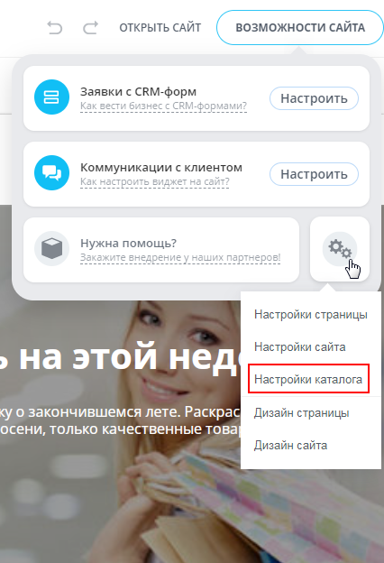
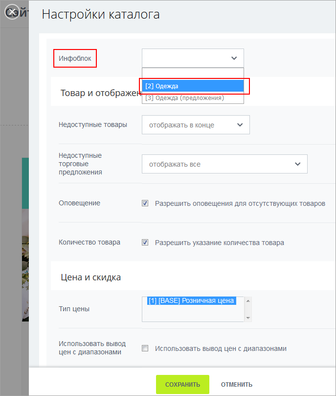
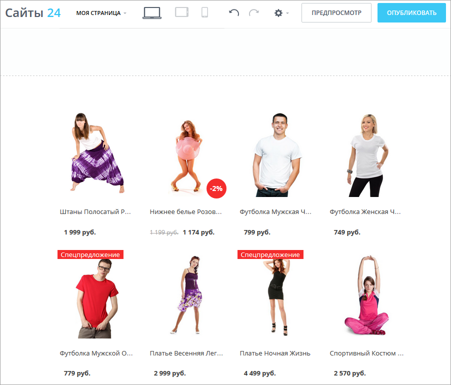
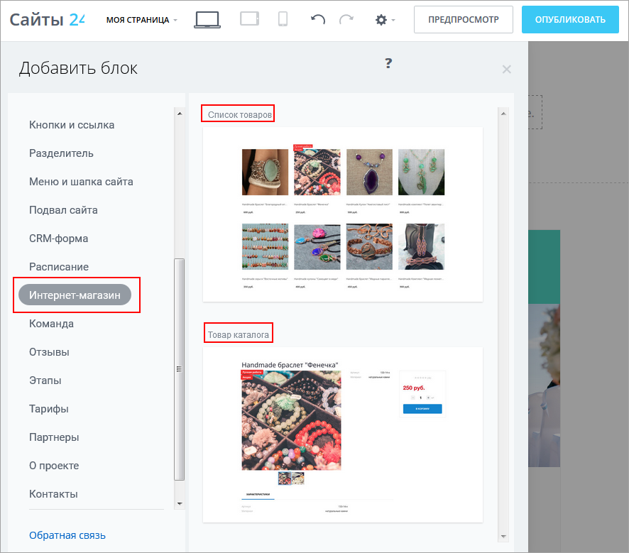
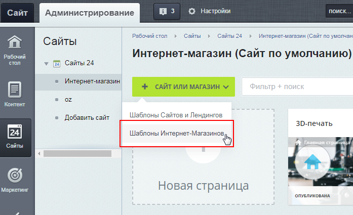
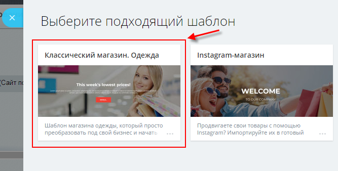
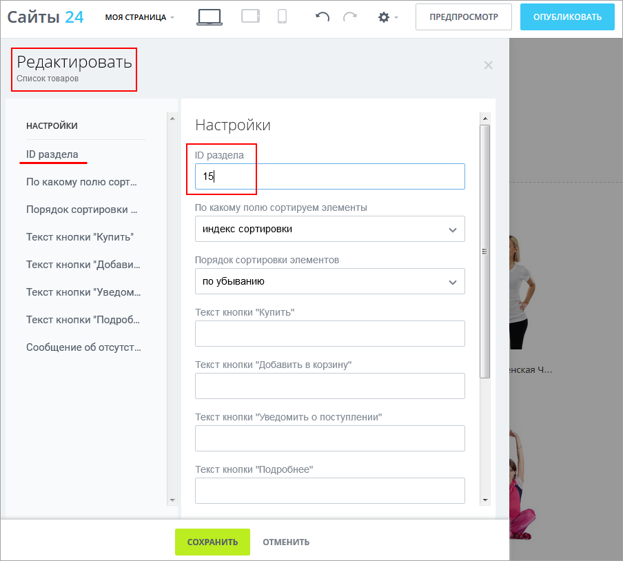
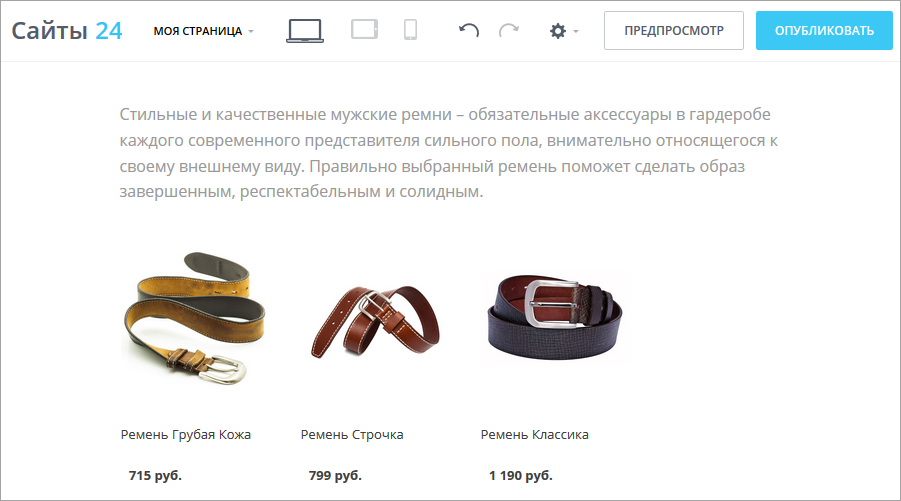

# Как на сайте вывести каталог товаров

**Навигация**
- [← Оглавление курса](index.md)
- [← Предыдущий: 12704 — Блок с компонентом внутри](lesson_12704.md)
- [Следующий: 12798 — Как настраивать сайты и страницы →](lesson_12798.md)

Официальная страница урока: https://dev.1c-bitrix.ru/learning/course/index.php?COURSE_ID=34&LESSON_ID=11245

Начать продавать уже сегодня вы сможете с модулем **Сайты 24**. Ведь в нём легко можно создать не только простой лендинг или сайт-визитку, но и серьезный интернет-магазин.

### Видеоурок

### Как вывести каталог товаров

Чтобы вывести на вашем сайте каталог товаров, вам нужно:

1. На вашем сайте кликнуть по кнопке **Возможности сайта** в правом верхнем углу, далее открыть настройки (значок с двумя шестерёнками) и выбрать
  			Настройки каталога
  

  		.
2. Выбрать нужный
  			инфоблок каталога
                      
  		.
3. Выбрать нужный блок, например, список товаров. На странице сразу появится ваш
  			каталог полностью
                        
  		.
  Блоки, предназначенные для вывода товаров, расположены в разделе
  			Интернет-магазин
                       
  		.
  Эти блоки берут информацию из модуля **Торговый каталог** и используют стандартные
  			компоненты
                      Компонент - специальный элемент системы, предназначенный для вывода информации из Базы данных сайта. [Подробнее](https://dev.1c-bitrix.ru/learning/course/index.php?COURSE_ID=34&CHAPTER_ID=04457&LESSON_PATH=3905.4457)...
  		 "1С-Битрикс: Управление сайтом":
  **Примечание:** Блоки, расположенные в разделе **Интернет-магазин**, предназначены для работы только с [Торговым каталогом](/learning/course/index.php?COURSE_ID=42&CHAPTER_ID=04771). Если вам нужно вывести информацию из другого инфоблока, вам следует [создать собственный блок](lesson_11263.md).

  - Блок **Список товаров** - это компонент **Элементы раздела**
  - Блок **Товар каталога** - это компонент **Элемент каталога детально**
    **Примечание**: С помощью блока **Товар каталога** можно показать детальную страницу только одного товара. Если вам нужна единая детальная страница для всех товаров в магазине, используйте
    			шаблон
    При добавлении сайта выберите пункт **Шаблоны Интернет-Магазинов**:
    
    		 интернет-магазина
    			Классический магазин. Одежда
    
    		.
4. При необходимости, отредактировать блок. Например, поменять
  			ID раздела каталога
                      
  		, который вы хотите выводить.
  	На странице теперь будет выводиться
  			нужный раздел
                      
  		.

Модуль **Торговый каталог** доступен в редакциях не ниже Малый бизнес и для его использования необходимо наличие установленного в системе модуля

			Информационные блоки

                    Информационный блок (или Инфоблок) – специальный инструмент "1С-Битрикс: Управление сайтом" с помощью которого заносится информация в Базу данных.
 [Подробнее...](https://dev.1c-bitrix.ru/learning/course/index.php?COURSE_ID=34&CHAPTER_ID=04477&LESSON_PATH=3905.4477)

		.

### Заключение

- Страницу можно настроить на вывод каталога интернет-магазина.
- Каталог выводится специальными блоками, которые используют стандартные компоненты.

### Документация по теме

- [Компоненты Каталога](https://dev.1c-bitrix.ru/user_help/components/content/catalog/index.php)
