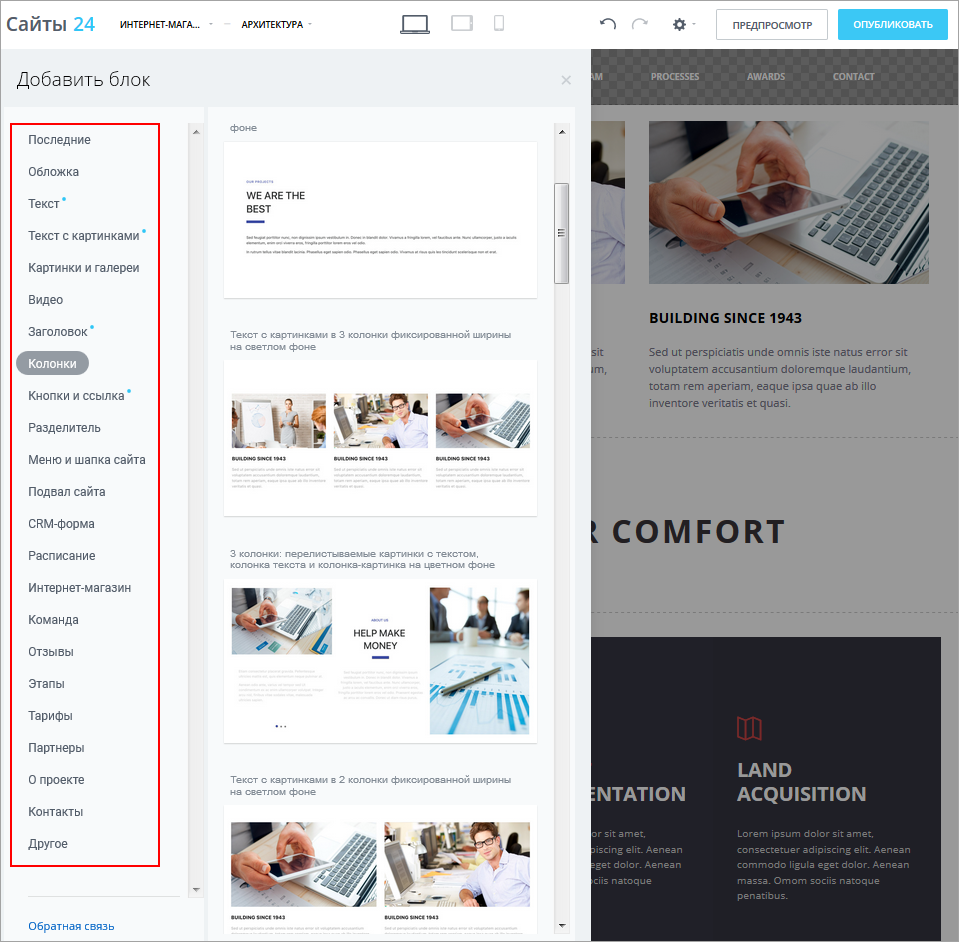
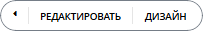
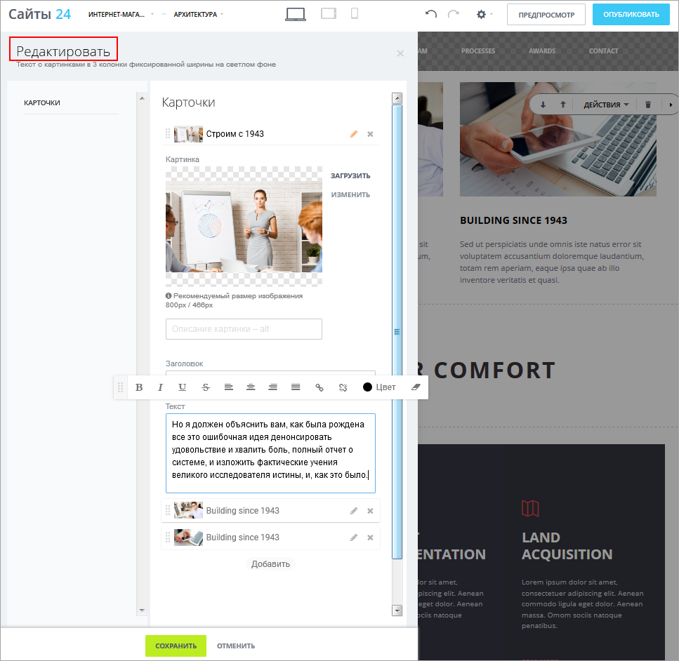
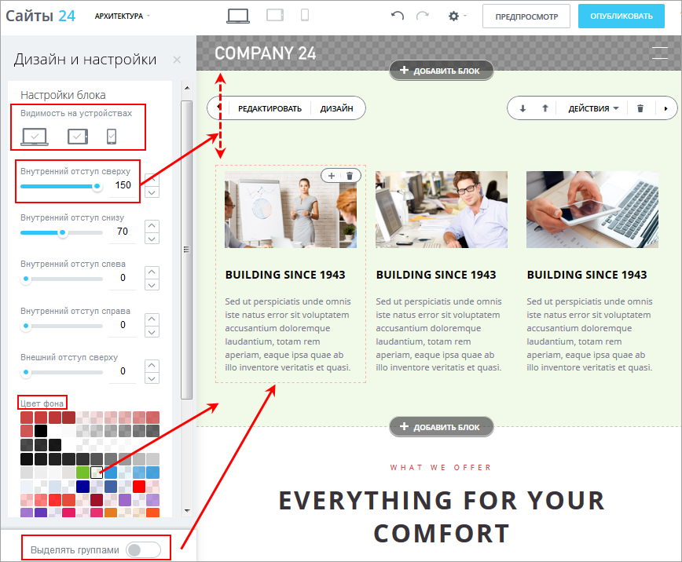

# Как настраивать блоки

**Навигация**
- [← Оглавление курса](index.md)
- [← Предыдущий: 11217 — Модуль Сайты - что это, зачем, как установить и работать](lesson_11217.md)
- [Следующий: 11403 — Анимация в блоках →](lesson_11403.md)

Официальная страница урока: https://dev.1c-bitrix.ru/learning/course/index.php?COURSE_ID=34&LESSON_ID=11249

Большинство блоков, доступных в конструкторе **Сайты 24**, настраиваются одинаково. Это легко и интуитивно понятно.

### Видеоурок

### Настройка блоков

1. нажать на кнопку 
2. выбрать тип блока из перечня
  
3. кликнуть 
4. и внести необходимые изменения.
  При
  			редактировании
                       
  		 можно поменять количество и порядок карточек, заголовки, текст, шрифт, картинку и др.
  При работе с
  			дизайном
                       
  		 можно настроить оформление всего блока, его части или нескольких однородных групп, задать отступы, фон, видимость на устройствах и др.

### Заключение

- Сайт состоит из блоков, как дом из кирпичиков.
- Существует множество видов блоков. Они перекрывают практически все потребности пользователей.
- Блоки можно удалять, добавлять, редактировать.
- Опции редактирования и дизайна позволяют еще более разнообразить блоки и настраивать их под индивидуальные потребности.

В следующих уроках мы подробно расскажем о возможностях по созданию собственных блоков, а также о выводе каталога товаров из интернет-магазина на страницах Сайтов 24.
