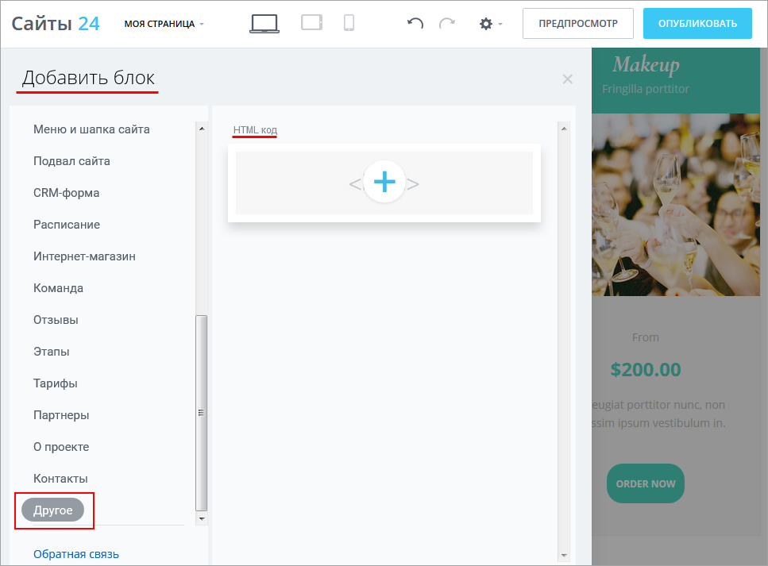
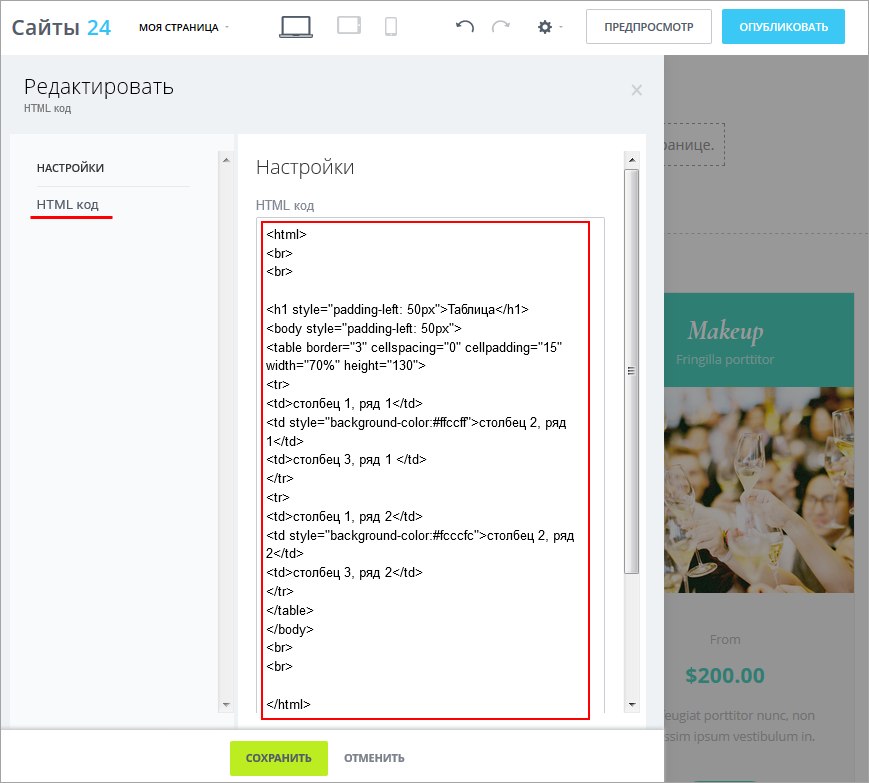
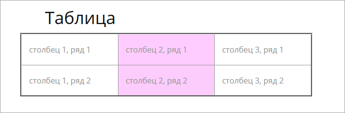

# Создание собственного блока

**Навигация**
- [← Оглавление курса](index.md)
- [← Предыдущий: 11403 — Анимация в блоках](lesson_11403.md)
- [Следующий: 12704 — Блок с компонентом внутри →](lesson_12704.md)

Официальная страница урока: https://dev.1c-bitrix.ru/learning/course/index.php?COURSE_ID=34&LESSON_ID=11263

Блоки модуля **Сайты 24** - это детали конструктора, из которых можно собрать практически любой сайт. И таких деталей в модуле более 200. Мы постарались обеспечить все потребности создателей сайтов готовыми решениями. Но если всё же вам не хватает какой-то возможности, вы всегда можете создать собственный функционал - просто добавьте блок с html-кодом.


### Важная информация

> Для создания собственного блока потребуется знание HTML. Или же вы можете заказать нужный функционал вашим разработчикам, а также воспользоваться готовыми html-шаблонами, которые предлагаются на разных площадках в интернете.

**Важное примечание!** В курсе **Контент-менеджер** не ставится задача полностью описать создание самостоятельного независимого блока, пригодного для тиражирования. Эта процедура включает в себя, кроме написания собственно html-кода блока, еще создание

			файла манифеста

                    Файл манифеста сопровождает каждый блок и описывает редактируемые части блока, а также содержит его название, описание, файлы JS/CSS.

		, обрамление блока в специальную

			обертку

                    Обертка - строка кода вида
&lt;div id="anchor" class="block-wrapper block-code"&gt;...&lt;/div&gt;

		 и

			регистрацию блока

                    Методы регистрации шаблонов дают возможность добавить свой шаблон в мастер создания сайта или страницы.

		. Это задача для программиста. Вся необходимая информация приведена в разделах REST- и API-документации [Сущность Блоки](https://dev.1c-bitrix.ru/rest_help/landing/block/blocks.php), [Файл манифеста](https://dev.1c-bitrix.ru/rest_help/landing/block/manifest.php), [Партнерские шаблоны](https://dev.1c-bitrix.ru/rest_help/landing/demos/index.php) и [Сайты24:Блоки](https://dev.1c-bitrix.ru/api_d7/bitrix/landing/block/index.php), а также в видео-лекции [Разработка для "Битрикс24.Сайтов" и "Сайтов24". Антон Долганин](https://www.youtube.com/watch?v=rajdgxVfAMc).

### Видеоурок

Посмотрите видеоролик о создании собственного блока:

### Создание собственного блока

Чтобы добавить собственный блок, выберите из перечня доступных блоков **Другое**:



Затем при редактировании блока введите в окно нужный

			html-код

                     

		.

**Обратите внимание!** Вы не увидите сразу на странице, как отрабатывает html-код. Результаты его работы будут видны только после публикации страницы.

Например, мы добавили в блок такой html-код:

```
<html>
<br>
<br>

<h1 style="padding-left: 50px">Таблица</h1>
<body style="padding-left: 50px">
<table border="3" cellspacing="0" cellpadding="15" width="70%" height="130">
<tr>
<td>столбец 1, ряд 1</td>
<td style="background-color:#ffccff">столбец 2, ряд 1</td>
<td>столбец 3, ряд 1 </td>
</tr>
<tr>
<td>столбец 1, ряд 2</td>
<td style="background-color:#fcccfc">столбец 2, ряд 2</td>
<td>столбец 3, ряд 2</td>
</tr>
</table>
</body>
<br>
<br>

</html>

```

и вот что получилось в результате после публикации страницы:



### Заключение

- Подавляющее большинство решений для любого сайта можно найти в готовых блоках.
- Если необходимо использовать собственный функционал, его код должен быть написан на HTML.
- Код вставляется в специальный блок и виден на странице после публикации.
