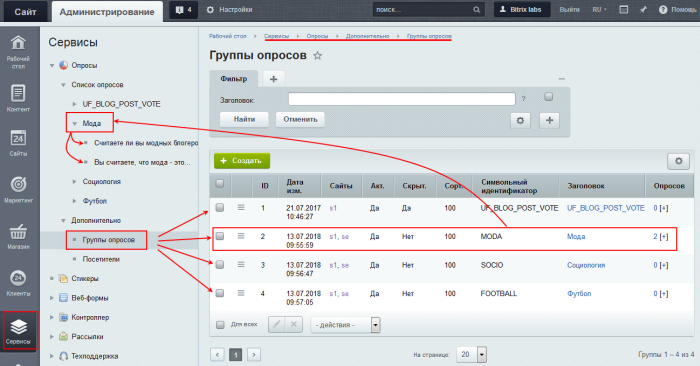

# Основные понятия

**Навигация**
- [← Оглавление курса](index.md)
- [← Предыдущий: 26220 — Проверьте себя](lesson_26220.md)
- [Следующий: 11393 — Создание и публикация опроса →](lesson_11393.md)

Официальная страница урока: https://dev.1c-bitrix.ru/learning/course/index.php?COURSE_ID=34&LESSON_ID=11391

### Основные понятия

> **Опрос** — очень удобный метод сбора мнений от посетителей сайта по разным вопросам. Опросы дают возможность быстро и с минимальными затратами собрать большой объем данных и принять правильное бизнес-решение по результатам исследования.

- **Опрос** - метод сбора первичной информации, мнения посетителей сайта по различным вопросам.
- **Вопросы** – то, на что хочется получить ответ от пользователя. В публичной части они выводятся в форме опроса (голосования). Число вопросов в опросе - от одного и более. Каждый вопрос содержит или поле для ввода ответа на вопрос, или варианты ответов разных типов.
- **Группа опросов** - любой опрос должен быть размещен в какой-то группе. Для всех опросов в группе задаются общие свойства и права доступа.
- **Посетители** - пользователи, принявшие участие в опросах.
- **Голосования** – информация по голосованиям пользователей доступна на странице **Голосования посетителей**.
- **Валидность** – надежность и достоверность исходной информации.

### Возможности модуля Опросы

С помощью модуля:

- создаются группы опросов (для облегчения поиска нужного опроса)
- ограничивается доступ посетителей к голосованиям (например, запрещается одному и тому же посетителю голосовать дважды в рамках одного опроса)
- останавливаются и возобновляются опросы
- экспортируются статистика опроса для анализа и выработки решений
- регулируется показ результатов голосований
- реализуются другие возможности

**Примечание**: Если Вы хотите создать форму обратной связи (например, анкету или заявку), с результатами которой можно работать в

			CRM

**CRM-система** (Customer Relationship Management) - система управления взаимоотношениями с клиентами. CRM служит для учета потенциальных и текущих клиентов, журналистов, партнеров и других «лидов». В CRM встроен каталог товаров и услуг.

		 корпоративного

			портала *Битрикс24*

Портал **Битрикс24** – это набор из пяти важных и полезных инструментов, которые помогают бизнесу работать: CRM, Задачи и проекты, Контакт-центр, Сайты и магазины, Офис.

[Подробнее](https://www.bitrix24.ru/whatisthis/)...

		 – воспользуйтесь функционалом модуля

			Веб-формы.

**Веб-форма** - специальная область на странице или отдельная страница сайта в которой посетитель может внести ту или иную информацию. Образно - это аналог бумажной анкеты, бланка и опросного листа. Количество веб-форм и количество вопросов в них ничем не ограничено, вам доступно гибкое управление параметрами ваших форм.

[Подробнее](lesson_9923.md)...

		 Также этот модуль позволяет гибко настроить права доступа к результатам заполнения форм и отправлять почтовые уведомления.

### Общая схема работы с модулем Опросы

- Создание опроса начинается со страницы **Группы опросов** (Сервисы &gt; Опросы &gt; Дополнительно &gt; Группы опросов).
  Здесь можно либо выбрать подходящую для вашего опроса группу, либо создать новую по нажатию кнопки   . Все созданные группы появляются в папке **Список опросов** в виде подпапок.
- На странице **Список опросов** (Сервисы &gt; Опросы &gt; Список опросов) в нужной группе создать опрос.
- Создать вопросы и задать для них варианты ответов.

### Администрирование модуля

Администрирование модуля (настройка, задание прав) описано в курсе [Администратор. Модули](/learning/course/index.php?COURSE_ID=41&LESSON_ID=2859).

### Документация по теме

- [Настройки модуля](https://dev.1c-bitrix.ru/user_help/service/vote/settings.php)
- [Группы опросов](https://dev.1c-bitrix.ru/user_help/service/vote/vote_channel_list.php)
- [Список вопросов](https://dev.1c-bitrix.ru/user_help/service/vote/vote_question_list.php)
- [Посетители](https://dev.1c-bitrix.ru/user_help/service/vote/vote_user_list.php)
- [Голосования](https://dev.1c-bitrix.ru/user_help/service/vote/vote_user_votes.php)
