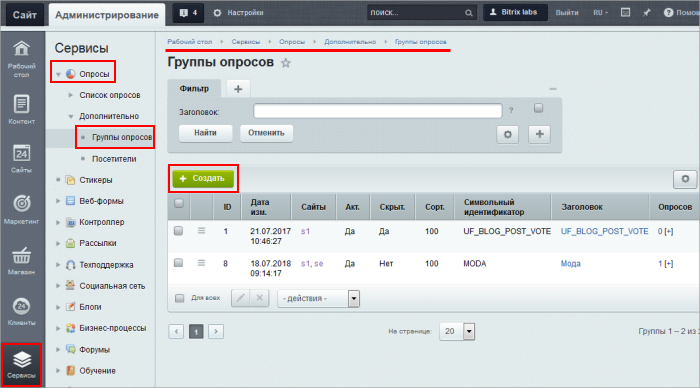
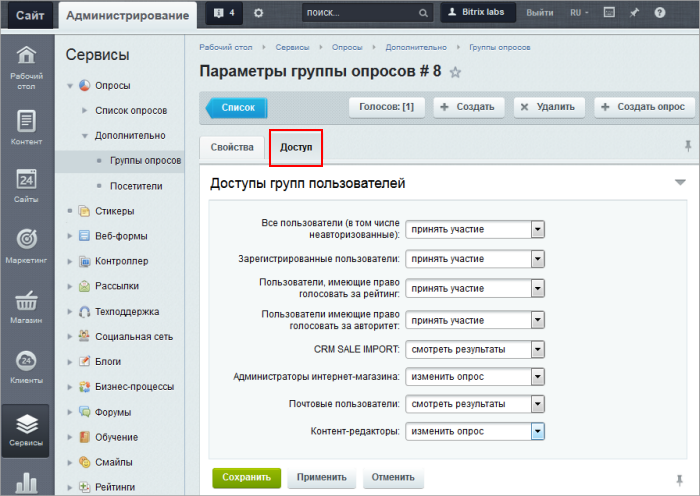
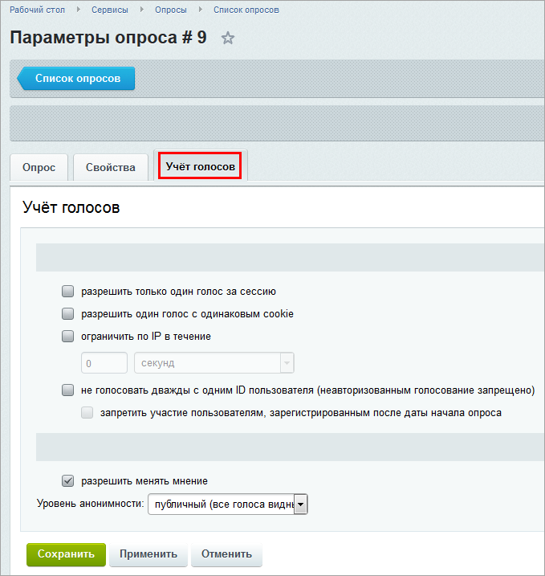
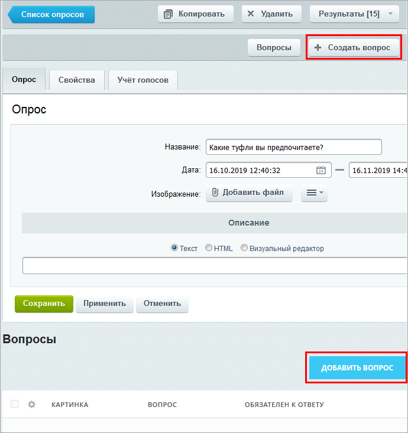
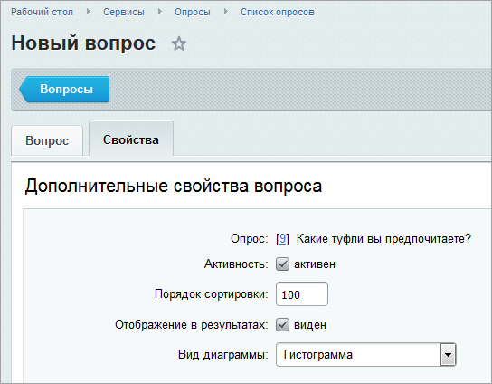
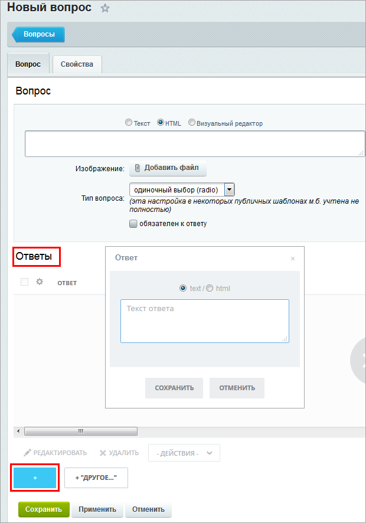
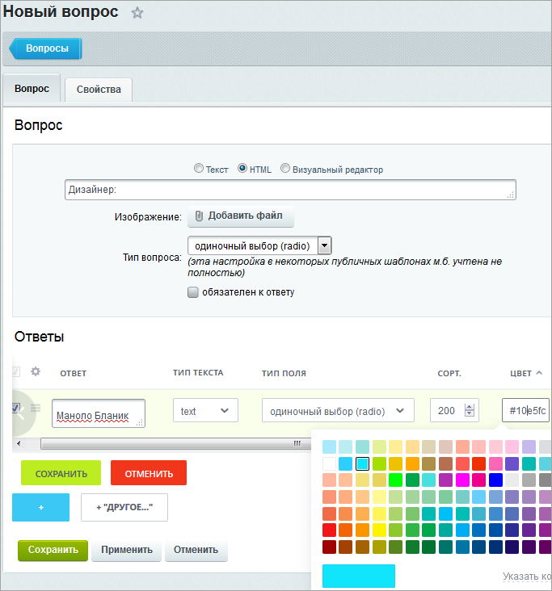
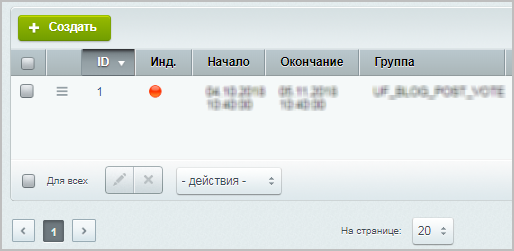

# Создание и публикация опроса

**Навигация**
- [← Оглавление курса](index.md)
- [← Предыдущий: 11391 — Основные понятия](lesson_11391.md)
- [Следующий: 11423 — Прочие возможности работы с опросами →](lesson_11423.md)

Официальная страница урока: https://dev.1c-bitrix.ru/learning/course/index.php?COURSE_ID=34&LESSON_ID=11393

### Видеоурок

Посмотрите видеоролик, в котором мы быстро и просто создаём и публикуем опрос:

- В Административной части в разделе Сервисы &gt; Опросы &gt; Дополнительно &gt; Группы опросов создаем новую группу опросов и настраиваем доступы
- В разделе Список опросов создаем опрос, задаем его свойства и ограничения
- Создаем вопросы для опроса. Устанавливаем вид диаграммы, варианты ответов, цвета
- В Публичной части создаем новую страницу для размещения опросов
- Размещаем на ней компонент Текущий опрос
- Собираем голоса посетителей и анализируем результаты

### Пошаговое описание создания и публикации опроса

1. Каждый опрос должен относиться к какой-либо группе. В Административной части вы можете либо выбрать из существующих групп в разделе Сервисы &gt; Опросы &gt; Список опросов, либо создать новую группу в Сервисы &gt; Опросы &gt; Дополнительно &gt; Группы опросов:
   
2. При создании группы задаются её свойства - активность, символьный идентификатор, заголовок и др. А также настраивается
  			Доступ
                      
  		 - указываются права доступа пользователей к группе опросов. Вы можете разрешить:
  		просмотр результатов, голосование вместе с просмотром результатов, изменение опроса вместе с голосованием и просмотром либо запретить все действия.
3. Папки в разделе Сервисы &gt; Опросы &gt; Список опросов полностью соответствуют группам опросов. Выберите нужную группу (папку) и создайте в ней опрос, нажав кнопку 
4. Задайте название опроса, дату, до которой он будет действовать, включите его, то есть установите флаг активности на вкладке **Свойства**. Можно также задать **Описание**.
5. На вкладке
  			Учёт голосов
                       
  		 установите возможности повторного голосования.
  Обратите внимание, что опцию **запретить участие пользователям, зарегистрированным после даты начала опроса**, можно включить, только если проставлена птичка в пункте **не голосовать дважды с одним ID пользователя (неавторизованным голосование запрещено)**.
6. Перейдите к
  			созданию вопросов
                      
  		, нажав кнопку **Создать вопрос** или **Добавить вопрос**:
7. В форме создания вопроса задайте собственно текст вопроса, его тип (одиночный или множественный выбор, выбор из списка и т.д.), является ли он обязательным, а на вкладке
  			Свойства
                       
  		 - параметры, то есть будет ли он отображен в результатах, вид диаграммы и др.:
8. В секции
  			Ответы
                      
  		 нажимайте кнопку "плюсик" и задавайте варианты ответов на вопрос:
9. Отредактируйте список ответов. Задайте
  			порядок сортировки, типы полей, цвета
                      
10. Для публикации опроса
  			создайте отдельную страницу
                      Создание страницы удобно выполнять сразу в нужном разделе с помощью специального мастера.
   
   [Читайте подробнее...](lesson_1911.md)
  		 и
  			разместите
                      В визуальном редакторе переместите компонент из списка в рабочую область.
   
   [Читайте подробнее...](lesson_9163.md#razm)
  		 на ней комплексный компонент **Текущий опрос (bitrix:voting.current)**. При настройке компонента не забудьте указать
  			группу опросов и ID опроса
                       
  		.

> **Примечание:** если в списке у опроса отображается
>
> 			красный индикатор,
>
>
>
>                      
>
>
>
>
> 		 то либо он неактивен, либо текущая дата не попадает в интервал его проведения.

### Документация по теме

- [Создание и редактирование опроса](http://dev.1c-bitrix.ru/user_help/service/vote/vote_edit.php)
- [Создание и редактирование вопроса](http://dev.1c-bitrix.ru/user_help/service/vote/vote_question_edit.php)
- [Компоненты модуля Опросы](https://dev.1c-bitrix.ru/user_help/components/services/votes/index.php)
