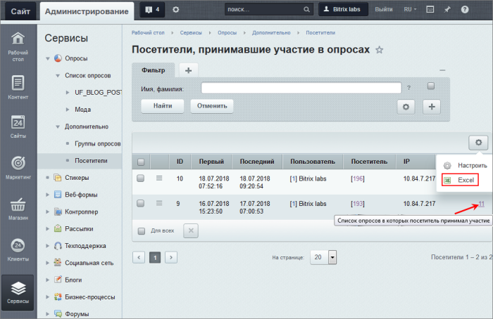
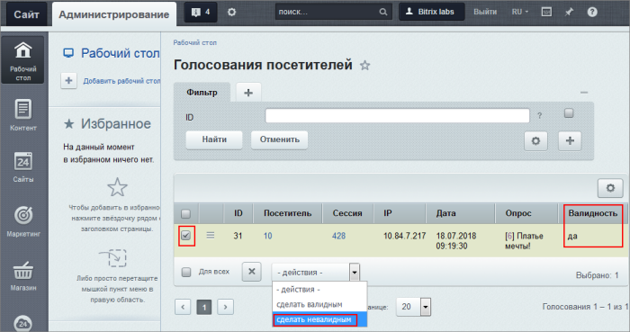
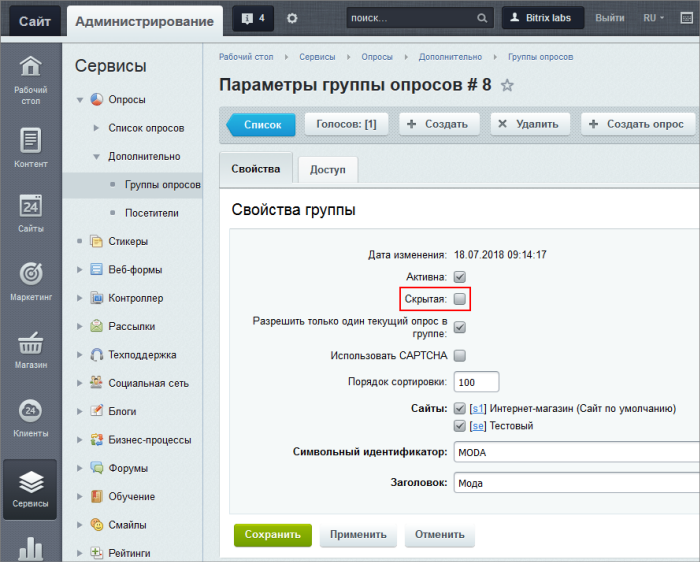
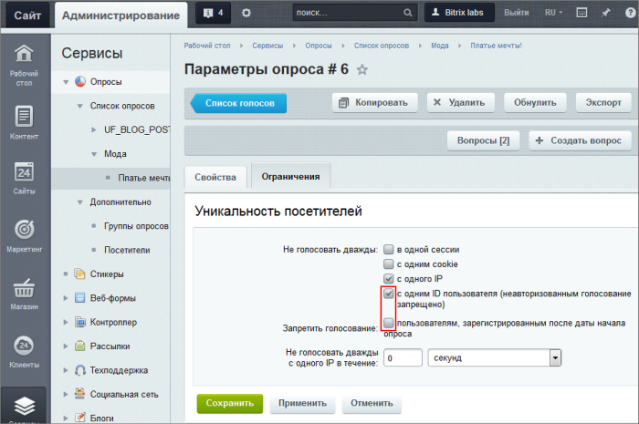
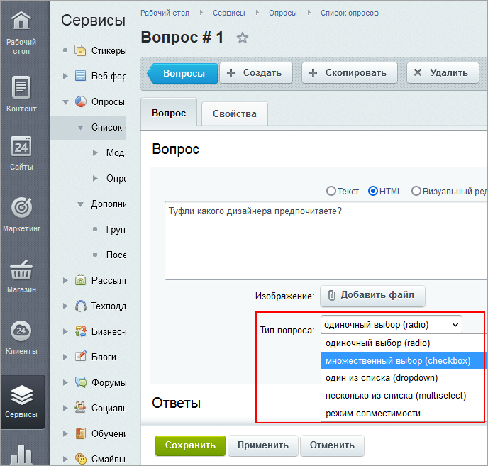
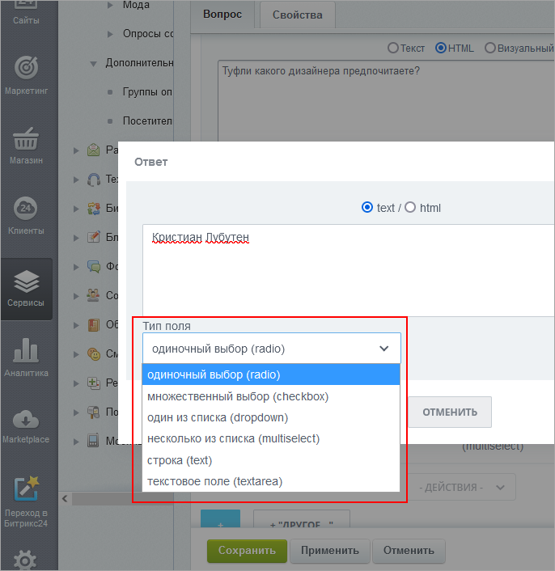

# Прочие возможности работы с опросами

**Навигация**
- [← Оглавление курса](index.md)
- [← Предыдущий: 11393 — Создание и публикация опроса](lesson_11393.md)
- [Следующий: 26222 — Проверьте себя →](lesson_26222.md)

Официальная страница урока: https://dev.1c-bitrix.ru/learning/course/index.php?COURSE_ID=34&LESSON_ID=11423

|  | #### Голосования, валидность, типы полей, компоненты для работы с опросами |
| --- | --- |

1. Информация о голосовавших пользователях доступна на странице **Посетители, принимавшие участие в опросах** (Сервисы &gt; Опросы &gt; Дополнительно &gt; Посетители)
2. Информация о результатах голосований доступна на странице **Голосования посетителей**. Попасть на неё можно, кликнув по цифре в графе **Голосований** на странице **Посетители, принимавшие участие в опросах**. Информацию о пользователях и о результатах можно экспортировать в Excel. Импортированный файл будет содержать перечень ответов, количество голосов и данные проголосовавших пользователей.
   
3. Если какие-то результаты голосований вызывают сомнения в их корректности (например, вы подозреваете, что количество голосов было искусственно завышено), то можно сделать их невалидными, т.е. не учитывать при построении результирующей диаграммы опроса
   
4. Если в группе опросов опция **Скрытая** не отмечена, то опрос из этой группы будет виден в списке опросов. Устанавливать этот флажок можно, если вы хотите, чтобы опрос группы не отображался в списке опросов, но использовался, например, в сообщениях живой ленты.
   
5. Поле **Запретить голосование пользователям, зарегистрированным после даты начала опроса** активизируется, если отметить опцию **с одним ID пользователя (неавторизованным голосование запрещено)** в группе полей **Не голосовать дважды**. Это поле нужно, чтобы защититься от искусственной "накрутки" голосов за счет регистрации новых пользователей.
   
6. Типы полей, доступные при создании
  			вопросов
                      
  		 и
  			ответов
                      
  		:

  - **radio** – радио-кнопка. Используется, если нужен только один вариант ответа из множества.
  - **checkbox** – флаг, "птичка". Доступно несколько вариантов ответов.
  - **dropdown** – элемент с выпадающим списком, разновидность радио-кнопки. Доступен только один вариант ответа из списка.
  - **multiselect** – список с возможностью множественного выбора, разновидность чек-бокса.
  - **text** – однострочное поле ввода. Посетитель заполняет поле своим ответом.
  - **textarea** – многострочное поле ввода. Используется, если нужен развернутый ответ, например, вы хотите получить предложения по улучшению работы вашего интернет-магазина.
7. Мы рекомендуем использовать для вывода опроса на страницу комплексный компонент **Текущий опрос (bitrix:voting.current)**. Это самый простой и удобный способ. Если вам нужен какой-то нестандартный сценарий опроса, то вы можете использовать простые компоненты, но это потребует создания нескольких страниц и дополнительных усилий по настройке компонентов на работу между собой.
  Для публикации опросов доступны простые компоненты:
  В пользовательской документации есть отдельная глава [Опросы, голосования](https://dev.1c-bitrix.ru/user_help/components/services/votes/index.php) с подробным описанием компонентов.

  - **Результаты опроса (bitrix:voting.result)** - для вывода диаграммы. Диаграмма может быть представлена в трех видах: по умолчанию, гистограмма или круговая диаграмма.
  - **Список опросов (bitrix:voting.list)** выводит список опросов из выбранных групп. Можно выбрать группу, опросы которой будут выведены на странице, либо все опросы, созданные на сайте.
  - **Форма опроса (bitrix:voting.form)** выводит форму опроса.
