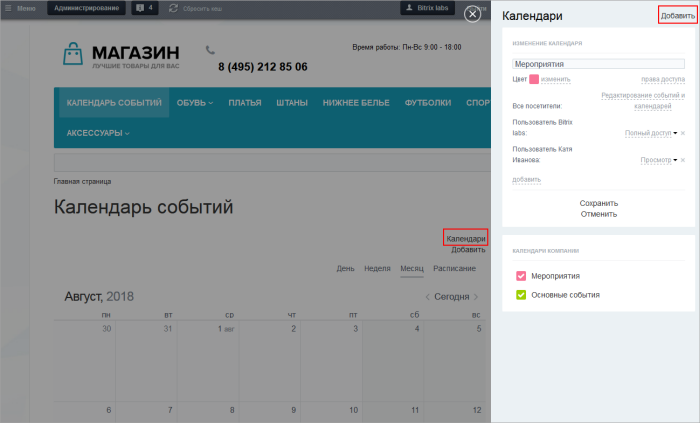
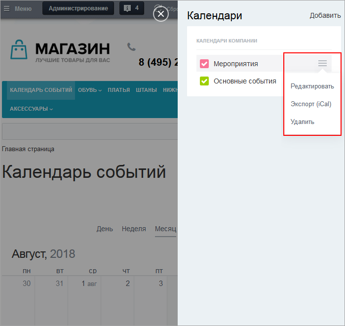

# Управление календарями

**Навигация**
- [← Оглавление курса](index.md)
- [← Предыдущий: 11447 — Публикация и настройка календарей](lesson_11447.md)
- [Следующий: 11445 — Управление событиями →](lesson_11445.md)

Официальная страница урока: https://dev.1c-bitrix.ru/learning/course/index.php?COURSE_ID=34&LESSON_ID=11443

|  | #### Добавление календарей |
| --- | --- |

Добавить новый календарь можно с помощью ссылки **Добавить** в

			слайдере

                    **Слайдер** (от англ. to slide - скользить) - элемент интерфейса, боковая панель, которая умеет открывать страницы сайта в отдельной области окна браузера, а также отображать произвольное содержимое внутри себя. Слайдер выезжает справа налево, занимая все пространство сверху донизу...
 [Подробнее...](https://dev.1c-bitrix.ru/api_help/js_lib/sidepanel/index.php)

		, появляющемся при клике по ссылке **Календари**.

В открывшейся форме обязательно укажите название календаря, задайте цвет и настройте права доступа. Сохраните.

 

**Важно!** При настройке прав доступа вы лишь детализируете права для данного конкретного календаря, т.к. права доступа к типу календаря имеют больший приоритет. Поэтому следите за тем, чтобы пользователи или группы пользователей не дублировали таковых, указанных в [настройках доступа к типу календарей](/learning/course/index.php?COURSE_ID=41&LESSON_ID=5266#type).

Для редактирования, экспорта, удаления календаря используйте меню действий, появляющееся при наведении курсора мыши:

**Примечание:** про экспорт данных календаря в формате iCal вы можете прочитать в [отдельном уроке](lesson_11457.md).
