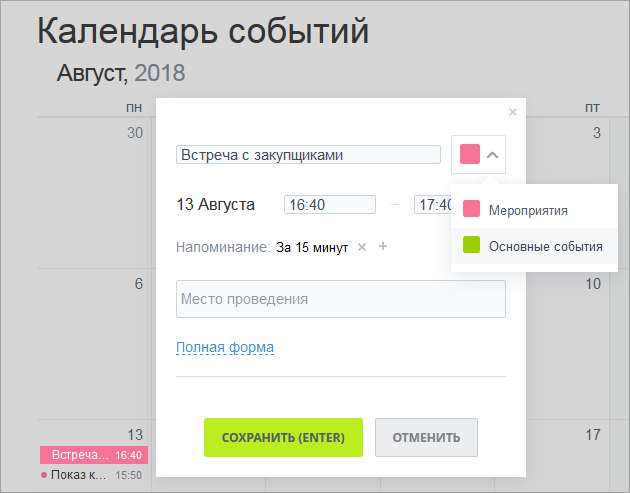
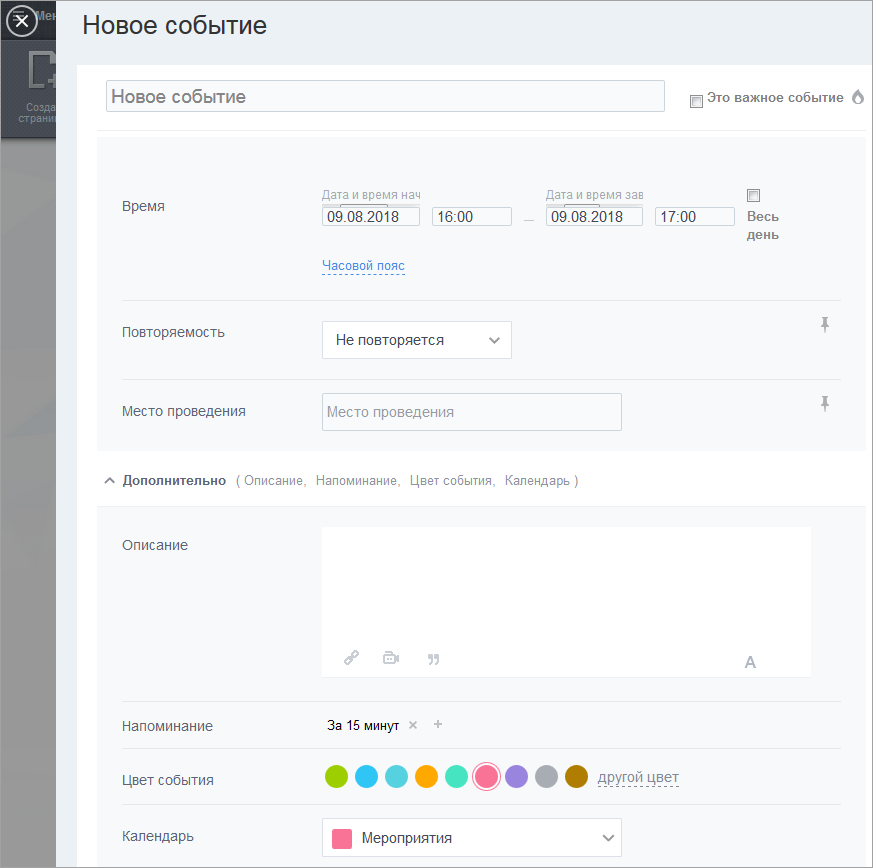
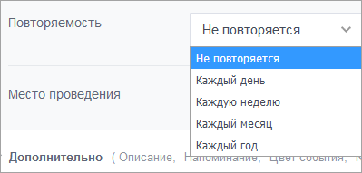
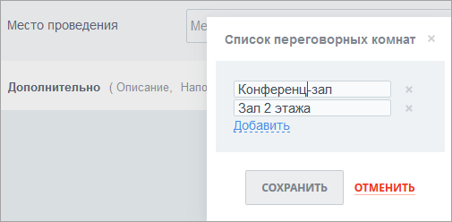
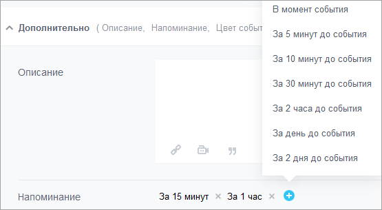
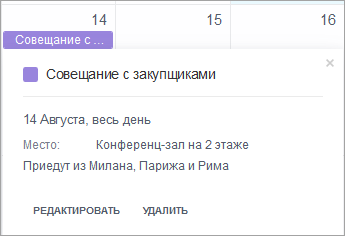
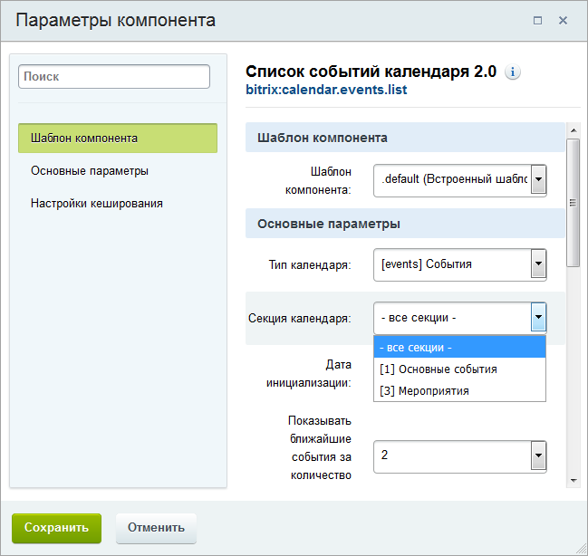
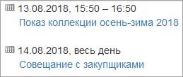

# Управление событиями

**Навигация**
- [← Оглавление курса](index.md)
- [← Предыдущий: 11443 — Управление календарями](lesson_11443.md)
- [Следующий: 11457 — Экспорт календарей →](lesson_11457.md)

Официальная страница урока: https://dev.1c-bitrix.ru/learning/course/index.php?COURSE_ID=34&LESSON_ID=11445

Добавить событие можно одним из двух способов.

### Добавление событий (способ 1)

В сетке календаря выберите день события и кликните по любому свободному месту в нем. Откроется окно добавления события:

Укажите название события и выберите календарь, к которому оно относится. Здесь же можно указать время и место события, установить напоминания.

Чтобы увидеть подробные настройки параметров события, нажмите ссылку **Полная форма** (см. **Второй способ**).

Сохраните внесенные данные.

### Добавление событий (способ 2)

Нажмите на ссылку **Добавить**, расположенную в верхнем правом углу календаря.

В

			слайдере

                    **Слайдер** (от англ. to slide - скользить) - элемент интерфейса, боковая панель, которая умеет открывать страницы сайта в отдельной области окна браузера, а также отображать произвольное содержимое внутри себя. Слайдер выезжает справа налево, занимая все пространство сверху донизу...
 [Подробнее...](https://dev.1c-bitrix.ru/api_help/js_lib/sidepanel/index.php)

		 откроется форма добавления нового события:

Вы можете отметить событие важным, с помощью пиктограмм календаря и часов вы можете указать дату и время начала и окончания события, либо сделать его на целый день, поставив галочку в окошке **Весь день**.

Можете установить повторяемость - каждый день, месяц или др.

 

А также задать место события. В поле **Место проведения** можно либо ввести название места, либо выбрать из списка переговорных или тут же создать этот список:

 

По ссылке **Дополнительно** открывается нижняя часть слайдера. Здесь можно задать описание события и отформатировать его в визуальном редакторе.

А также задать напоминания:

 

Можно установить цвет события и календарь, в котором оно будет располагаться.

### Редактирование и удаление событий

Чтобы просмотреть событие, кликните по нему:

 

Событие можно отредактировать или удалить. При редактировании в слайдере откроется всё та же форма создания события (см. **Второй способ**).

**Примечание:** редактирование и удаление событий доступно только в том случае, если у вас достаточно прав на календарь.

### Просмотр всех событий календаря

Для просмотра всех событий календарей можно использовать компонент **Список событий календаря 2.0** (Компоненты &gt; Контент &gt; Календарь событий ), в настройках которого необходимо указать тип календарей, события которых следует вывести, и секцию (сами календари):

В итоге список событий, выводимых данным компонентом, будет выглядеть следующим образом:

Учтите, что компонент не выводит прошедшие события.
