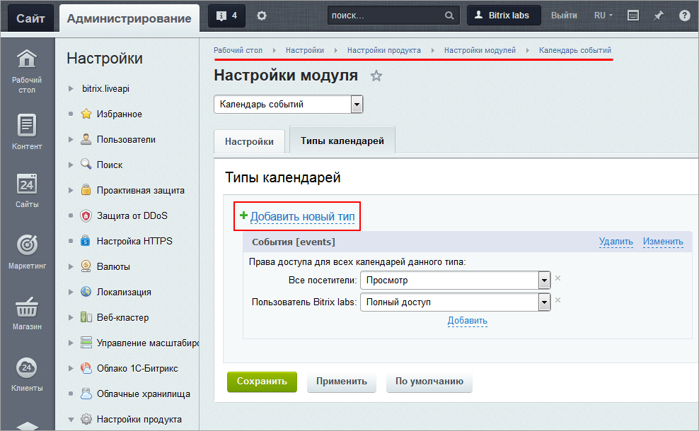
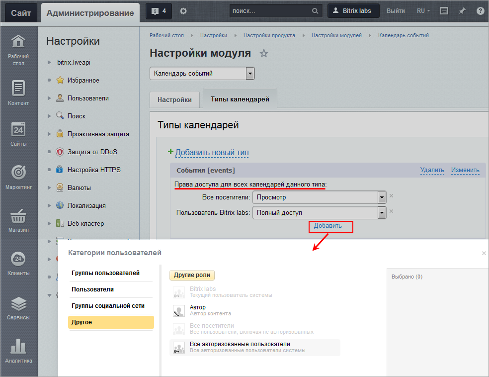
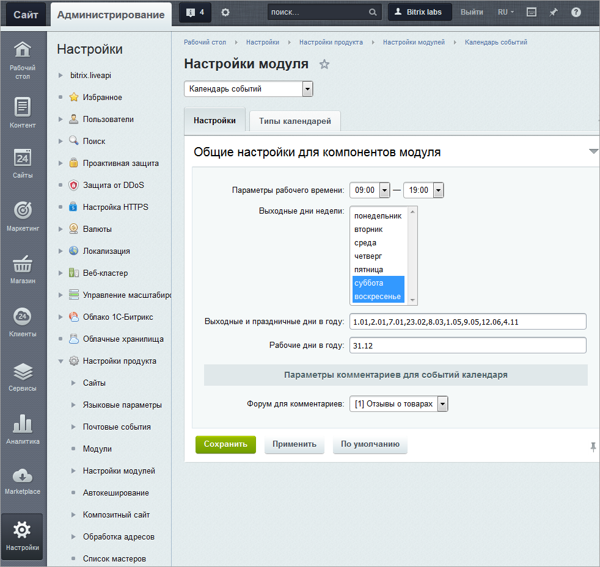
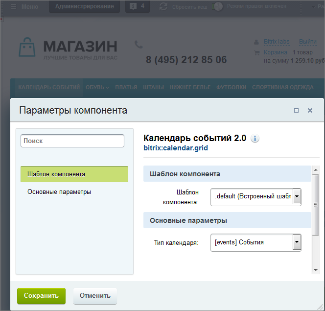
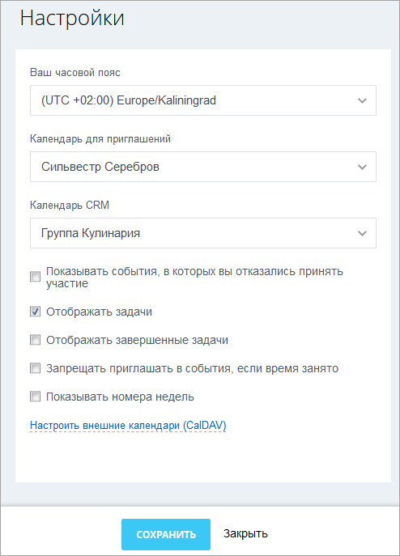

# Публикация и настройка календарей

**Навигация**
- [← Оглавление курса](index.md)
- [← Предыдущий: 5191 — Возможности модуля](lesson_5191.md)
- [Следующий: 11443 — Управление календарями →](lesson_11443.md)

Официальная страница урока: https://dev.1c-bitrix.ru/learning/course/index.php?COURSE_ID=34&LESSON_ID=11447

### Видеоурок

### Как сделать календарь?

- Решите, где вы будете размещать календарь - на отдельной странице или на уже существующей.
- Выберите, какого типа будет календарь - календарь компании, личный или другой.
- Решите, кто будет иметь доступ к календарю.
- Если календарь будет размещен на отдельной странице,
  			создайте
                      Самый простой способ создания страницы - через специальный мастер.
  
  [Читать подробнее...](lesson_1911.md)
  		 эту страницу. Тип календаря **События** имеется в системе по умолчанию. Обычно он содержит события компании. Если ваш календарь  будет содержать личные события или какие-то другие, отличающиеся от событий компании, то создайте отдельный
  			тип календаря
                      Откройте страницу административного раздела Настройки &gt; Настройки продукта &gt; Настройки модулей &gt; Календарь событий и нажмите кнопку **Добавить новый тип**.
  [Читать подробнее...](/learning/course/index.php?COURSE_ID=41&LESSON_ID=5266#type)
  		.
  ## Добавление типа календаря
  
- Не забудьте настроить [доступ](/learning/course/index.php?COURSE_ID=41&LESSON_ID=5266#dostup) для созданного типа календаря
  ## Настройка доступа
  
- Настройте рабочие и выходные дни и другие параметры
  ## Рабочие, выходные дни, другие параметры
  
- Разместите на нужной странице
  			компонент
                      Компонент - специальный элемент системы, предназначенный для вывода информации из Базы данных сайта. [Подробнее](https://dev.1c-bitrix.ru/learning/course/index.php?COURSE_ID=34&CHAPTER_ID=04457&LESSON_PATH=3905.4457)...
  		 **Календарь событий 2.0 (bitrix:calendar.grid)** (Компоненты &gt; Контент &gt; Календарь событий)
- Настройте компонент - укажите шаблон компонента и тип календаря
  ## Компонент Календарь
  

Нажмите "шестеренку"   и настройте отображение календаря - часовой пояс, отображение задач и другое. Эти настройки будут действовать на все календари данного типа.

## Настройка отображения

Сохраните изменения. Календарь будет опубликован и вы сможете добавлять события (об этом читайте в [следующем уроке](lesson_11445.md)) в него.
