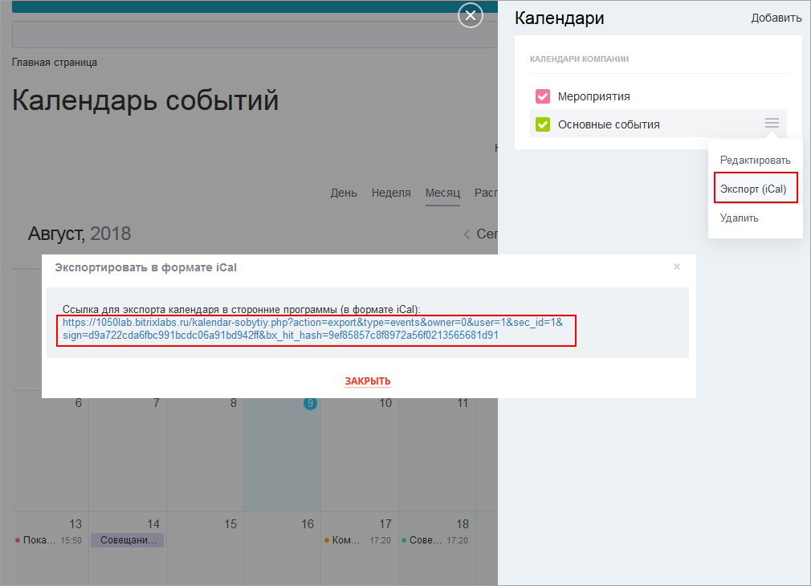
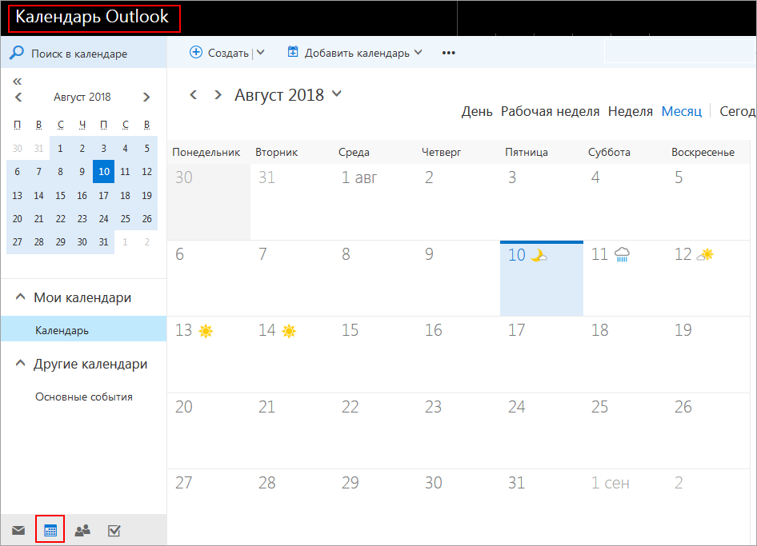
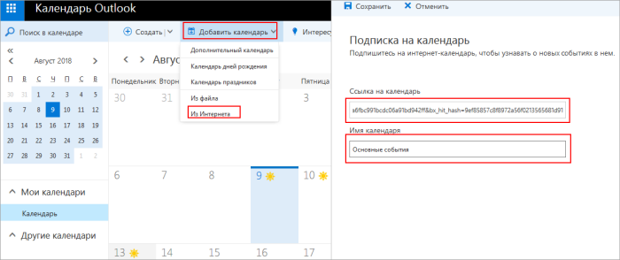
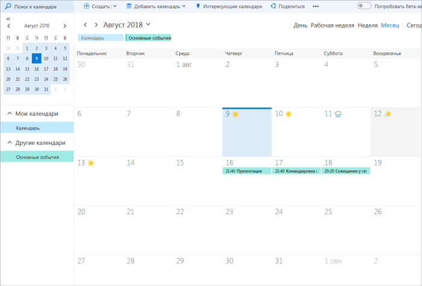
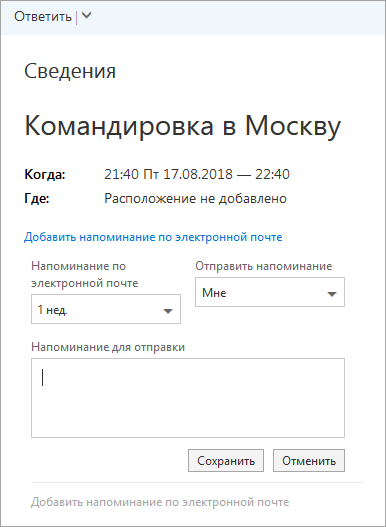

# Экспорт календарей

**Навигация**
- [← Оглавление курса](index.md)
- [← Предыдущий: 11445 — Управление событиями](lesson_11445.md)
- [Следующий: 12902 — Проверьте себя →](lesson_12902.md)

Официальная страница урока: https://dev.1c-bitrix.ru/learning/course/index.php?COURSE_ID=34&LESSON_ID=11457

|  | События календаря могут быть экспортированы в **iCal**. |
| --- | --- |

Чтобы экспортировать некоторый календарь, выполните следующее:

- Нажмите пункт **Экспорт (iCal)** в его меню действий.
- Скопируйте ссылку в буфер обмена:
  
- Запустите MS Outlook и перейдите к разделу **Календарь**.
  
- На панели инструментов **Outlook** выберите **Добавить календарь &gt; Из Интернета**.
- В окне **Подписка на календарь** вставьте ссылку из буфера обмена и задайте имя календаря:
  
- Сохраните подписку. Будет выполнен импорт вашего календаря, его события сразу появятся на сетке.
  

В результате события сайта можно будет просматривать в MS Outlook и добавлять к ним напоминания по электронной почте.

При добавлении или редактировании их на сайте все изменения оперативно попадают в MS Outlook. Но не наоборот - события календаря Outlook не отображаются в календаре на сайте.
