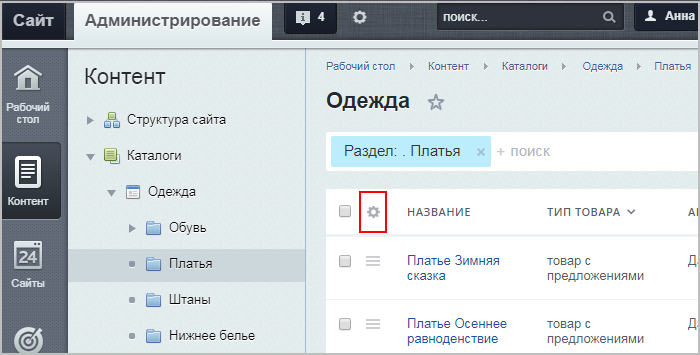
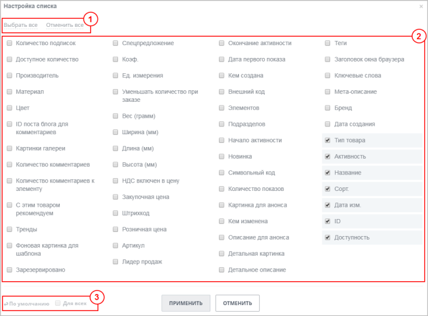

# Настройка списка элементов (новый интерфейс)

**Навигация**
- [← Оглавление курса](index.md)
- [← Предыдущий: 2776 — Настройка списка элементов (старый интерфейс)](lesson_2776.md)
- [Следующий: 1841 — Форма редактирования элемента →](lesson_1841.md)

Официальная страница урока: https://dev.1c-bitrix.ru/learning/course/index.php?COURSE_ID=34&LESSON_ID=11801

### Видеоурок

Согласитесь, что при постоянной работе с однотипными файлами (в нашем случае - со списком элементов) хочется, чтобы все самые важные параметры были на виду, т.е. не приходилось открывать каждый элемент, а можно было все просмотреть в единой таблице. Это значительно экономит время и позволяет избегать рутинных действий.

В 1С-Битрикс реализована возможность настройки списка элементов.  То есть можно сделать видимым в списке только то, что нужно именно вам!

### Настройка списка элементов

Кнопка

			Настроить

		 вызывает окно, в котором вы можете выбрать колонки для показа в таблице элементов данной формы:

Рабочие области окна настройки полей:

1 - Область быстрого выбора (можно сразу либо **Выбрать все**, либо **Отменить все**).

2 - Область выбора необходимых полей для вывода в таблице элементов.

3 - Область возврата к настройкам **По умолчанию**, а для

			администраторов

В данном случае имеются в виду пользователи, обладающие уровнем прав **Полный доступ [W]** к Главному модулю.

		 также и область настройки отображения **Для всех** пользователей (т.е. выбранные администратором колонки будут отображаться не только у него, но и у всех пользователей, имеющих доступ к просмотру этих элементов).

Все, что нужно сделать для обеспечения себе более комфортной работы со списком элементов - выбрать нужные поля и нажать кнопку **Применить** (соответственно, при нажатии кнопки **Отменить** все внесенные вами изменения удалятся).

Чтобы быстро поменять расположение колонок на экране,

			перетяните

		 их в требуемые места, ухватив левой кнопкой мыши. При этом в **настройках списка** порядок тоже изменится.

**Примечание**: Вы также можете изменить названия выводимых колонок, кликнув по

			изображению пера

		 справа от названия поля и нажав кнопку **Сохранить** после переименования. Вернуться к исходным названиям можно с помощью кнопки **По умолчанию**.

### Важно запомнить!

Полностью удалять все параметры нельзя, должна оставаться хотя бы одна колонка.

**Колонку флажков** и **Меню действий** из Списка элементов удалить нельзя в принципе - это системные колонки.

По умолчанию настройки каждой таблицы сохраняются для текущего авторизованного пользователя. Установка

			администратором

В данном случае имеются в виду пользователи, обладающие уровнем прав **Полный доступ [W]** к Главному модулю.

		 флажка в поле **Для всех** позволяет применить выбранные параметры формы для всех зарегистрированных пользователей, имеющих доступ к административному разделу.

|  | #### Заключение |
| --- | --- |

1С-Битрикс позволяет сделать работу Контент-менеджера удобной и производительной. Один из способов - настройка списка элементов, что позволяет держать перед глазами всегда только те данные, которые нужны.
