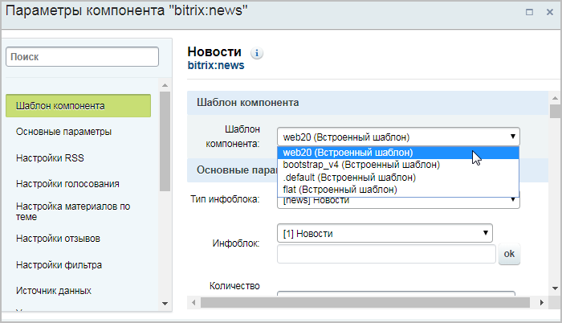
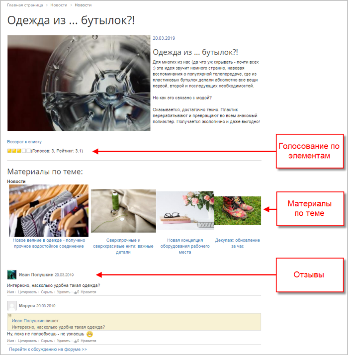

# Общий вид

**Навигация**
- [← Оглавление курса](index.md)
- [← Предыдущий: 12876 — Групповая генерация символьных кодов](lesson_12876.md)
- [Следующий: 12167 — Голосование по элементам инфоблока →](lesson_12167.md)

Официальная страница урока: https://dev.1c-bitrix.ru/learning/course/index.php?COURSE_ID=34&LESSON_ID=12165

Для **элементов инфоблока** существуют удобные штатные инструменты, с помощью которых вы без особых усилий сможете настроить следующие полезные опции:

- [Голосование](lesson_12167.md)
- [Материалы по теме](lesson_12169.md)
- [Отзывы (комментарии)](lesson_12171.md)

Все эти опции включаются в **настройках комплексных компонентов**:

| Компонент | Голосование по элементам инфоблока | Материалы по теме | Отзывы (комментарии) |
| --- | --- | --- | --- |
| Новости | **+** | **+** | **+** |
| Фотогалерея | **+** |  | **+** |
| Каталог |  |  | **+** |

В этой главе рассмотрим подключение этих опций на примере комплексного компонента  **Новости**.

**Примечание**: Опции могут работать не во всех

			штатных шаблонах

		 комплексных компонентов.

Вот так будет выглядеть страница детального просмотра элемента инфоблока Новостей со всеми настроенными опциями в одном из штатных шаблонов (шаблон **web20**):

