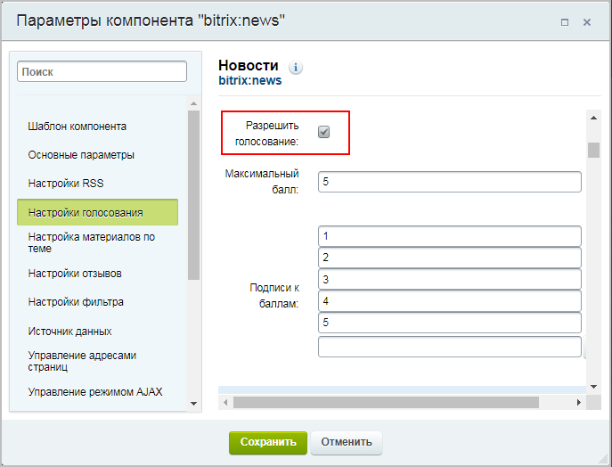
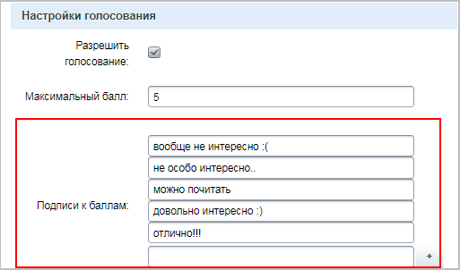
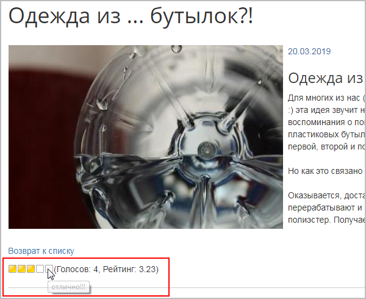
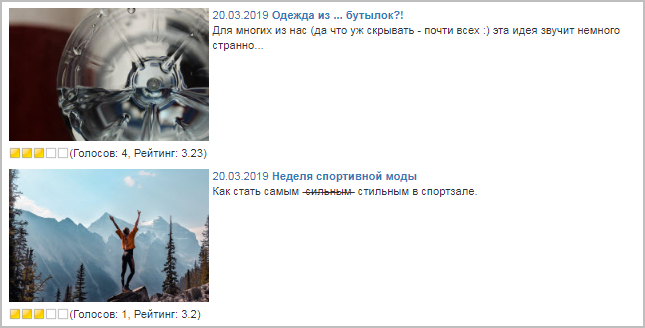
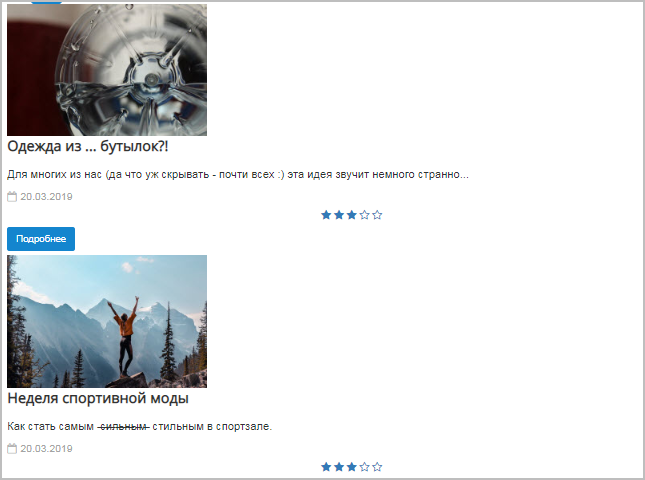
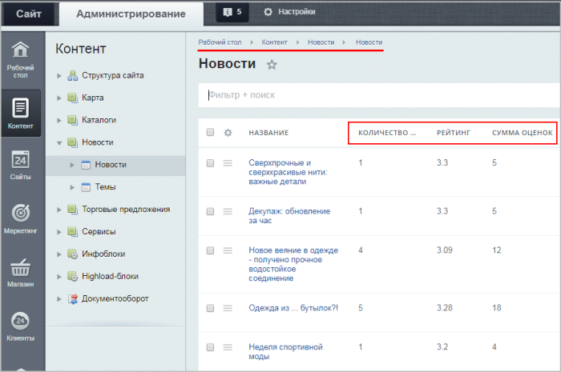

# Голосование по элементам инфоблока

**Навигация**
- [← Оглавление курса](index.md)
- [← Предыдущий: 12165 — Общий вид](lesson_12165.md)
- [Следующий: 12171 — Отзывы (комментарии) к элементу инфоблока →](lesson_12171.md)

Официальная страница урока: https://dev.1c-bitrix.ru/learning/course/index.php?COURSE_ID=34&LESSON_ID=12167

### Настраиваем возможность голосовать

Для настройки голосования по элементам инфоблока нужно всего лишь отметить опцию **Разрешить голосование** в настройках комплексного компонента.

В графе **Максимальный балл** указывается число возможных вариантов ответа.

При желании можно составить свои

			подписи к баллам

		 для пояснения критериев оценки, и тогда при наведении курсора будет отражаться это

			пояснение.

Вид кнопок голосования зависит от выбранного шаблона комплексного компонента. Также от шаблона зависит и возможность голосования не только на странице детального просмотра, но и в списке элементов.

## Внешний вид инструмента голосования в штатных шаблонах компонента Новости (news).

- Шаблон **web20** (разрешено голосование в списке элементов):
  
- Шаблон **bootstrap** (разрешено голосование в списке элементов):
  
- Шаблон **flat** (разрешено голосование в списке элементов):
  
- Шаблон **defalt** (голосование ТОЛЬКО на странице детального просмотра):
  
  

### Результаты голосования

На основании результатов голосования в публичной части выводится

			рейтинг.

Просмотреть сами результаты голосования можно в административном разделе в таблице элементов (Контент &gt; Тип нужного инфоблока &gt; Нужный инфоблок):

**Примечание**: Если эти колонки не отображаются, то

			настройте

Кнопка **Настроить** вызывает окно, в котором вы можете выбрать колонки для показа в таблице элементов данной формы:

Все, что нужно сделать для обеспечения себе более комфортной работы со списком элементов - выбрать нужные поля и нажать кнопку **Применить**.

[Подробнее](lesson_11801.md)...

		 их вывод в списке элементов.

### Как считается рейтинг

Рейтинг

Рейтинги рассчитываются автоматически каждый час с помощью соответствующих агентов, но если необходимо посмотреть изменение рейтинга после каких-либо его изменений, то можно пересчитать рейтинг вручную .

[Подробнее](https://dev.1c-bitrix.ru/learning/course/index.php?COURSE_ID=35&LESSON_ID=1987)...

		 рассчитывается по

			формуле Экслера:

Рейтинг по голосам на **Exler.ru** считается не как простое среднее арифметическое, а по формуле (несколько упрощенной), принятой на IMDB.

[Подробнее](https://www.exler.ru/blog/kak-schitaetsya-rejting-na-exler-ru.htm)...

рейтинг **=** **(**сумма всех оценок **+** 31,25**)** **/** **(**число проголосовавших **+** 10**)**

При таком расчете нельзя быстро поднять или опустить новость в рейтинге за пару голосований. А с увеличением числа голосов рейтинг приближается к среднему арифметическому.

Т.е. если за одну новость проголосовали 1 раз и поставили максимальное количество баллов (например, 5), а за вторую проголосовали 10 раз (но из них половина поставила 5 баллов, а половина - 4), то выше в рейтинге будет вторая новость (у второй новости рейтинг 3.8, а у первой - 3.3).
